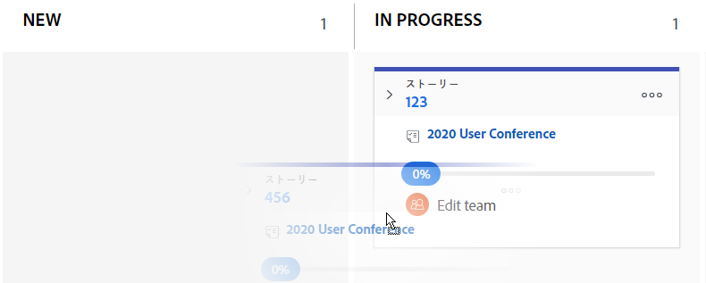

# [!UICONTROL かんばん]ボードでストーリーのステータスの更新

ストーリーの進行状況を反映するために、ストーリーのステータスを直接[!UICONTROL かんばん]ボードから変更できます。

>[!NOTE]
>
>「[!UICONTROL チーム設定]」エリア内の「[!UICONTROL ストーリーボード]」セクションで選択したステータスのみが、[!UICONTROL かんばん]ボードとステータスドロップダウンメニューで利用できます。詳しくは、[かんばんの設定](../../agile/get-started-with-agile-in-workfront/configure-kanban.md)を参照してください

## アクセス要件

この記事の手順を実行するには、次のアクセス権が必要です。

<table style="table-layout:auto"> 
 <col> 
 <col> 
 <tbody> 
  <tr> 
   <td role="rowheader"><strong>[!DNL Adobe Workfront] プラン*</strong></td> 
   <td> 
任意
 </td> 
  </tr> 
  <tr> 
   <td role="rowheader"><strong>[!DNL Adobe Workfront] ライセンス*</strong></td> 
   <td> 
[!UICONTROL Work] 以上
 </td> 
  </tr> 
  <tr> 
   <td role="rowheader"><strong>アクセスレベル設定*</strong></td> 
   <td> 
[!UICONTROL Worker] 以上
 
メモ：それでもアクセスできない場合は、アクセスレベルに追加の制限が設定されていないかどうかを [!DNL Workfront] 管理者にお問い合わせください。[!DNL Workfront] 管理者がアクセスレベルを変更する方法について詳しくは、<a href="../../administration-and-setup/add-users/configure-and-grant-access/create-modify-access-levels.md" class="MCXref xref">カスタムアクセスレベルの作成または変更</a>を参照してください。
 </td> 
  </tr> 
 </tbody> 
</table>

&#42;ご利用のプラン、ライセンスタイプ、アクセス権を確認するには、[!DNL Workfront] 管理者にお問い合わせください。

## かんばんボード上のストーリーのステータスの更新

1. [!DNL Adobe Workfront] の右上にある&#x200B;**[!UICONTROL メインメニュー]**&#x200B;アイコンをクリックし、次に「**[!UICONTROL チーム]**」をクリックします。

1. （オプション）「**[!UICONTROL チームを切り替え]**」アイコン「」をクリックし、ドロップダウンメニューから新しい[!UICONTROL かんばん]チームを選択するか、検索バーでチームを検索します。

1. ストーリーのステータスを更新する[!UICONTROL かんばん]ボードに移動します。
1. [!UICONTROL かんばん]ボード上の 1 つのステータス列から別の列にストーリーをドラッグします。\
   ストーリーは追加された後 2 週間、[!UICONTROL 完了]列に残ります。\
   
