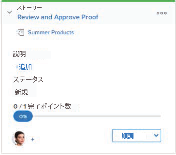

# ストーリーにフラグを使用する [!UICONTROL かんばん] ボード

の [!DNL Kanban] ボード、フラグは、ストーリーが次のステータスに移動する準備ができた時点を視覚的に示します。 これにより、 [!UICONTROL かんばん] チームは、ステータス間でストーリーを移動する際に、「プッシュ」アプローチではなく「プル」アプローチを使用します。

**例：** 「プル」アプローチを使用するチームの例を次に示します。チームのグラフィックデザイナーであるオリビアは、仕事を終え、ストーリーの旗を&quot;に設定します[!UICONTROL プル準備完了].&quot; この旗は、チームのコピーライターであるトニーに対し、物語が次のステータスに移る準備ができていることを視覚的に示します。 トニーは、作業を始める準備が整ったら、次のステータスに進みます。

ストーリーでフラグを使用する際は、次の点に注意してください。

* フラグはステータスではなく、チームの別のメンバーがストーリーを次のステータスに移す準備ができていることを視覚的に示します。
* ストーリーカード内のストーリーカードにはフラグが表示されません。 [!UICONTROL バックログ] 列または [!UICONTROL 完了] 列 ( または、列のステータスが [!UICONTROL 完了]) をクリックします。

   ストーリーのステータスについて詳しくは、 [かんばんボードのストーリーにフラグを使用](#updating-the-status-of-stories-and-subtasks)

## アクセス要件

この記事の手順を実行するには、次のアクセス権が必要です。

<table style="table-layout:auto"> 
 <col> 
 <col> 
 <tbody> 
  <tr> 
   <td role="rowheader"><strong>[!DNL Adobe Workfront] 計画*</strong></td> 
   <td> 
任意
 </td> 
  </tr> 
  <tr> 
   <td role="rowheader"><strong>[!DNL Adobe Workfront] ライセンス*</strong></td> 
   <td> 
[!UICONTROL Work] 以降
 </td> 
  </tr> 
  <tr> 
   <td role="rowheader"><strong>アクセスレベル設定*</strong></td> 
   <td> 
[!UICONTROL Worker] 以降
 
注意：まだアクセス権がない場合は、 [!DNL Workfront] 管理者（アクセスレベルに追加の制限を設定している場合） を参照してください。 [!DNL Workfront] 管理者は、 <a href="../../administration-and-setup/add-users/configure-and-grant-access/create-modify-access-levels.md" class="MCXref xref">カスタムアクセスレベルの作成または変更</a>.
 </td> 
  </tr> 
 </tbody> 
</table>

&#42;ご利用のプラン、ライセンスの種類、アクセス権を確認するには、 [!DNL Workfront] 管理者。

## ストーリーにフラグを使用する [!UICONTROL かんばん] ボード

ストーリーのフラグを変更するには：

1. 次をクリック： **[!UICONTROL メインメニュー]** アイコン  右上隅に [!DNL Adobe Workfront]を選択し、「 **[!UICONTROL チーム]**.

1. （オプション） **[!UICONTROL チームの切り替え]** アイコン を選択し、新しい [!UICONTROL かんばん] チームをドロップダウンメニューから選択するか、検索バーでチームを検索します。

1. 次に移動： [!UICONTROL かんばん] ボードでストーリーのフラグを変更します。
1. ストーリータイルを展開して、フラグを表示します。\
   フラグはに設定されます。 **[!UICONTROL 追跡中]** デフォルトでは、各ストーリーに対して\
   

1. 現在のフラグをクリックし、次のフラグオプションから「 」を選択します。

   * **[!UICONTROL 追跡中]:** ストーリーのステータスは適切で、現時点では何のアクションも実行する必要はありません。\

      かんばんボードの各ストーリーの既定のフラグです。\
      

   * **[!UICONTROL ブロック済み]:** ストーリーは次のステータスに進めません。 ストーリーにこのフラグを設定した場合、ストーリーは WIP 数の上限にはカウントされません。 (WIP 制限の詳細については、「 [かんばんの構成](../../agile/get-started-with-agile-in-workfront/configure-kanban.md).\

      

   * **[!UICONTROL プル準備完了]:** このストーリーは、チームの別のメンバーが次のステータスに移動する準備が整いました。\

      
