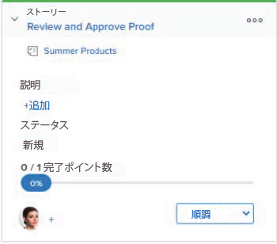

# [!UICONTROL かんばん]ボードのストーリーにフラグを使用

[!DNL Kanban] ボードで、フラグは、ストーリーが次のステータスに移行する準備ができていることを視覚的に示します。 これにより、[!UICONTROL かんばん]チームは、ステータス間でストーリーを移動する際に、「プッシュ」アプローチではなく「プル」アプローチを使用できます。

**例：**「プル」アプローチを使用するチームの例を考えてみましょう。チームのグラフィックデザイナーである Olivia が作業を終了し、ストーリーフラグを「[!UICONTROL プル準備完了]」に設定します。 このフラグは、チームのコピーライターである Tony に対し、ストーリーが次のステータスに移る準備ができていることを視覚的に示します。 Tony は、作業を始める準備が整ったら、次のステータスに進みます。

ストーリーでフラグを使用する際は、次の点に注意してください。

* フラグはステータスではなく、チームの別のメンバーがストーリーを次のステータスに移す準備ができていることを視覚的に示します。
* [!UICONTROL バックログ]列または[!UICONTROL 完了]列（または列のステータスが[!UICONTROL 完了]に等しい列）にあるストーリーカードにはフラグが表示されません。

  ストーリーのステータスについて詳しくは、[かんばんボード上のストーリーでのフラグの使用](#updating-the-status-of-stories-and-subtasks)を参照してください。

## アクセス要件

+++ 展開すると、この記事の機能のアクセス要件が表示されます。

<table style="table-layout:auto"> 
 <col> 
 </col> 
 <col> 
 </col> 
 <tbody> 
  <tr> 
   <td role="rowheader">Adobe Workfront パッケージ</td> 
   <td> 
任意
 </td> 
  </tr> 
  <tr> 
   <td role="rowheader">Adobe Workfront プラン</td> 
   <td> 
標準
 
   
Work またはそれ以上
 </td> 
  </tr>
 </tbody> 
</table>

詳しくは、[Workfront ドキュメントのアクセス要件](/help/quicksilver/administration-and-setup/add-users/access-levels-and-object-permissions/access-level-requirements-in-documentation.md)を参照してください。

+++

## [!UICONTROL かんばん]ボードのストーリーでフラグを使用

ストーリーのフラグを変更するには：

{{step1-to-team}}

1. （オプション）**[!UICONTROL チームを切り替え]**&#x200B;アイコン  をクリックし、ドロップダウンメニューから新しい[!UICONTROL かんばん]チームを選択するか、検索バーでチームを検索します。

1. ストーリーのステータスを変更する[!UICONTROL かんばん]ボードに移動します。
1. ストーリータイルを展開して、フラグを表示します。
デフォルトでは、各ストーリーの&#x200B;**[!UICONTROL トラック]**&#x200B;にフラグが設定されています。
   

1. 現在のフラグをクリックし、次のフラグオプションから選択します。

   * **[!UICONTROL トラック &#x200B;]:** ストーリーは適切なステータスであり、現時点ではアクションを実行する必要はありません。

     かんばんボードの各ストーリーの既定のフラグです。
     

   * **[!UICONTROL ブロック済み]：**&#x200B;ストーリーは次のステータスに進めません。 ストーリーにこのフラグを設定した場合、ストーリーは WIP 制限にカウントされません。 （WIP制限について詳しくは、[&#x200B; カンバンの設定](../../agile/get-started-with-agile-in-workfront/configure-kanban.md)を参照してください）。

     

   * **[!UICONTROL 引き出す準備ができました]:** ストーリーは、チームの別のメンバーによって次のステータスに移動する準備ができています。

     
