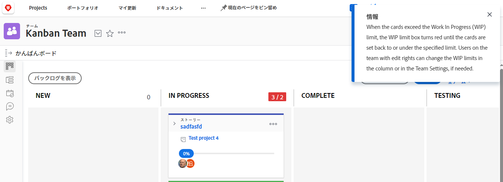

# かんばんボードでの[!UICONTROL 進行中の作業]（WIP）の上限の管理

[かんばんの設定](../../agile/get-started-with-agile-in-workfront/configure-kanban.md)の記事で説明されているように、[!UICONTROL かんばん]ボードの各列に対し、[!UICONTROL 進行中の作業]（WIP）の上限を設定できます。

WIP の上限は視覚的に警告が表示されるだけで、各ステータス列の項目が設定した上限より多くならないよう制限するものではありません。

## アクセス要件

この記事の手順を実行するには、次のアクセス権が必要です。

<table style="table-layout:auto"> 
 <col> 
 <col> 
 <tbody> 
  <tr> 
   <td role="rowheader"><strong>[!DNL Adobe Workfront] プラン*</strong></td> 
   <td> 
任意
 </td> 
  </tr> 
  <tr> 
   <td role="rowheader"><strong>[!DNL Adobe Workfront] ライセンス*</strong></td> 
   <td> 
[!UICONTROL Work] 以上
 </td> 
  </tr> 
  <tr> 
   <td role="rowheader"><strong>アクセスレベル設定*</strong></td> 
   <td> 
[!UICONTROL Worker] 以上
 
メモ：まだアクセス権がない場合は、[!DNL Workfront] 管理者に問い合わせて、アクセスレベルに追加の制限が設定されているかどうかを確認してください。[!DNL Workfront] 管理者がアクセスレベルを変更する方法について詳しくは、<a href="../../administration-and-setup/add-users/configure-and-grant-access/create-modify-access-levels.md" class="MCXref xref">カスタムアクセスレベルの作成または変更</a>を参照してください。
 </td> 
  </tr> 
 </tbody> 
</table>

&#42;ご利用のプラン、ライセンスタイプまたはアクセス権を確認するには、[!DNL Workfront] 管理者にお問い合わせください。

## [!UICONTROL かんばん]ボードで[!UICONTROL 進行中の作業]（WIP）の上限を表示

アジャイルチームに WIP の上限を設定すると、かんばんボードの各列（[!UICONTROL 完了]」列以外）の右上隅に WIP の上限が表示されます。

[!UICONTROL かんばん]ボードのいずれかの列で上限を超えた場合は常に、上限が赤でハイライト表示され、メッセージが表示されます。\

## [!UICONTROL かんばん]ボードで[!UICONTROL 進行中の作業]（WIP）の上限を更新

[!UICONTROL 編集]権限を持つチームメンバーは、[!UICONTROL かんばん]ボードで直接、各ステータス列の WIP の上限を更新できます。あるいは、[かんばんの設定](../../agile/get-started-with-agile-in-workfront/configure-kanban.md)の記事の説明に従って WIP の上限を更新することもできます。

1. [!DNL Adobe Workfront] の右上隅にある&#x200B;**[!UICONTROL メインメニュー]**&#x200B;アイコン 、「**[!UICONTROL チーム]**」の順にクリックします。

1. （オプション）**[!UICONTROL チームを切り替え]**&#x200B;アイコン  をクリックし、新しい[!UICONTROL かんばん]チームをドロップダウンメニューから選択するか、検索バーでチームを検索します。

1. [!UICONTROL かんばん]ボードで、かんばんボードの各列の右上隅にある WIP 上限を検索します。
1. 変更する WIP の上限をクリックし、新しい上限を指定します。
1. **[!UICONTROL Enter]** を押します。
