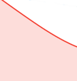

# アジャイルバーンダウンチャートの概要

バーンダウンチャートには、ストーリーがイテレーションでどのように進行しているかが視覚的に表示されます。実際のバーンダウン率は、イテレーションタイムラインの理想的なバーンダウン率に対して測定されます。

選択した日に基づいてバーンダウンチャートが調整されます。現在の日付がデフォルトです。前日を選択した場合、バーンダウンチャート内のすべてのデータとバーンダウンチャートの上の「[!UICONTROL 完了ステータス]」セクションのすべての値が再計算され、選択した日の終わりのデータが表示されます。（過去の日付または現在の日付を選択できます。将来の日付は選択できません。）

## 視覚インジケーター

バーンダウンチャートには、次の視覚インジケーターが含まれます。

<table style="table-layout:auto"> 
 <col> 
 <col> 
 <tbody> 
  <tr> 
   <td role="rowheader">  </td> 
   <td> 
イテレーションが開始された時点に基づく理想的なバーンダウン率。
 
イテレーションの範囲が変更されない（時間やポイントが追加または削除されない）場合、この行は表示されません。
 
この線は、休日に作業が行われる場合は平坦に表示されます。詳しくは、<a title="アジャイルバーンダウンチャートの使用" href="#how-days-off-affect-the-burndown-chart" class="MCXref xref">休日がバーンダウンチャートに与える影響</a>を参照してください。
 </td> 
  </tr> 
  <tr> 
   <td role="rowheader">  </td> 
   <td> 
現在のストーリーまたはタスクに基づく理想的なバーンダウン率。
 
イテレーション開始後にイテレーションに時間またはポイントが追加または削除されると、現在の理想的なバーンダウン率（青色の実線）は、元の理想的なバーンダウン率（青色の点線）とは異なります。
 
この線は、休日に作業が行われる場合は平坦に表示されます。
 
詳しくは、<a title="アジャイルバーンダウンチャートの使用" href="#how-days-off-affect-the-burndown-chart" class="MCXref xref">休日がバーンダウンチャートに与える影響</a>を参照してください。
 </td> 
  </tr> 
  <tr> 
   <td role="rowheader">  </td> 
   <td> 
バーンダウン率が理想的な値（理想的なバーンダウン計算より 1 日あたりの残りポイント数または時間数が多い）未満の場合、実際のバーンダウン率は赤色で表示されます。
 
次の式は、実際のバーンダウン率を計算するために使用されます。
 
[SUM（進行中の作業のポイントまたは時間値 * 完了率）+ 完了した作業のポイントまたは時間値]
 </td> 
  </tr> 
  <tr> 
   <td role="rowheader">  </td> 
   <td> 
バーンダウン率が理想的な値以上（理想的なバーンダウン計算より 1 日当たりの残りポイント数が同じか、または少ない場合）には、実際のバーンダウン率が緑色で表示されます。
 
次の式は、実際のバーンダウン率を計算するために使用されます。
 
[SUM（進行中の作業のポイントまたは時間値 * 完了率）+ 完了した作業のポイントまたは時間値]
 </td> 
  </tr> 
  <tr> 
   <td role="rowheader">  </td> 
   <td> 
範囲の変更（時間またはポイントがイテレーションから追加または削除される）。
 
範囲の変更は、常に 1 日の中央に縦線で表示されます。また、範囲の変更が発生した日の中央に青色の点が表示されます。
 
バーンダウンチャートの縦軸は、ストーリーのポイントまたは時間を示します。
 </td> 
  </tr> 
  <tr> 
   <td role="rowheader">  </td> 
   <td> 
日付範囲の変更（イテレーション期間が増加または減少）。
 
イテレーション期間が変更された日の中央に、青色の点が表示されます。
 </td> 
  </tr> 
  <tr> 
   <td role="rowheader">  </td> 
   <td> 
作業がバーンダウンするたびに、実際のバーンダウン率に緑色または赤色の点が表示されます。（その日の実際のバーンダウン率が赤色の場合、点は赤色、その日の実際のバーンダウン率が緑色の場合、点は緑色です。）
 
次のいずれかが発生すると、作業はバーンダウンします。
 
    <ul> 
     <li> ストーリーの [!UICONTROL Percent Complete] が増加します。 [!UICONTROL Percent Complete] は、次の場合に増加します。 
      <ul> 
       <li> 
手動で変更済み
 </li> 
       <li> 
ストーリーのポイントまたは時間数が更新されます
 </li> 
      </ul></li>  
     <li>ストーリーのステータスが [!UICONTROL Complete] に変わります</li> 
    </ul> </td> 
  </tr> 
 </tbody> 
</table>

## 休日がバーンダウンチャートに与える影響 {#how-days-off-affect-the-burndown-chart}

[!DNL Workfront] で定義されたデフォルトのスケジュールは、バーンダウンから休日（週末と休日）を除外することで、バーンダウンチャートに影響します。バーンダウンチャートでは、デフォルトのスケジュールを使用して稼働日を定義します（[スケジュールを作成](../../../administration-and-setup/set-up-workfront/configure-timesheets-schedules/create-schedules.md)で説明)。

アジャイルチームは代替スケジュールを定義することで、チーム固有の非稼働日を組み込むことができます（[バーンダウンチャートに代替のチームスケジュールを使用](../../../agile/use-scrum-in-an-agile-team/burndown/use-alt-team-schedule-burndown-charts.md)の記事で説明）。その後、この代替スケジュールは、チームに割り当てられたイテレーションのバーンダウンチャートに反映されます。代替スケジュールは、バーンダウンチャートにのみ影響します。

次の場合にのみ、休日がバーンダウンチャートに反映されます。

* 作業は以前休日に記録されていました。（作業が記録された日が表示されます。）

  仕事が休日にログオンした場合。

   * チームには作業を行う予定がないため、理想的なバーンダウンを計算する際には、記録された作業は含まれません。
   * 作業が完了した日、またはバーンダウンチャートを表示している日（休日に表示している場合）のバーンダウンチャートには、理想的なバーンダウンライン（青い実線と青い破線）が平坦に表示されます。
   * ログに記録された作業は、推測完了期間や 1 日あたりの平均ポイントまたは時間など、他のバーンダウン統計値を計算する際に含まれます。

* 休日にバーンダウンチャートを表示しています。（表示している日がバーンダウンチャートに表示されます。）
* 休日にそのイテレーションの残り作業の合計を完了します。

  ユーザーが休日にイテレーションの残り作業の合計を完了すると、[!UICONTROL 推測完了期間]フィールドにイテレーションが完了した日付が表示されます。

  イテレーションを計画する際に、イテレーションの終了日を非作業日に設定し、イテレーションが時間どおりに終了するように追跡している場合、[!UICONTROL 推定完了]日は、設定したイテレーション終了日の前の最終作業日に設定されます（非作業日に作業がバーンダウンするようにスケジュールされていないため）。

  イテレーションの終了日は、[イテレーションを作成](../../../agile/use-scrum-in-an-agile-team/iterations/create-an-iteration.md)の記事で説明されているように、イテレーションが計画される際に指定されます。
