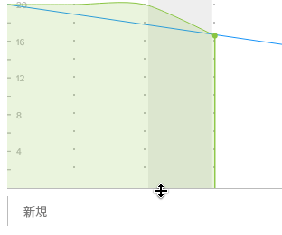

# バーンダウンチャートのサイズ変更と折りたたみ

バーンダウンチャートのサイズを変更したり折りたたんだりして、ストーリーボード上で占める部分を調整できます。

バーンダウンチャートのサイズや表示に対して行った変更内容は、自分に対してのみ表示され、ブラウザーキャッシュをクリアするとリセットされます。

## アクセス要件

この記事の手順を実行するには、次のアクセス権が必要です。

<table style="table-layout:auto"> 
 <col> 
 </col> 
 <col> 
 </col> 
 <tbody> 
  <tr> 
   <td role="rowheader"><strong>[!DNL Adobe Workfront] プラン*</strong></td> 
   <td> 
任意
 </td> 
  </tr> 
  <tr> 
   <td role="rowheader"><strong>[!DNL Adobe Workfront] ライセンス*</strong></td> 
   <td> 
[!UICONTROL Review] 以降
 </td> 
  </tr> 
 </tbody> 
</table>

&#42;保有するプランやライセンスの種類を確認するには、[!DNL Workfront] 管理者にお問い合わせください。

## バーンダウンチャートのサイズ変更

1. 右上隅にある&#x200B;**[!UICONTROL メインメニュー]**&#x200B;アイコンを選択し[!DNL Adobe Workfront]、次に「**[!UICONTROL チーム]**」をクリックします。

1. （オプション）**[!UICONTROL チームを切り替え]**&#x200B;アイコン  をクリックし、ドロップダウンメニューから新しい[!UICONTROL スクラム]チームを選択するか、検索バーでチームを検索します。

1. サイズを変更するバーンダウンチャートを含むイテレーションに移動します。
1. バーンダウンチャートの下線にポインタを合わせ、チャートを希望のサイズにドラッグします。\
   

## バーンダウンチャートの折りたたみ

1. [!DNL Adobe Workfront] の右上隅にある&#x200B;**[!UICONTROL メインメニュー]**&#x200B;アイコンをクリックし、次に「**[!UICONTROL チーム]**」をクリックします。

1. （オプション）**[!UICONTROL チームを切り替え]**&#x200B;アイコン  をクリックし、ドロップダウンメニューから新しい[!UICONTROL スクラム]チームを選択するか、検索バーでチームを検索します。

1. 折りたたむバーンダウンチャートを含むイテレーションに移動します。
1. [!UICONTROL 完了率]ステータスバーの左側の矢印アイコンをクリックします。
