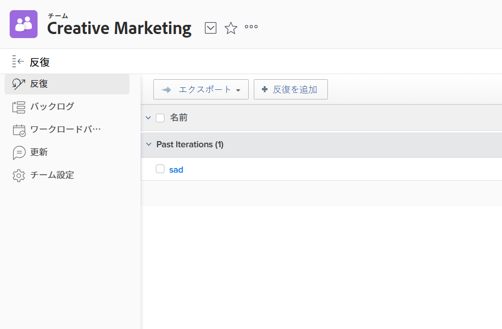

# 反復を作成

繰り返しは、Scrum Agile チームが作業能力を計画する際の主要なコンポーネントです。 [!DNL Adobe Workfront] チームのニーズに合わせて複数の反復を作成し、スクラムアジャイルチームが作業を管理できます。

## アクセス要件

この記事の手順を実行するには、次のアクセス権が必要です。

<table style="table-layout:auto"> 
 <col> 
 </col> 
 <col> 
 </col> 
 <tbody> 
  <tr> 
   <td role="rowheader"><strong>[!DNL Adobe Workfront] 計画*</strong></td> 
   <td> 
任意
 </td> 
  </tr> 
  <tr> 
   <td role="rowheader"><strong>[!DNL Adobe Workfront] ライセンス*</strong></td> 
   <td> 
[!UICONTROL Review] 以降
 </td> 
  </tr> 
 </tbody> 
</table>

&#42;保有するプランやライセンスの種類を確認するには、 [!DNL Workfront] 管理者。

## 反復を追加

以下を使用： [!UICONTROL 反復を追加] 反復をすばやく作成し、後でタスクと問題を追加する機能。

1. 次をクリック： **[!UICONTROL メインメニュー]** アイコン  右上隅に [!DNL Adobe Workfront]を選択し、「 **[!UICONTROL チーム]**.

1. （オプション） **[!UICONTROL チームの切り替え]** アイコン をクリックし、ドロップダウンメニューから新しいスクラムチームを選択するか、検索バーでチームを検索します。

1. の **[!UICONTROL 反復]** タブ、クリック **[!UICONTROL 反復を追加]**.\
   

1. 以下を指定します。

   <table style="table-layout:auto"> 
    <col> 
    <col> 
    <tbody> 
     <tr> 
      <td role="rowheader"><strong>[!UICONTROL 反復名 ]</strong></td> 
      <td>反復の名前を入力します。</td> 
     </tr> 
     <tr> 
      <td role="rowheader"><strong>[!UICONTROL Goal]</strong></td> 
      <td>繰り返しの目標を追加します。</td> 
     </tr> 
     <tr> 
      <td role="rowheader"><strong>[!UICONTROL 開始日 ]</strong></td> 
      <td>反復を開始する日付を入力します。</td> 
     </tr> 
     <tr> 
      <td role="rowheader"><strong>[!UICONTROL 終了日 ]</strong></td> 
      <td>
繰り返しの終了日を入力します。 [!DNL Workfront] では、開始日から 4 週間以内の終了日を設定することをお勧めします。

ヒント：終了日として必ず稼働日を選択してください。 バーンダウングラフの計算に使用されるのは稼働日のみです。 デフォルトでは、バーンダウングラフはデフォルトのスケジュールを使用して稼働日を定義します ( <a href="../../../administration-and-setup/set-up-workfront/configure-timesheets-schedules/create-schedules.md" class="MCXref xref">スケジュールの作成</a>) をクリックします。 また、チーム固有の非就業日を組み込むには、アジャイルチームが代替スケジュールを使用するように選択できます（「バーンダウンチャートの代替チームスケジュールの定義」を参照）。 <a href="../../../agile/get-started-with-agile-in-workfront/create-an-agile-team.md" class="MCXref xref">アジャイルチームの作成</a>) をクリックします。
</td> 
     </tr> 
     <tr> 
      <td role="rowheader"><strong>[!UICONTROL Capacity]</strong></td> 
      <td> 反復処理の容量を指定します。 これは、チームが繰り返しで達成できるポイントまたは時間の数です。 入力する数は、その反復でのすべてのストーリーの合計からのポイント数または時間数以上である必要があります。 [!DNL Workfront] このフィールドには、デフォルトで 50 の処理能力が事前入力されます。 </td> 
     </tr> 
     <tr> 
      <td role="rowheader"><strong>[!UICONTROL フォーカス ]</strong></td> 
      <td>チームのフォーカス率を指定します。 チームの全メンバーがこの反復に完全に焦点を当てると、焦点は 100%になります。 [!DNL Workfront] このフィールドにデフォルトで 100%を事前入力します。 </td> 
     </tr> 
    </tbody> 
   </table>

1. クリック **[!UICONTROL 送信]**. 繰り返しを作成したら、ストーリーを追加する必要があります。 詳しくは、 [既存の反復にストーリーを追加する](../../../agile/use-scrum-in-an-agile-team/iterations/add-stories-to-existing-iteration.md).

## での反復計画 [!UICONTROL バックログ] タブ

以下を使用： [!UICONTROL 反復計画] バックログのタスクを使用して反復処理を作成する機能です。

1. 次をクリック： **[!UICONTROL メインメニュー]** アイコン  右上隅に [!DNL Adobe Workfront]を選択し、「 **[!UICONTROL チーム]**.

1. （オプション） **[!UICONTROL チームの切り替え]** アイコン をクリックし、ドロップダウンメニューから新しいスクラムチームを選択するか、検索バーでチームを検索します。

1. 選択 **[!UICONTROL バックログ]** をクリックします。 次に、「 **[!UICONTROL 反復計画]**.

1. 次の情報を指定します。

   <table style="table-layout:auto"> 
    <col> 
    <col> 
    <tbody> 
     <tr> 
      <td role="rowheader"><strong>[!UICONTROL 反復名 ]</strong></td> 
      <td>反復の名前を指定します。</td> 
     </tr> 
     <tr> 
      <td role="rowheader"><strong>[!UICONTROL 開始日 ]</strong></td> 
      <td> 繰り返しを開始する日付を指定します。</td> 
     </tr> 
     <tr> 
      <td role="rowheader"><strong>[!UICONTROL 終了日 ]</strong> </td> 
      <td>
繰り返しが終了する日付を指定します。 [!DNL Workfront] では、開始日から 4 週間以内の終了日を設定することをお勧めします。

ヒント：終了日として必ず稼働日を選択してください。 バーンダウングラフの計算に使用されるのは稼働日のみです。 デフォルトでは、バーンダウングラフはデフォルトのスケジュールを使用して稼働日を定義します ( <a href="../../../administration-and-setup/set-up-workfront/configure-timesheets-schedules/create-schedules.md" class="MCXref xref">スケジュールの作成</a>) をクリックします。 また、チーム固有の非就業日を組み込むには、アジャイルチームが代替スケジュールを使用するように選択できます ( <a href="../../../agile/use-scrum-in-an-agile-team/burndown/use-alt--team-schedule-burndown-charts.md" class="MCXref xref">バーンダウングラフに代替のチームスケジュールを使用</a>) をクリックします。
</td> 
     </tr> 
     <tr> 
      <td role="rowheader"><strong>[!UICONTROL フォーカス ]</strong></td> 
      <td>チームのフォーカス率を指定します。 チームの全メンバーがこの反復に完全に焦点を当てると、焦点は 100%になります。 [!DNL Workfront] このフィールドにチームの過去の繰り返しの平均値を事前入力します。 これがチームの最初の反復である場合、このフィールドの値はデフォルトでは 0 になります。</td> 
     </tr> 
     <tr> 
      <td role="rowheader"> <strong>[!UICONTROL Capacity]</strong></td> 
      <td> 反復処理の容量を指定します。 これは、チームが繰り返しで達成できるポイントまたは時間の数です。 入力する数は、その反復でのすべてのストーリーの合計からのポイント数または時間数以上である必要があります。 [!DNL Workfront] このフィールドにチームの過去の繰り返しの平均値を事前入力します。 これがチームの最初の反復である場合、このフィールドの値はデフォルトでは 0 になります。</td> 
     </tr> 
     <tr> 
      <td role="rowheader"> <strong>[!UICONTROL Goal]</strong></td> 
      <td> 反復の目標を指定します。 このフィールドは必須ではありません。</td> 
     </tr> 
    </tbody> 
   </table>

1. （オプション）ストーリーを選択して今すぐ反復に追加するか、この手順をスキップして後で反復にストーリーを追加できます。 バックログの先頭のストーリーの方が優先されます。 物語は、能力に合うときに緑で強調表示され、表示されない場合は、赤でハイライト表示されます。\
   タスクとイシューの両方を 1 つのイテレーションに追加できます。

   * **タスクをイテレーションに追加するには：** の **[!UICONTROL バックログ]** タブで、 **[!UICONTROL ストーリー]** 」タブが選択されています（バックログを表示する場合は、このタブがデフォルトで選択されています）。 繰り返しに追加するストーリーを選択します。\

      反復処理にタスクを追加すると、タスクの開始日が [[!UICONTROL 理解] 反復処理に追加した場合のタスク開始日の計算方法](#understand-how-task-start-dates-are-calculated-when-added-to-an-iteration).

   * **イテレーションに問題を追加するには：** の **[!UICONTROL バックログ]** タブで、 **[!UICONTROL 問題]** タブをクリックします。 反復に追加する問題を選択します。

1. 「**[!UICONTROL 保存]」をクリックします。**
繰り返しが作成されます。

1. （オプション）既存の反復にストーリーを追加するには、 [既存の反復にストーリーを追加する](../../../agile/use-scrum-in-an-agile-team/iterations/add-stories-to-existing-iteration.md).

## 反復に追加した場合のタスクの開始日の計算方法を理解する {#understand-how-task-start-dates-are-calculated-when-added-to-an-iteration}

タスクをストーリーとして繰り返しに追加する場合、 [!UICONTROL タスクの完了が必要です] 拘束は各ストーリーに使用されます。 ほとんどの場合、タスクの計画開始日は次の式に基づいて計算されます。

[!UICONTROL 反復終了日] マイナス (-) [!UICONTROL タスク期間] 次と等しい (=) [!UICONTROL タスクの予定開始日]

この [!UICONTROL プロジェクト終了日] プロジェクトの開始日が反復の開始日より後で、プロジェクトの終了日が反復の終了日より後の場合は、の代わりにが使用されます。

個々のスクラムチームが、繰り返し日付ではなく、デフォルトでプロジェクト日付を使用するように設定できます。 詳しくは、 [作業項目を反復処理に追加する際の日付の適用方法を設定する](../../../agile/get-started-with-agile-in-workfront/configure-scrum.md#configur5) 記事内 [スクラムの設定](../../../agile/get-started-with-agile-in-workfront/configure-scrum.md).
