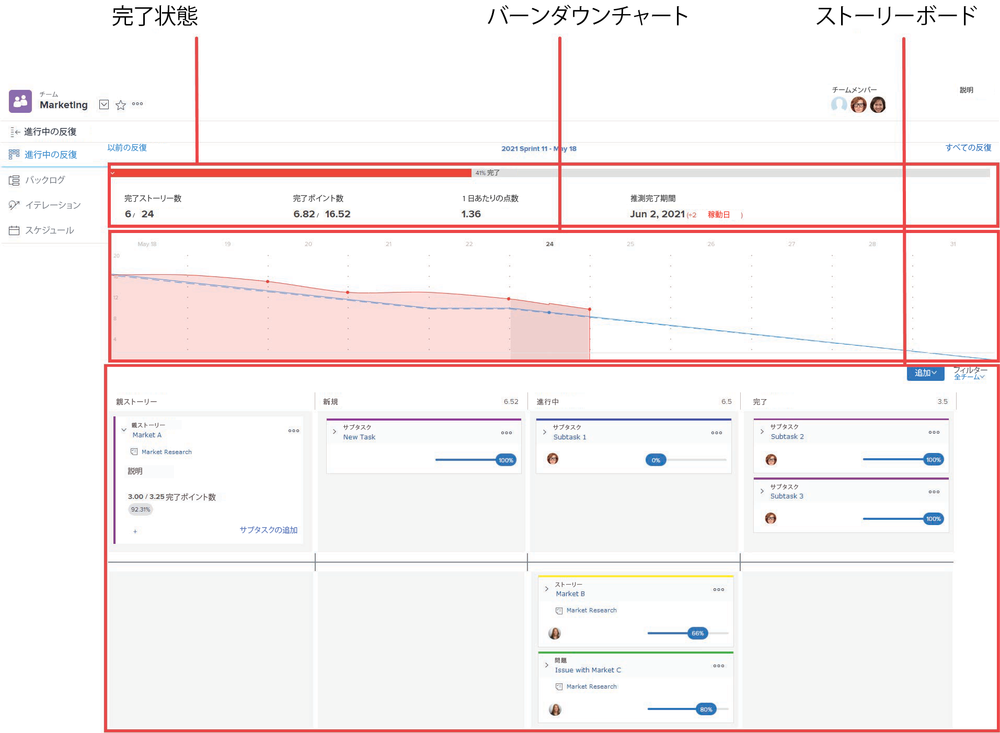

# イテレーションの概要

アジャイルイテレーションは、完了ステータス、バーンダウン、およびストーリーボードの 3 つのエリアで構成されます。

バーンダウンチャートと完了ステータスについては、[[!UICONTROL バーンダウン]](../../../agile/use-scrum-in-an-agile-team/burndown/burndown.md)の節を参照してください。

ストーリーボードについて詳しくは、[[!UICONTROL スクラム]ボード](../../../agile/use-scrum-in-an-agile-team/scrum-board/scrum-board.md)の節を参照してください。
