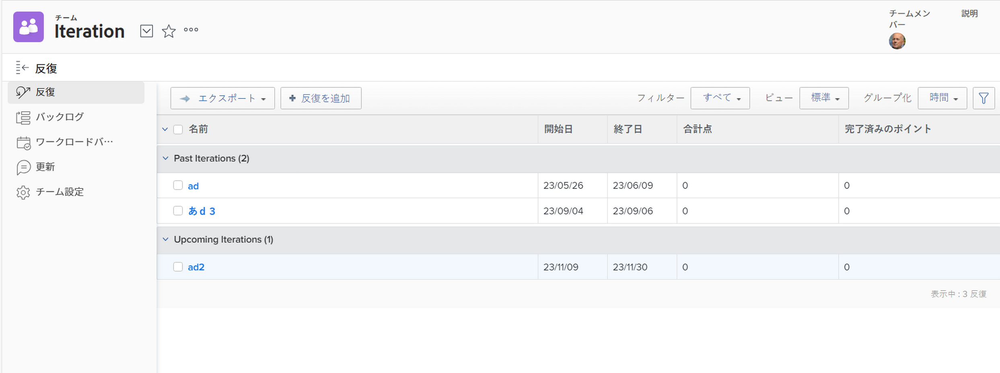

# イテレーションを表示

特定のチームのすべての反復を表示することも、個々の反復を表示することもできます。反復には、その反復に含まれるストーリー、イシュー、ドキュメントに関するデータが表示されます。

## アクセス要件

この記事の手順を実行するには、次のアクセス権が必要です。

<table style="table-layout:auto"> 
 <col> 
 </col> 
 <col> 
 </col> 
 <tbody> 
  <tr> 
   <td role="rowheader"><strong>[!DNL Adobe Workfront] プラン*</strong></td> 
   <td> 
任意
 </td> 
  </tr> 
  <tr> 
   <td role="rowheader"><strong>[!DNL Adobe Workfront] ライセンス*</strong></td> 
   <td> 
[!UICONTROL Review] 以降
 </td> 
  </tr> 
 </tbody> 
</table>

&#42;保有するプランやライセンスの種類を確認するには、[!DNL Workfront] 管理者にお問い合わせください。

## 特定のチームに割り当てられたイテレーションを表示

1. 右上隅にある&#x200B;**[!UICONTROL メインメニュー]**&#x200B;アイコンを選択し[!DNL Adobe Workfront]、次に「**[!UICONTROL チーム]**」をクリックします。

1. （オプション）**[!UICONTROL チームの切り替え]**&#x200B;アイコン  をクリックし、ドロップダウンメニューから新しいスクラムチームを選択するか、検索バーでチームを検索します。

1. 左側のパネルで、「**[!UICONTROL 反復]**」を選択して特定の反復を選択するか、「**[!UICONTROL 進行中の反復]**」を選択します。

   

   >[!NOTE]
   >
   >「**[!UICONTROL 進行中の反復]**」が左側のパネルに表示されるのは、レイアウトテンプレートに割り当てられ、その反復に少なくとも 1 つのタスクまたはイシューがある場合のみです。詳しくは、[レイアウトテンプレートを使用した左側のパネルのカスタマイズ](/help/quicksilver/administration-and-setup/customize-workfront/use-layout-templates/customize-left-panel.md)を参照してください。

1. （オプション）表示する特定の反復の名前をクリックします。\
   反復のストーリーが表示されます。

   ![[!UICONTROL イテレーションのストーリー]](assets/iteration-stories-list-NWE.png)
