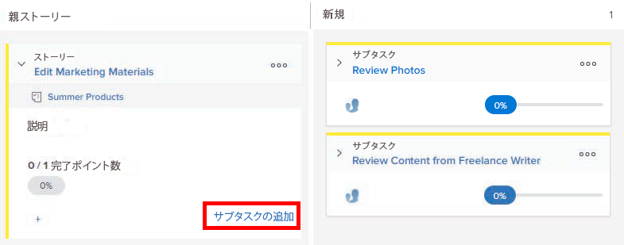
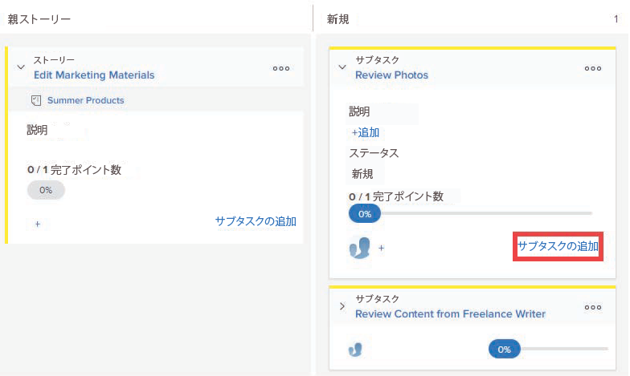

# サブタスクを [!UICONTROL スクラム] ボード

既存のストーリーのサブタスクを作成する場合は、次の点に注意してください。

**次の場合に [!UICONTROL 完了モード] プロジェクトの設定が次のように設定されている [!UICONTROL 手動]:**

* サブタスクを含む親ストーリーの移動先 [!UICONTROL 完了] 親ストーリーを 100%に更新し、 [!UICONTROL ステータス] から [!UICONTROL 完了]. サブタスクは更新されません。
* 次の手順で [!UICONTROL 完了率] ストーリーを更新するには、 [!UICONTROL ストーリー] タブまたは [!UICONTROL 詳細] ページに表示されます。

**次の場合に [!UICONTROL 完了モード] プロジェクトの設定が次のように設定されている [!UICONTROL 自動]**:

* サブタスクを含む親ストーリーの移動先 [!UICONTROL 完了] 親ストーリーを 100%に更新し、 [!UICONTROL ステータス] から [!UICONTROL 完了]. サブタスクも 100%に更新され、 [!UICONTROL ステータス] が [!UICONTROL 完了].
* 次の手順で [!UICONTROL 完了率] このストーリーの場合、 [!UICONTROL 完了率] サブタスクの この [!UICONTROL 完了率] というのは、 [!UICONTROL 完了率] すべてのサブタスクの

## アクセス要件

この記事の手順を実行するには、次のアクセス権が必要です。

<table style="table-layout:auto"> 
 <col> 
 </col> 
 <col> 
 </col> 
 <tbody> 
  <tr> 
   <td role="rowheader"><strong>[!DNL Adobe Workfront] 計画*</strong></td> 
   <td> 
任意
 </td> 
  </tr> 
  <tr> 
   <td role="rowheader"><strong>[!DNL Adobe Workfront] ライセンス*</strong></td> 
   <td> 
[!UICONTROL Work] 以降
 </td> 
  </tr> 
  <tr> 
   <td role="rowheader"><strong>アクセスレベル設定*</strong></td> 
   <td> 
[!UICONTROL Worker] 以降
 
注意：まだアクセス権がない場合は、 [!DNL Workfront] 管理者（アクセスレベルに追加の制限を設定している場合） を参照してください。 [!DNL Workfront] 管理者はアクセスレベルを変更できます。詳しくは、 <a href="../../../administration-and-setup/add-users/configure-and-grant-access/create-modify-access-levels.md" class="MCXref xref">カスタムアクセスレベルの作成または変更</a>.
 </td> 
  </tr> 
  <tr> 
   <td role="rowheader"><strong>オブジェクト権限</strong></td> 
   <td> 
サブタスクが存在するタスクへの [!UICONTROL Contribute] または [!UICONTROL Manage] アクセス
 
追加のアクセス権のリクエストについて詳しくは、 <a href="../../../workfront-basics/grant-and-request-access-to-objects/request-access.md" class="MCXref xref">オブジェクトへのアクセスのリクエスト </a>.
 </td> 
  </tr> 
 </tbody> 
</table>

&#42;ご利用のプラン、ライセンスの種類、アクセス権を確認するには、 [!DNL Workfront] 管理者。

## スクラムボード上の既存のストーリーにサブタスクを追加

1. 次をクリック： **[!UICONTROL メインメニュー]** アイコン  右上隅に [!DNL Adobe Workfront]を選択し、「 **[!UICONTROL チーム]**.

1. （オプション） **[!UICONTROL チームの切り替え]** アイコン をクリックし、ドロップダウンメニューから新しいスクラムチームを選択するか、検索バーでチームを検索します。

1. サブタスクを追加するストーリーを含む俊敏な反復またはプロジェクトに移動します。 繰り返しに移動する方法については、 [反復を表示](../../../agile/use-scrum-in-an-agile-team/iterations/view-iteration.md).
1. サブタスクを追加するストーリーボードのストーリータイルに移動します。
1. クリック **[!UICONTROL サブタスクを追加]** をメインストーリーカードにドラッグして、ストーリーのサブタスクを作成します。

   

   または

   クリック **[!UICONTROL サブタスクを追加]** サブタスクタイル上にサブタスクを作成します。

   [!DNL Workfront] は無限レベルのサブタスクをサポートしますが、アジャイルストーリーボードに表示されるのは 2 つのレベル（サブタスクのサブタスク）だけです。

   

   現在スイムレーンを持たないストーリーにサブタスクを追加すると、親タスクは [!UICONTROL 親ストーリー] 列とサブタスクがスイムレーン内に移動します。

1. 次の情報を指定します。

   <table style="table-layout:auto">
    <col>
    <col>
    <tbody>
     <tr>
      <td role="rowheader"><strong>[!UICONTROL サブタスク名 ]</strong></td>
      <td> サブタスクの名前を指定します。</td>
     </tr>
     <tr>
      <td role="rowheader"><strong>[!UICONTROL 説明 ]</strong></td>
      <td>サブタスクの説明を指定します。</td>
     </tr>
     <tr>
      <td role="rowheader"><strong>[!UICONTROL 予測 ]</strong></td>
      <td>サブタスクの見積もりを指定します。 
見積もりを作成する際は、次の点に注意してください。

       <ul>
        <li>アジャイルチームがストーリーをポイント単位で推定するように設定されている場合、デフォルトでは 1 ポイントが 8 時間になります。 見積もりは、ストーリーに [!UICONTROL 予定時間 ] として追加されます。</li>
        <li>すべてのサブタスクの合計推定値によって、親ストーリーの推定値が決まります。 詳しくは、 <a href="../../../agile/use-scrum-in-an-agile-team/scrum-board/update-status-of-stories-and-subtasks.md" class="MCXref xref">スクラムボード上のストーリーとサブタスクのステータスの更新</a>.</li>
        <li>新しいサブタスクを作成する際には、[!UICONTROL 推定 ] フィールドが既に設定されています。 サブタスクの見積もりをリセットすると、親ストーリーの見積もりがリセットされます（親ストーリーはすべてのサブタスクの合計であるため）。</li>
       </ul> </td>
     </tr>
     <tr>
      <td role="rowheader"><strong>[!UICONTROL 予定時間数 ]</strong></td>
      <td> （プロジェクトでのみ使用可能）タスクの予定時間数を指定します。</td>
     </tr>
     <tr>
      <td role="rowheader"><strong>[!UICONTROL 割り当て ]</strong></td>
      <td>サブタスクを割り当てるチームの名前を入力し、ドロップダウンリストに表示されたら、その名前をクリックします。</td>
     </tr>
    </tbody>
   </table>

1. 「**[!UICONTROL 作成]**」をクリックします。
