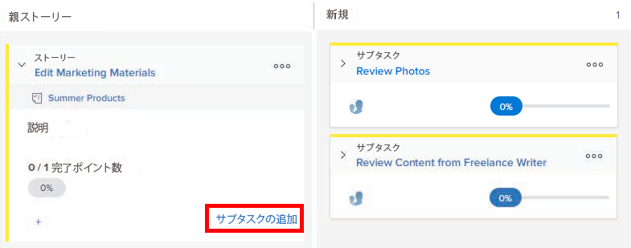
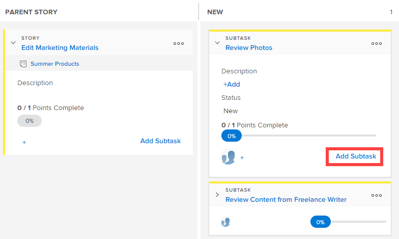

# [!UICONTROL スクラム]ボードの既存のストーリーにサブタスクを追加

既存のストーリーのサブタスクを作成する場合は、次の点に注意してください。

**プロジェクトの[!UICONTROL 完了モード]の設定が[!UICONTROL 手動]に設定されている場合：**

* サブタスクを含む親ストーリーを「[!UICONTROL 完了]」に移動すると、親ストーリーが 100％、[!UICONTROL ステータス]が「[!UICONTROL 完了]」に更新されます。 サブタスクは更新されません。
* ストーリーの[!UICONTROL 完了率]を更新するには、オブジェクトの[!UICONTROL ストーリー]タブまたは[!UICONTROL 詳細]ページから更新する必要があります。

**プロジェクトの[!UICONTROL 完了モード]の設定が「[!UICONTROL 自動]**」に設定されている場合：

* サブタスクを含む親ストーリーを[!UICONTROL 完了]に移動すると、親ストーリーが 100％、[!UICONTROL ステータス]が「[!UICONTROL 完了]」に更新されます。 サブタスクも 100％となり、[!UICONTROL ステータス]が「[!UICONTROL 完了]」に更新されます。
* ストーリーの[!UICONTROL 完了率]を更新するには、サブタスクの[!UICONTROL 完了率]を更新する必要があります。 ストーリーの[!UICONTROL 完了率]は、すべてのサブタスクの[!UICONTROL 完了率]に基づいています。

## アクセス要件

+++ 展開すると、この記事の機能のアクセス要件が表示されます。

この記事の手順を実行するには、次のアクセス権が必要です。

<table style="table-layout:auto"> 
 <tbody> 
  <tr> 
   <td role="rowheader">[!DNL Adobe Workfront] プラン*</td> 
   <td> 
任意
 </td> 
  </tr> 
  <tr> 
   <td role="rowheader">[!DNL Adobe Workfront] ライセンス</td> 
   <td> 
新規：[!UICONTROL Standard]
 
   または
   
現在：[!UICONTROL Work] 以上
 </td> 
  </tr>
   <tr> 
   <td role="rowheader">オブジェクト権限</td> 
   <td>サブタスクが存在するタスクへの[!UICONTROL Contribute]または[!UICONTROL Manage]アクセス </td> 
  </tr>
 </tbody> 
</table>

詳しくは、[Workfront ドキュメントのアクセス要件](/help/quicksilver/administration-and-setup/add-users/access-levels-and-object-permissions/access-level-requirements-in-documentation.md)を参照してください。

+++

## スクラムボード上の既存のストーリーにサブタスクを追加

{{step1-to-team}}

1. （オプション）**[!UICONTROL チームの切り替え]**&#x200B;アイコン  をクリックし、ドロップダウンメニューから新しいスクラムチームを選択するか、検索バーでチームを検索します。

1. サブタスクを追加するストーリーを含むアジャイルイテレーションまたはプロジェクトに移動します。 イテレーションに移動する方法については、[イテレーションを表示](../../../agile/use-scrum-in-an-agile-team/iterations/view-iteration.md)を参照してください。
1. サブタスクを追加するストーリーボードのストーリータイルに移動します。
1. **[!UICONTROL サブタスクを追加]**&#x200B;をメインストーリーカードでクリックし、ストーリーにサブタスクを作成します。

   

   または

   **[!UICONTROL サブタスクを追加]**&#x200B;をサブタスクタイルでクリックし、サブタスクにサブタスクを作成します。

   [!DNL Workfront]はサブタスクの無限レベルをサポートしていますが、アジャイルストーリーボードには2つのレベル（サブタスクのサブタスク）のみが表示されます。

   

   現在スイムレーンを持たないストーリーにサブタスクを追加すると、親タスクは[!UICONTROL 親ストーリー]列に移動し、サブタスクはスイムレーン内に移動します。

1. 次の情報を指定します。

   <table style="table-layout:auto">
    <col>
    <col>
    <tbody>
     <tr>
      <td role="rowheader"><strong>[!UICONTROL Subtask Name]</strong></td>
      <td> サブタスクの名前を指定します。</td>
     </tr>
     <tr>
      <td role="rowheader"><strong>[!UICONTROL Description]</strong></td>
      <td>サブタスクの説明を指定します。</td>
     </tr>
     <tr>
      <td role="rowheader"><strong>[!UICONTROL Estimate]</strong></td>
      <td>サブタスクの見積もりを指定します。 
見積もりを作成する際は、次の点に注意してください。

       <ul>
        <li>アジャイルチームがストーリーをポイント単位で推定するように設定されている場合、デフォルトでは1ポイントが8時間になります。 見積もりは、ストーリーに[!UICONTROL Planned Hours]として追加されます。</li>
        <li>すべてのサブタスクの合計推定値によって、親ストーリーの推定値が決まります。 詳しくは、<a href="../../../agile/use-scrum-in-an-agile-team/scrum-board/update-status-of-stories-and-subtasks.md" class="MCXref xref">スクラムボード上のストーリーとサブタスクのステータスの更新</a>を参照してください。</li>
        <li>新しいサブタスクを作成する際には、[!UICONTROL Estimate]フィールドが既に設定されています。 サブタスクの見積もりをリセットすると、親ストーリーの見積もりもリセットされます（親ストーリーはそのすべてのサブタスクの合計であるため）。</li>
       </ul> </td>
     </tr>
     <tr>
      <td role="rowheader"><strong>[!UICONTROL Planned Hours]</strong></td>
      <td> （プロジェクトでのみ使用可能）タスクの予定時間数を指定します。</td>
     </tr>
     <tr>
      <td role="rowheader"><strong>[!UICONTROL Assignment]</strong></td>
      <td>サブタスクを割り当てるチームの名前を入力し、ドロップダウンリストに表示されたら、その名前をクリックします。</td>
     </tr>
    </tbody>
   </table>

1. 「**[!UICONTROL 作成]**」をクリックします。
