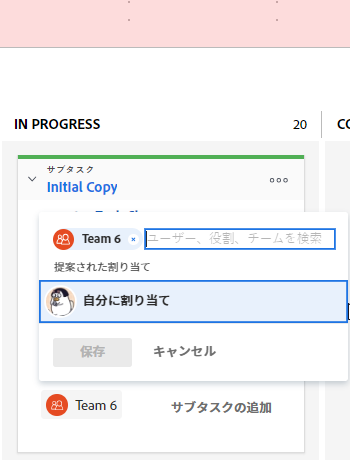

# [!UICONTROL スクラム]ボード上のストーリーへのユーザーの割り当て

## アクセス要件

+++ 展開すると、この記事の機能のアクセス要件が表示されます。

この記事の手順を実行するには、次のアクセス権が必要です。

<table style="table-layout:auto"> 
 <tbody> 
  <tr> 
   <td role="rowheader">[!DNL Adobe Workfront] プラン*</td> 
   <td> 
任意
 </td> 
  </tr> 
  <tr> 
   <td role="rowheader">[!DNL Adobe Workfront] ライセンス</td> 
   <td> 
新規：[!UICONTROL Standard]
 
   または
   
現在：[!UICONTROL Work] 以上
 </td> 
  </tr>
 </tbody> 
</table>

詳しくは、[Workfront ドキュメントのアクセス要件](/help/quicksilver/administration-and-setup/add-users/access-levels-and-object-permissions/access-level-requirements-in-documentation.md)を参照してください。

+++

## [!UICONTROL スクラム]ボード上のストーリーへのユーザーの割り当て

{{step1-to-team}}

1. （オプション）**[!UICONTROL チームを切り替え]**&#x200B;アイコン  をクリックし、ドロップダウンメニューから新しい[!UICONTROL スクラム]チームを選択するか、検索バーでチームを検索します。

1. ユーザーを割り当てるストーリーボードを含むアジャイルイテレーションまたはプロジェクトに移動します。 イテレーションに移動する方法については、[イテレーションの表示](../../../agile/use-scrum-in-an-agile-team/iterations/view-iteration.md)を参照してください。
1. ユーザーを追加するストーリーボードのストーリータイルに移動します。
1. ストーリータイル（または既に割り当てられている場合はユーザーアバター）上のチームアバターをクリックし、ストーリーに割り当てるユーザーの名前を入力してから、名前が表示されたらその名前をクリックします。 おすすめユーザーを選択することもできます。

   >[!TIP]
   >
   >また、ストーリーに担当業務を割り当てることもできます。 割り当てることができるのは、アクティブなユーザーとアクティブな役割のみです。

   
