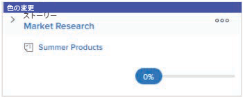
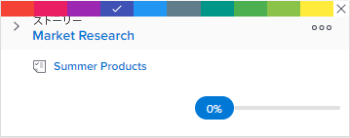

# ストーリーを [!UICONTROL スクラム] ボード

## ストーリーの既定の色の関連付けを変更する

ストーリーのデフォルトの色の関連付けは、ストーリーボードが繰り返しに配置されているか、プロジェクトに配置されているかによって異なります。

* **[!UICONTROL 反復]**:繰り返しでは、ストーリーボードのタイルは、ストーリーが関連付けられているプロジェクトに応じて色分けされます。 （各プロジェクトには、任意にストーリーボード上の色が割り当てられます）。 このデフォルトの動作は、アジャイルチームごとに変更できます。 反復でのアジャイルストーリーの色は、プロジェクト（デフォルト）、ストーリーの優先度、所有者、自由形式に関連付けることができます。 詳しくは、 [アジャイルストーリーボード上のストーリーに対してカラーインジケーターを使用する方法を設定する](../../../agile/get-started-with-agile-in-workfront/configure-scrum.md#configur4) 記事内 [スクラムの設定](../../../agile/get-started-with-agile-in-workfront/configure-scrum.md).

* **[!UICONTROL プロジェクト]**:プロジェクトでは、サブタスクは親タスクの色に一致するので、特定のスイムレーン内のすべてのストーリーの色が同じになります。 色は、タスクにサブタスクがない場合や親タスクがない場合に、タスクを作成するときにランダムにタスクに割り当てられます。 このデフォルトの動作は、アジャイルビューを変更することで変更できます。 プロジェクト上の俊敏なストーリーの色は、親ストーリー（デフォルト）、ストーリーの優先度、所有者または自由形式に結び付けることができます。 詳しくは、 [の作成またはカスタマイズ [!UICONTROL アジャイル] 表示](../../../reports-and-dashboards/reports/reporting-elements/views-overview.md#customizing-an-agile-view) in [表示の概要 ( [!DNL Adobe Workfront]](../../../reports-and-dashboards/reports/reporting-elements/views-overview.md).

## アクセス要件

この記事の手順を実行するには、次のアクセス権が必要です。

<table style="table-layout:auto"> 
 <col> 
 </col> 
 <col> 
 </col> 
 <tbody> 
  <tr> 
   <td role="rowheader"><strong>[!DNL Adobe Workfront] 計画*</strong></td> 
   <td> 
任意
 </td> 
  </tr> 
  <tr> 
   <td role="rowheader"><strong>[!DNL Adobe Workfront] ライセンス*</strong></td> 
   <td> 
[!UICONTROL Work] 以降
 </td> 
  </tr> 
  <tr> 
   <td role="rowheader"><strong>アクセスレベル設定*</strong></td> 
   <td> 
[!UICONTROL Worker] 以降
 
注意：まだアクセス権がない場合は、 [!DNL Workfront] 管理者（アクセスレベルに追加の制限を設定している場合） を参照してください。 [!DNL Workfront] 管理者は、 <a href="../../../administration-and-setup/add-users/configure-and-grant-access/create-modify-access-levels.md" class="MCXref xref">カスタムアクセスレベルの作成または変更</a>.
 </td> 
  </tr> 
 </tbody> 
</table>

&#42;ご利用のプラン、ライセンスの種類、アクセス権を確認するには、 [!DNL Workfront] 管理者。

## フリーフォームを使用する場合のストーリーの色の変更

アジャイルチームの設定が設定されている場合、 [!UICONTROL カードの色の関連付け先] オプションが [!UICONTROL フリーフォーム]を使用すると、個々のストーリータイルの色を手動で変更できます。 これは、チームや組織にとって重要な他のタイプの情報を伝えるのに役立ちます。

1. 次をクリック： **[!UICONTROL メインメニュー]** アイコン  右上隅に [!DNL Adobe] Workfront、 **[!UICONTROL チーム]**.

1. （オプション） **[!UICONTROL チームの切り替え]** アイコン をクリックし、ドロップダウンメニューから新しいスクラムチームを選択するか、検索バーでチームを検索します。

1. 左のパネルで、「 」を選択します。 **[!UICONTROL 反復]** 特定の反復を選択するには、または **[!UICONTROL 現在の反復]**.
1. ストーリータイルの上部にある色付きのバナーの上にマウスポインターを置きます。

   

1. クリック **[!UICONTROL 色を変更]**&#x200B;をクリックし、目的の色を選択します。

   
