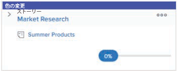

# [!UICONTROL スクラム]ボードでのストーリーの色分け

## ストーリーのデフォルト色分けの変更

ストーリーのデフォルトの色分けは、ストーリーボードが反復に配置されているかプロジェクトに配置されているかによって異なります。

* **[!UICONTROL イテレーション]**：イテレーションでは、ストーリーボードのタイルは、ストーリーが関連付けられているプロジェクトに従って色分けされます。（ストーリーボードでは、各プロジェクトに任意のカラーが割り当てられます）。 このデフォルトの動作は、アジャイルチームごとに変更できます。 イテレーション上のアジャイルストーリーのカラーは、プロジェクト（デフォルト）、ストーリーの優先度、所有者、または自由形式に関連付けることができます。 詳細については、記事[スクラムの構成](../../../agile/get-started-with-agile-in-workfront/configure-scrum.md#configur4)の[アジャイルストーリー掲示板でのストーリーに対するカラーインジケーターの使用方法の構成](../../../agile/get-started-with-agile-in-workfront/configure-scrum.md)を参照してください。

* **[!UICONTROL プロジェクト]**：プロジェクトでは、サブタスクは親タスクの色と一致するので、特定のスイムレーン内のストーリーの色はすべて同じになります。サブタスクや親タスクがないタスクの色は、タスクを作成するときにランダムに割り当てられます。この既定の動作は、アジャイルビューを変更することによって変更できます。 プロジェクト上のアジャイルストーリーのカラーは、親ストーリー（デフォルト）、ストーリーの優先度、所有者、または自由形式に関連付けることができます。 詳しくは、[ビューの概要： [!DNL Adobe Workfront]](../../../reports-and-dashboards/reports/reporting-elements/views-overview.md) の[[!UICONTROL アジャイル]ビューの作成またはカスタマイズ](../../../reports-and-dashboards/reports/reporting-elements/views-overview.md#customizing-an-agile-view)を参照してください。

## アクセス要件

+++ 展開すると、この記事の機能のアクセス要件が表示されます。

この記事の手順を実行するには、次のアクセス権が必要です。

<table style="table-layout:auto"> 
 <tbody> 
  <tr> 
   <td role="rowheader">[!DNL Adobe Workfront] プラン*</td> 
   <td> 
任意
 </td> 
  </tr> 
  <tr> 
   <td role="rowheader">[!DNL Adobe Workfront] ライセンス</td> 
   <td> 
新規：[!UICONTROL Standard]
 
   または
   
現在：[!UICONTROL Work] 以上
 </td> 
  </tr>
 </tbody> 
</table>

この表の情報について詳しくは、[Workfront ドキュメントのアクセス要件](/help/quicksilver/administration-and-setup/add-users/access-levels-and-object-permissions/access-level-requirements-in-documentation.md)を参照してください。

+++

## 自由形式を使用した場合のストーリーの色の変更

[!UICONTROL カードの色を関連付ける]オプションが[!UICONTROL 自由形式]に設定されるようにアジャイルチームの設定が構成されている場合、ユーザーは個々のストーリーのタイルの色を手動で変更できます。 これは、チームや組織にとって重要な他の種類の情報を伝えるのに役立ちます。

{{step1-to-team}}

1. （オプション）**[!UICONTROL チームを切り替え]**&#x200B;アイコン  をクリックし、ドロップダウンメニューから新しいスクラムチームを選択するか、検索バーでチームを検索します。

1. 左パネルで、「**[!UICONTROL 反復]**」を選択して特定の反復を選ぶか、「**[!UICONTROL 進行中の反復]**」を選択します。
1. ストーリータイルの上部にある色付きバナーにポインタを合わせます。

   

1. 「**[!UICONTROL 色の変更]**」をクリックし、目的の色を選択します。

   
