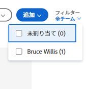

# [!UICONTROL スクラム]ボード上でユーザー別にフィルタリング

スクラムボードのフィルターを使用して、どの作業項目が他のユーザーに関連付けられ、どの作業項目が未割り当てであるかを確認できます。

## アクセス要件

+++ 展開すると、この記事の機能のアクセス要件が表示されます。

この記事の手順を実行するには、次のアクセス権が必要です。

<table style="table-layout:auto"> 
 <tbody> 
  <tr> 
   <td role="rowheader">[!DNL Adobe Workfront] プラン*</td> 
   <td> 
任意
 </td> 
  </tr> 
  <tr> 
   <td role="rowheader">[!DNL Adobe Workfront] ライセンス</td> 
   <td> 
新規：[!UICONTROL Standard]
 
   または
   
現在：[!UICONTROL Work] 以上
 </td> 
  </tr>
 </tbody> 
</table>

この表の情報について詳しくは、[Workfront ドキュメントのアクセス要件](/help/quicksilver/administration-and-setup/add-users/access-levels-and-object-permissions/access-level-requirements-in-documentation.md)を参照してください。

+++

## スクラムボード上でユーザー別にフィルタリング

{{step1-to-team}}

1. （オプション）**[!UICONTROL チームの切り替え]**&#x200B;アイコン  をクリックし、ドロップダウンメニューから新しいスクラムチームを選択するか、検索バーでチームを検索します。

1. アクティブなイテレーションに移動します。
1. [!UICONTROL スクラム]ボードの右側にある[!UICONTROL フィルター]ドロップダウンメニューをクリックします。
1. ユーザーの名前を選択するか、「**[!UICONTROL 未割り当て]**」を選択します。

>[!NOTE]
>
>列の合計は、フィルタリングの結果に基づいて変更されることはありません。列の合計は、ボード上のすべての作業アイテムの合計を表示します。

