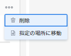

# [!UICONTROL スクラム]ボードでのストーリーとイシューの管理

ストーリーやイシューを[!UICONTROL スクラム]ボードから別のイテレーションやバックログに移動したり、[!UICONTROL スクラム]ボードから削除したりできます。ストーリーやイシューを削除すると、30 日間ごみ箱に移動され、システム管理者のみが復元できます。

## アクセス要件

この記事の手順を実行するには、次のアクセス権が必要です。

<table style="table-layout:auto"> 
 <col> 
 <col> 
 <tbody> 
  <tr> 
   <td role="rowheader"><strong>[!DNL Adobe Workfront] プラン*</strong></td> 
   <td> 
任意
 </td> 
  </tr> 
  <tr> 
   <td role="rowheader"><strong>[!DNL Adobe Workfront] ライセンス*</strong></td> 
   <td> 
[!UICONTROL Work] 以上
 </td> 
  </tr> 
  <tr> 
   <td role="rowheader"><strong>アクセスレベル設定*</strong></td> 
   <td> 
[!UICONTROL Worker] 以上
 
メモ：それでもアクセスできない場合は、アクセスレベルに追加の制限が設定されていないかどうかを [!DNL Workfront] 管理者にお問い合わせください。[!DNL Workfront] 管理者がアクセスレベルを変更する方法について詳しくは、<a href="../../../administration-and-setup/add-users/configure-and-grant-access/create-modify-access-levels.md" class="MCXref xref">カスタムアクセスレベルの作成または変更</a>を参照してください。
 </td> 
  </tr> 
  <tr> 
   <td role="rowheader"><strong>オブジェクト権限</strong></td> 
   <td> 
タスクまたはイシューへの[!UICONTROL Manage]アクセス権
 
追加のアクセス権のリクエストについて詳しくは、<a href="../../../workfront-basics/grant-and-request-access-to-objects/request-access.md" class="MCXref xref">オブジェクトへのアクセス権のリクエスト</a>を参照してください。
 </td> 
  </tr> 
 </tbody> 
</table>

&#42;ご利用のプラン、ライセンスタイプまたはアクセス権を確認するには、[!DNL Workfront] 管理者にお問い合わせください。

## [!UICONTROL スクラム]ボードからストーリーまたはイシューを移動

1. [!DNL Adobe Workfront] の右上隅にある&#x200B;**[!UICONTROL メインメニュー]**&#x200B;アイコン  をクリックし、次に「**[!UICONTROL チーム]**」をクリックします。
1. **[!UICONTROL チームの切り替え]**&#x200B;アイコン  をクリックし、ドロップダウンメニューからスクラムチームを選択するか、検索バーでチームを検索します。
1. 左パネルで、「**[!UICONTROL 反復]**」を選択して特定のイテレーションを選択するか、「**[!UICONTROL 進行中の反復]**」を選択します。
1. ストーリーまたはイシューの&#x200B;**[!UICONTROL その他]**&#x200B;アイコンをクリックし、「**[!UICONTROL 指定の場所に移動]**」を選択します。

   

1. 確認メッセージで、次のいずれかを選択します。

   <table style="table-layout:auto">
    <tr>
        <td><strong>[!UICONTROL Another iteration]</strong></td>
        <td>アイテムを別のイテレーションに移動する場合に選択し、ストーリーまたはイシューの移動先のイテレーションを選択します。今後のイテレーションが定義されていない場合は、アイテムを移動できません。</td>
    </tr>
    <tr>
        <td><strong>[!UICONTROL Backlog]</strong></td>
        <td>ストーリーまたはイシューをチームのバックログに移動する場合に選択します。</td>
    </tr>
   </table>

   >[!NOTE]
   >
   >作業アイテムの[!UICONTROL 予定開始日]と[!UICONTROL 予定完了日]は、[!UICONTROL チームを編集]ページの設定の影響を受けます。詳しくは、[スクラムの設定](../../../agile/get-started-with-agile-in-workfront/configure-scrum.md)の記事で[[!UICONTROL 作業アイテムをイテレーションに追加する際に日付を適用する方法の設定]](../../../agile/get-started-with-agile-in-workfront/configure-scrum.md#configur5)を参照してください。

1. 「**[!UICONTROL 移動]**」をクリックします。

## [!UICONTROL スクラム]ボードからストーリーまたはイシューを削除

1. [!DNL Adobe Workfront] の右上隅にある&#x200B;**[!UICONTROL メインメニュー]**&#x200B;アイコン 、「**[!UICONTROL ボード]**」の順にクリックします。
1. **[!UICONTROL チームの切り替え]**&#x200B;アイコン  をクリックしたあと、ドロップダウンメニューからスクラムチームを選択するか、検索バーでチームを検索します。
1. 左パネルで、「**[!UICONTROL 反復]**」を選択して特定のイテレーションを選択するか、「**[!UICONTROL 進行中の反復]**」を選択します。
1. ストーリーまたはイシューの&#x200B;**[!UICONTROL その他]**&#x200B;アイコンをクリックし、「**[!UICONTROL ストーリーを削除]**」または「**[!UICONTROL 問題の削除]**」を選択します。

   

1. 確認メッセージで、「**[!UICONTROL はい、削除します]**」をクリックします。
