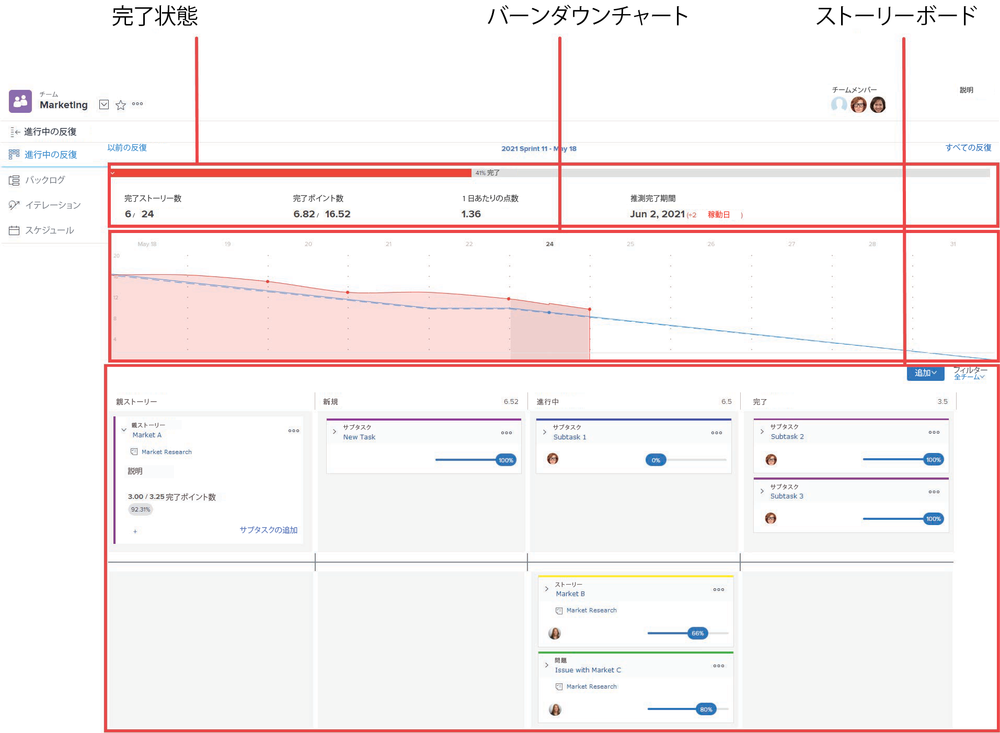
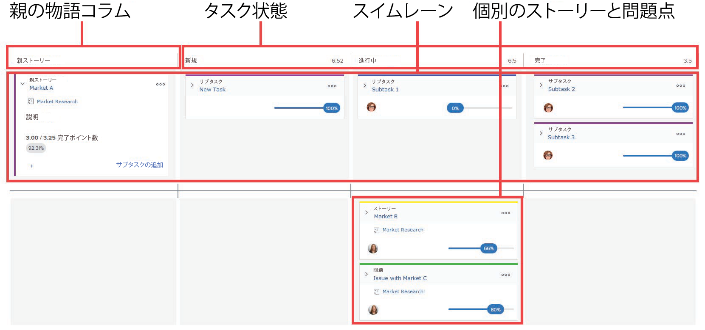
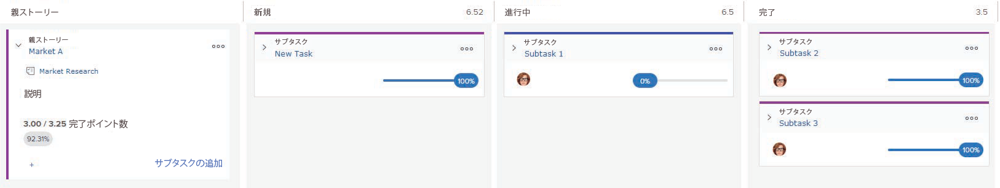

# [!UICONTROL スクラム] ボードの概要

この [!UICONTROL スクラム] アジャイルストーリーボードは、完了ステータスとバーンダウンチャートと共に表示されます。 これらのアジャイルコンポーネントは、 [!UICONTROL Adobe Workfront]:

* アジャイル反復時。 純粋なアジャイル環境（バックログと反復を使用）でのアジャイルストーリーボード、バーンダウンチャート、完了ステータスの使用について詳しくは、 [機敏な環境での作業](../../../agile/work-in-an-agile-environment/work-in-an-agile-environment.md).
* プロジェクトをアジャイルビューで表示する場合。 既存のプロジェクト内でアジャイルストーリーボード、バーンダウンチャート、完了ステータスを活用する方法について詳しくは、 [アジャイルビューでのプロジェクト管理](../../../manage-work/projects/manage-projects/manage-projects-in-agile-view.md).

## ストーリーボードのレイアウトと機能

ストーリーボードは、次の要素で構成されています。

* **[!UICONTROL 親ストーリー] 列：** ストーリーボードの他の列とは異なり、  [!UICONTROL 親ストーリー]  列はタスクステータスではなく、反復またはプロジェクト内のサブタスクを含むストーリーを格納するために存在します。 この列には、ストーリーボード上に少なくとも 1 つのサブタスクを持つ親ストーリーのみを配置できます。 親ストーリー自体は、ステータスからステータスへと、ストーリーボード全体に移動するわけではありません。

   繰り返しでは、この列はストーリーボードに表示されるのは、ストーリーボード上の 1 つ以上のストーリーに、次の要件を満たすサブタスクが 1 つ以上含まれている場合のみです。

   * 親タスクと同じアジャイルチームに割り当て済み
   * 反復に属する

      プロジェクトでは、タスクに少なくとも 1 つのサブタスクが含まれるたびに、この列が表示されます。

      

* **タスクステータス：** ストーリーのステータス列に基づいて、ストーリーが繰り返しまたはプロジェクトをどのように進んでいるかを示します。

   「アジャイルビュー」を変更して、プロジェクトに合わせてタスクステータスをカスタマイズできます ( [アジャイルビューの作成またはカスタマイズ](../../../reports-and-dashboards/reports/reporting-elements/views-overview.md#customizing-an-agile-view) in [表示の概要 ( [!UICONTROL Adobe Workfront]](../../../reports-and-dashboards/reports/reporting-elements/views-overview.md).

* **スイムレーン：** 親ストーリーとそのサブタスクがストーリーボードに表示されると、ストーリーとそのサブタスク専用のスイムレーンが作成されます。 これにより、ストーリーボード全体でストーリーのサブタスクがどのように進行しているかを視覚的に区別できます。

   繰り返しでは、スイムレーンはストーリーボード上のストーリーに、次の要件を満たすサブタスクが 1 つ以上含まれている場合にのみ、ストーリーボード上に表示されます。

   * 親タスクと同じアジャイルチームに割り当て済み
   * 反復に属する

   プロジェクトでは、スイムレーンは、タスクにサブタスクが 1 つ以上、または親タスクが 1 つ以上ある場合に常に表示されます。

* **個々のストーリー：** 個々の話や問題は、ストーリーボード上の泳ぐレーンの下に表示されます。 これは、スイムレーンの一部であるストーリーと視覚的に区別されます。

## サブタスクとストーリー間の関係

ストーリーにサブタスクが含まれている場合、親ストーリー自体の情報（ポイント/時間、パーセント完了など）を更新することはできません。 さらに、ストーリーをストーリーボードの上に移動して、ステータスを更新することはできません。 その代わりに、ストーリーのサブタスクに加えた変更がストーリーに反映されます。 すべてのサブタスクのストーリーポイントまたは時間を組み合わせて、親ストーリーのポイントまたは時間を指定します。

例えば、ストーリーに 4 ポイントのサブタスクが 1 つしかない場合、ストーリー自体にも 4 ポイントが割り当てられます。 サブタスクポイントの値を 3 に変更すると、親ストーリーのポイントの値が 3 に変更されます。 同じストーリーに別のサブタスクを作成し、そのサブタスクのポイント値を 4 に設定した場合、両方のサブタスクの結合ポイント値を反映するために、ストーリーのポイント値が 7 に変更されます。

この同じロジックは、第 2 レベルのサブタスク（サブタスクのサブタスク）にも適用されます。 サブタスクに第 2 レベルのサブタスクが 1 つ以上ある場合、サブタスクは第 2 レベルのサブタスクに基づいて計算されます。

## ストーリーボードとバックログの関係

>[!NOTE]
>
>この節の情報は、反復処理のアジャイルビューにのみ適用されます。プロジェクトのアジャイルビューでは、バックログは使用されません。 ( イテレーションとプロジェクトでのアジャイルビューの違いについて詳しくは、 [!UICONTROL アジャイル] View on a Project verses on an Iteration » ( [アジャイルビューでのプロジェクト管理](../../../manage-work/projects/manage-projects/manage-projects-in-agile-view.md).)

反復バックログには、見積もりを設定できるストーリーまたはサブタスクのみが表示されます。 親ストーリーに、ストーリーボードに表示されるサブタスクがある場合（同じアジャイルチームに割り当てられ、イテレーションに属しているため）、親タスクはバックログに表示されません。 この場合、バックログにはサブタスクのみが表示され、ストーリーボードにはサブタスクと親ストーリーが表示されます。

例えば、ストーリー A にサブタスク 1 とサブタスク 2 が含まれ、両方のサブタスクが同じアジャイルチームに割り当てられているとします。 この場合、Story A は Subtask 1 と Subtask 2 と共にスイムレーンのストーリーボードに表示されます。 ただし、バックログには Subtask 1 と Subtask 2 のみが表示されます。

この同じロジックは、第 2 レベルのサブタスク（サブタスクのサブタスク）にも適用されます。 サブタスクに同じアジャイルチームに 1 つ以上の第 2 レベルのサブタスクが割り当てられ、その反復に属している場合、第 2 レベルのサブタスクのみがバックログに表示されます。

バックログの詳細については、 [アジャイルバックログの管理](../../../agile/work-in-an-agile-environment/manage-the-agile-backlog.md).
