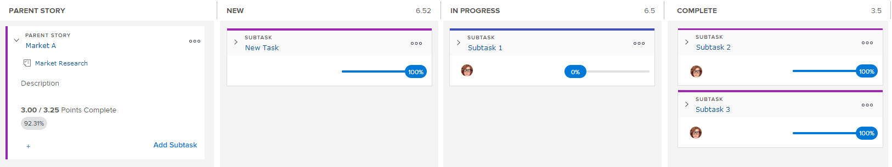

# [!UICONTROL スクラム]ボードの概要

<!-- Audited: 5/2025 -->

[!UICONTROL &#x200B; スクラム &#x200B;] アジャイルストーリーボードは、完了ステータスとバーンダウンチャートとともに表示されます。 これらのアジャイルコンポーネントは、[!UICONTROL Adobe Workfront]の次の状況で使用できます。

* ヒントが得られると思います。 純粋なアジャイル環境（バックログとイテレーションを含む）でアジャイルストーリーボード、バーンダウンチャート、完了ステータスを使用する方法について詳しくは、[&#x200B; アジャイル環境での作業](../../../agile/work-in-an-agile-environment/work-in-an-agile-environment.md)を参照してください。
* アジャイルビューでプロジェクトを表示する場合。 既存のプロジェクト内でアジャイルストーリーボード、バーンダウンチャート、完了ステータスを活用する方法について詳しくは、[&#x200B; アジャイルビューでのプロジェクトの管理](../../../manage-work/projects/manage-projects/manage-projects-in-agile-view.md)を参照してください。

## ストーリーボードのレイアウトと機能

ストーリーボードは、以下の要素で構成されます。

* **親ストーリー列**: ストーリーボードの他の列とは異なり、[!UICONTROL 親ストーリー]列はタスクステータスではなく、イテレーションまたはプロジェクトにサブタスクを含むストーリーを格納するために存在します。 ストーリー ボード上に少なくとも 1 つのサブタスクを持つ親ストーリーのみが、この列に格納できます。親ストーリー自体は、ステータスからステータスへと、ストーリーボード全体にわたって移動するわけではありません。

  イテレーションでは、この列がストーリーボードに表示されるのは、ストーリーボード上の 1 つ以上のストーリーに、以下の要件を満たすサブタスクが 1 つ以上含まれている場合のみです。

   * 親タスクと同じアジャイルチームに割り当てられます。
   * イテレーションに属します。

     プロジェクトでは、タスクに 1 つ以上のサブタスクが含まれている場合に、この列が表示されます。

     

* **タスクのステータス**: ストーリーがどのステータス列にあるかに基づいて、ストーリーがイテレーションまたはプロジェクトをどのように進めているかを示します。

  タスクのステータスは、アジャイルビューを変更することで、プロジェクトに合わせてカスタマイズできます。

* **スイムレーン**：親ストーリーとそのサブタスクがストーリーボードに表示されると、ストーリーとそのサブタスク専用のスイムレーンが作成されます。 これにより、ストーリーのサブタスクがストーリーボード全体でどのように進行しているかを、視覚的に区別できるようになります。

  イテレーションでは、スイムレーンがストーリーボードに表示されるのは、ストーリーボード上の 1 つ以上のストーリーに、以下の要件を満たすサブタスクが 1 つ以上含まれている場合のみです。

   * 親タスクと同じアジャイルチームに割り当てられます。
   * イテレーションに属します。

  プロジェクトでは、スイムレーンは、タスクにサブタスクが 1 つ以上、または親タスクが 1 つある場合に表示されます。

* **個々のストーリー**：個々のストーリーとイシューが、ストーリーボードのスイムレーンの下に表示されます。 これにより、スイムレーンの一部であるストーリーとは、視覚的に区別されます。

## サブタスクとストーリー間の関係

ストーリーにサブタスクが含まれている場合、親ストーリー自体に関する情報（ポイント/時間や完了率など）を更新することはできません。 さらに、ストーリーをストーリーボード全体に移動してステータスを更新することはできません。 ストーリーのサブタスクに加えた変更がストーリーに反映されます。すべてのサブタスクのストーリーポイントまたは時間を合計したものが、親ストーリーのポイントまたは時間になります。

例えば、ストーリーに 4 ポイントのサブタスクが 1 つだけある場合、ストーリー自体も 4 ポイントとなります。サブタスクポイントの値を 3 に変更すると、親ストーリーのポイントの値が 3 に変わります。同じストーリーに別のサブタスクを作成し、そのサブタスクのポイント値を 4 に設定した場合、両方のサブタスクの合計ポイント値を反映して、ストーリーのポイント値は 7 に変わります。

この同じロジックは、第 2 レベルのサブタスク（サブタスクのサブタスク）にも適用されます。サブタスクに第 2 レベルのサブタスクが 1 つ以上ある場合、サブタスクは第 2 レベルのサブタスクに基づいて計算されます。

## ストーリーボードとバックログの関係

イテレーションバックログには、見積もりを設定できるストーリーやサブタスクのみが表示されます。親ストーリーに、ストーリーボードに表示されるサブタスクがある場合（同じアジャイルチームに割り当てられ、イテレーションに属しているため）、親タスクはバックログに表示されません。 この状況では、サブタスクのみがバックログに表示されますが、ストーリーボードにはサブタスクと親ストーリーが表示されます。

例えば、ストーリーAにサブタスク 1とサブタスク 2が含まれている（両方のサブタスクが同じアジャイルチームに割り当てられている）とします。 この状況では、ストーリー A は、サブタスク 1 とサブタスク 2 を持つスイムレーン内のストーリーボードに表示されます。ただし、バックログにはサブタスク 1 とサブタスク 2 のみが表示されます。

この同じロジックは、第 2 レベルのサブタスク（サブタスクのサブタスク）にも適用されます。サブタスクに1つ以上のセカンドレベルサブタスクが同じアジャイルチームに割り当てられ、イテレーションに属している場合、バックログには2番目のレベルサブタスクのみが表示されます。

バックログについて詳しくは、[&#x200B; アジャイルバックログの管理](../../../agile/work-in-an-agile-environment/manage-the-agile-backlog.md)を参照してください。
