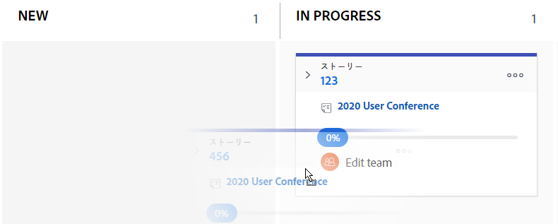

# ストーリーとサブタスクのステータスを [!UICONTROL スクラム] ボード

ストーリーのステータスをアジャイルストーリーボードから直接変更し、ストーリーが反復またはプロジェクトを通じてどのように進んでいるかを反映させることができます。

>[!NOTE]
>
>選択したステータスのみ [!UICONTROL ストーリーボード] チーム設定領域のセクションは、 [!UICONTROL スクラム] ボードとステータスドロップダウンメニュー 詳しくは、 [スクラムの設定](../../../agile/get-started-with-agile-in-workfront/configure-scrum.md).

## アクセス要件

この記事の手順を実行するには、次のアクセス権が必要です。

<table style="table-layout:auto"> 
 <col> 
 </col> 
 <col> 
 </col> 
 <tbody> 
  <tr> 
   <td role="rowheader"><strong>[!DNL Adobe Workfront] 計画*</strong></td> 
   <td> 
任意
 </td> 
  </tr> 
  <tr> 
   <td role="rowheader"><strong>[!DNL Adobe Workfront] ライセンス*</strong></td> 
   <td> 
[!UICONTROL Work] 以降
 </td> 
  </tr> 
  <tr> 
   <td role="rowheader"><strong>アクセスレベル設定*</strong></td> 
   <td> 
[!UICONTROL Worker] 以降
 
注意：まだアクセス権がない場合は、 [!DNL Workfront] 管理者（アクセスレベルに追加の制限を設定している場合） を参照してください。 [!DNL Workfront] 管理者は、 <a href="../../../administration-and-setup/add-users/configure-and-grant-access/create-modify-access-levels.md" class="MCXref xref">カスタムアクセスレベルの作成または変更</a>.
 </td> 
  </tr> 
 </tbody> 
</table>

&#42;ご利用のプラン、ライセンスの種類、アクセス権を確認するには、 [!DNL Workfront] 管理者。

## ストーリーまたはサブタスクのステータスを更新

1. 次をクリック： **[!UICONTROL メインメニュー]** アイコン  右上隅に [!DNL Adobe Workfront]を選択し、「 **[!UICONTROL チーム]**.

1. （オプション） **[!UICONTROL チームの切り替え]** アイコン をクリックし、ドロップダウンメニューから新しいスクラムチームを選択するか、検索バーでチームを検索します。

1. アクティブな反復に移動します。
1. ストーリーボードのあるステータス列から別の列にストーリーをドラッグします。\
   
