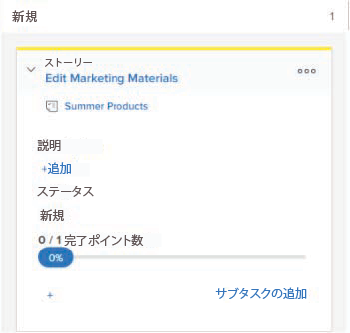

# ストーリー情報の表示と編集 [!UICONTROL スクラム] ボード

## 表示および編集できる情報を理解する

ストーリーボード上のストーリータイルを表示する場合、次の表の情報を使用できます。 ほとんどの情報は、ストーリータイルから直接、インラインで編集できます。

<table style="table-layout:auto"> 
 <col> 
 <col> 
 <col> 
 <thead> 
  <tr> 
   <th><strong>情報</strong> </th> 
   <th><strong>表示</strong> </th> 
   <th><strong>編集可能なインライン</strong> </th> 
  </tr> 
 </thead> 
 <tbody> 
  <tr> 
   <td>タスクまたはイシューへの直接リンクを含むストーリー名</td> 
   <td>✓</td> 
   <td> </td> 
  </tr> 
  <tr> 
   <td> 
プロジェクトに直接リンクされたプロジェクト名 このリンクは、反復でアジャイルビューを使用する場合に、ストーリー（サブタスクではなく親タスク）にのみ表示されます。プロジェクトでアジャイルビューを使用する場合は表示されません。
 </td> 
   <td>✓ </td> 
   <td> </td> 
  </tr> 
  <tr> 
   <td> 
ストーリーの完了ポイント数または完了時間数と、ストーリーに割り当てられたポイント数または時間数 これらの数値は、各ストーリーの [!UICONTROL 完了率 ] の計算と表示に使用されます。
 </td> 
   <td>✓</td> 
   <td>✓</td> 
  </tr> 
  <tr> 
   <td> 
各ストーリーおよびイシューの [!UICONTROL パーセント完了 ]。 繰り返しの [!UICONTROL パーセント完了 ] は、各ストーリーの [!UICONTROL パーセント完了 ] に基づいて計算されます。
 
ストーリーまたはイシューの [!UICONTROL パーセント完了 ] を更新する際に、0 ～ 100 の任意の数を選択できます。
 </td> 
   <td>✓</td> 
   <td>✓</td> 
  </tr> 
  <tr> 
   <td> 
ストーリーの担当者
 </td> 
   <td>✓</td> 
   <td>✓</td> 
  </tr> 
  <tr> 
   <td> 
タイルの色またはカテゴリ
 </td> 
   <td>✓</td> 
   <td>✓</td> 
  </tr> 
  <tr> 
   <td> 
「[!UICONTROL Agile] ビューの作成とカスタマイズ」( <a href="../../../reports-and-dashboards/reports/reporting-elements/views-overview.md" class="MCXref xref">[!UICONTROL Adobe Workfront] の表示の概要</a>.
 </td> 
   <td>✓</td> 
   <td>✓</td> 
  </tr> 
 </tbody> 
</table>

## アクセス要件

この記事の手順を実行するには、次のアクセス権が必要です。

<table style="table-layout:auto"> 
 <col> 
 </col> 
 <col> 
 </col> 
 <tbody> 
  <tr> 
   <td role="rowheader"><strong>[!DNL Adobe Workfront] 計画*</strong></td> 
   <td> 
任意
 </td> 
  </tr> 
  <tr> 
   <td role="rowheader"><strong>[!DNL Adobe Workfront] ライセンス*</strong></td> 
   <td> 
[!UICONTROL Work] 以降
 </td> 
  </tr> 
  <tr> 
   <td role="rowheader"><strong>アクセスレベル設定*</strong></td> 
   <td> 
[!UICONTROL Worker] 以降
 
注意：まだアクセス権がない場合は、 [!DNL Workfront] 管理者（アクセスレベルに追加の制限を設定している場合） を参照してください。 [!DNL Workfront] 管理者はアクセスレベルを変更できます。詳しくは、 <a href="../../../administration-and-setup/add-users/configure-and-grant-access/create-modify-access-levels.md" class="MCXref xref">カスタムアクセスレベルの作成または変更</a>.
 </td> 
  </tr> 
  <tr> 
   <td role="rowheader"><strong>オブジェクト権限</strong></td> 
   <td> 
タスクまたはイシューへのアクセスを編集
 
追加のアクセス権のリクエストについて詳しくは、 <a href="../../../workfront-basics/grant-and-request-access-to-objects/request-access.md" class="MCXref xref">オブジェクトへのアクセスのリクエスト </a>.
 </td> 
  </tr> 
 </tbody> 
</table>

&#42;ご利用のプラン、ライセンスの種類、アクセス権を確認するには、 [!DNL Workfront] 管理者。

## ストーリータイルの情報の表示と編集

1. 次をクリック： **[!UICONTROL メインメニュー]** アイコン  右上隅に [!DNL Adobe Workfront]を選択し、「 **[!UICONTROL チーム]**.

1. （オプション） **[!UICONTROL チームの切り替え]** アイコン をクリックし、ドロップダウンメニューから新しいスクラムチームを選択するか、検索バーでチームを検索します。

1. 左のパネルで、「 」を選択します。 **[!UICONTROL 反復]** 特定の反復を選択するには、または **[!UICONTROL 現在の反復]**.

1. 次に移動： [!UICONTROL スクラム] アジャイルストーリーボード。
1. を展開します。 [!UICONTROL ストーリー] タイルを使用して、ストーリーに関連するすべてのフィールドを表示します。

   

1. （オプション）フィールドを編集するには、フィールドをクリックして、変更を加えます。

   必ず [!UICONTROL 編集] ストーリータイルを編集するタスクまたはイシューに対する権限

>[!NOTE]
>
>次の手順で [!UICONTROL 完了率]に値を入力する場合は、0 ～ 100 の数値を入力する必要があります。 このフィールドは、動かすことのできるスライダーではありません。
