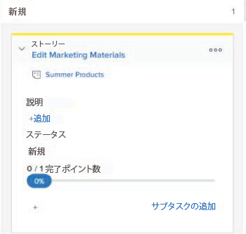

# [!UICONTROL スクラム]のボードのストーリー情報の表示と編集

## 表示および編集できる情報について

ストーリーボード上のストーリータイルを表示する場合、次の表の情報を使用できます。 ほとんどの情報は、ストーリータイルから直接、インラインで編集できます。

<table style="table-layout:auto"> 
 <col> 
 <col> 
 <col> 
 <thead> 
  <tr> 
   <th><strong>情報</strong> </th> 
   <th><strong>表示されている</strong> </th> 
   <th><strong>インラインで編集可能</strong> </th> 
  </tr> 
 </thead> 
 <tbody> 
  <tr> 
   <td>タスクまたはイシューへの直接リンクを含むストーリー名</td> 
   <td>✓</td> 
   <td> </td> 
  </tr> 
  <tr> 
   <td> 
プロジェクトに直接リンクするプロジェクト名 このリンクは、イテレーションでアジャイルビューを使用する場合はストーリー（親タスクではなく、サブタスク）にのみ表示されます。プロジェクトでアジャイルビューを使用する場合は表示されません。
 </td> 
   <td>✓ </td> 
   <td> </td> 
  </tr> 
  <tr> 
   <td> 
ストーリー上で完了したポイントまたは時間の数、およびストーリーに割り当てられたポイントまたは時間の数 これらの数値は、それぞれのストーリーの [!UICONTROL Percent CompletePercent Complete] を計算して表示するために使用されます。
 </td> 
   <td>✓</td> 
   <td>✓</td> 
  </tr> 
  <tr> 
   <td> 
それぞれのストーリーおよびイシューの [!UICONTROL Percent Complete]。 イテレーションの [!UICONTROL The Percent CompletePercent Complete] は、それぞれのストーリーの [!UICONTROL Percent CompletePercent Complete] に基づいて計算されます。
 
ストーリーまたはイシューの [!UICONTROL Percent Complete] を更新する際に、0 と 100 の間の任意の数を選択できます。
 </td> 
   <td>✓</td> 
   <td>✓</td> 
  </tr> 
  <tr> 
   <td> 
ストーリーの担当者
 </td> 
   <td>✓</td> 
   <td>✓</td> 
  </tr> 
  <tr> 
   <td> 
タイルのカラーまたはカテゴリ
 </td> 
   <td>✓</td> 
   <td>✓</td> 
  </tr> 
  <tr> 
   <td> 
[!UICONTROL Adobe Workfront]</a>の「<a href="../../../reports-and-dashboards/reports/reporting-elements/views-overview.md" class="MCXref xref"> ビューの概要」の「アジャイルビューの作成とカスタマイズ」で説明されているように、アジャイルビューを変更してアジャイルビューに追加された可能性のある追加フィールド（カスタムフィールドを含む）です。
 </td> 
   <td>✓</td> 
   <td>✓</td> 
  </tr> 
 </tbody> 
</table>

## アクセス要件

+++ 展開すると、この記事の機能のアクセス要件が表示されます。

この記事の手順を実行するには、次のアクセス権が必要です。

<table style="table-layout:auto"> 
 <tbody> 
  <tr> 
   <td role="rowheader">[!DNL Adobe Workfront] プラン*</td> 
   <td> 
任意
 </td> 
  </tr> 
  <tr> 
   <td role="rowheader">[!DNL Adobe Workfront] ライセンス</td> 
   <td> 
新規：[!UICONTROL Standard]
 
   または
   
現在：[!UICONTROL Work] 以上
 </td> 
  </tr>
   <tr> 
   <td role="rowheader">オブジェクト権限</td> 
   <td>[!UICONTROL Contribute]または[!UICONTROL Manage] タスクまたは問題へのアクセス</td> 
  </tr>
 </tbody> 
</table>

詳しくは、[Workfront ドキュメントのアクセス要件](/help/quicksilver/administration-and-setup/add-users/access-levels-and-object-permissions/access-level-requirements-in-documentation.md)を参照してください。

+++

## ストーリータイルの情報の表示と編集

{{step1-to-team}}

1. （オプション）**[!UICONTROL チームを切り替え]**&#x200B;アイコン  をクリックし、ドロップダウンメニューから新しいスクラムチームを選択するか、検索バーでチームを検索します。

1. 左パネルで、「**[!UICONTROL 反復]**」を選択して特定の反復を選ぶか、「**[!UICONTROL 進行中の反復]**」を選択します。

1. [!UICONTROL &#x200B; スクラム &#x200B;] アジャイルストーリーボードに移動します。
1. [!UICONTROL ストーリー]タイルを展開して、ストーリーに関連するすべてのフィールドを表示します。

   

1. （オプション）フィールドを編集するには、フィールドをクリックして、変更を加えます。

   ストーリータイルを編集するには、タスクまたはイシューに対する[!UICONTROL 編集]権限が必要です。

>[!NOTE]
>
>[!UICONTROL 完了率]を変更する場合は、0 から 100 の間の数値を入力する必要があります。 フィールドは移動できるスライダーではありません。
