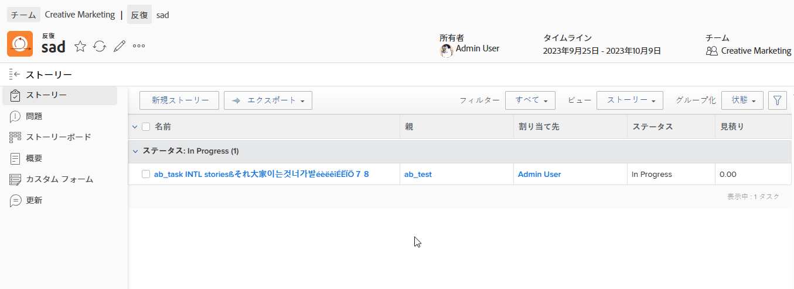

# 俊敏なストーリーを作成

さまざまな方法で、1 つの反復で俊敏なストーリーを作成できます。 俊敏なストーリーを作成した後、ストーリーにサブタスクを追加できます。

ストーリーまたはサブタスクを繰り返し追加する場合、「期間タイプ」は [!UICONTROL シンプル] 「タスク制約」(Task Constraint) は「固定日付」(Fixed Dates) に設定され、その反復内で日付がロックされます。 繰り返しの期間タイプまたはタスク制約は変更できません。 また、タスクの期間は 0 分を超える値にする必要があります。

繰り返しに追加された後のストーリーの管理方法については、 [反復](../../agile/use-scrum-in-an-agile-team/iterations/iterations.md).

## アクセス要件

この記事の手順を実行するには、次のアクセス権が必要です。

<table style="table-layout:auto"> 
 <col> 
 </col> 
 <col> 
 </col> 
 <tbody> 
  <tr> 
   <td role="rowheader"><strong>[!DNL Adobe Workfront] 計画*</strong></td> 
   <td> 
任意
 </td> 
  </tr> 
  <tr> 
   <td role="rowheader"><strong>[!DNL Adobe Workfront] ライセンス*</strong></td> 
   <td> 
[!UICONTROL Work] 以降
 </td> 
  </tr> 
  <tr> 
   <td role="rowheader"><strong>アクセスレベル設定*</strong></td> 
   <td> 
[!UICONTROL Worker] 以降
 
注意：まだアクセス権がない場合は、 [!DNL Workfront] 管理者（アクセスレベルに追加の制限を設定している場合） を参照してください。 [!DNL Workfront] 管理者はアクセスレベルを変更できます。詳しくは、 <a href="../../administration-and-setup/add-users/configure-and-grant-access/create-modify-access-levels.md" class="MCXref xref">カスタムアクセスレベルの作成または変更</a>.
 </td> 
  </tr> 
  <tr> 
   <td role="rowheader"><strong>オブジェクト権限</strong></td> 
   <td> 
[!UICONTROL ストーリーが存在するプロジェクトへの [!UICONTROL 管理 ] アクセス権
 
追加のアクセス権のリクエストについて詳しくは、 <a href="../../workfront-basics/grant-and-request-access-to-objects/request-access.md" class="MCXref xref">オブジェクトへのアクセスのリクエスト </a>.
 </td> 
  </tr> 
 </tbody> 
</table>

&#42;ご利用のプラン、ライセンスの種類、アクセス権を確認するには、 [!DNL Workfront] 管理者。

## 反復での俊敏なストーリーの作成

1. ストーリーを作成するアジャイルな反復に移動します。

   1. 次をクリック： **[!UICONTROL メインメニュー]** アイコン  右上隅に [!DNL Adobe Workfront]を選択し、「 **[!UICONTROL チーム]**.

   1. （オプション） **[!UICONTROL チームの切り替え]** アイコン をクリックし、ドロップダウンメニューから新しいスクラムチームを選択するか、検索バーでチームを検索します。

   1. 左のパネルで、「 」を選択します。 **[!UICONTROL 反復]** 特定の反復を選択するには、または **[!UICONTROL 現在の反復]**.
   1. ストーリーを作成する特定の反復の名前をクリックします。

   

1. クリック **[!UICONTROL 新しいストーリー].**
1. 次の情報を指定します。

   <table style="table-layout:auto">
    <col>
    <col>
    <tbody>
     <tr>
      <td role="rowheader"><strong>[!UICONTROL ストーリー名 ]</strong></td>
      <td>ストーリーの名前を入力します。</td>
     </tr>
     <tr>
      <td role="rowheader"><strong>[!UICONTROL 説明 ]</strong></td>
      <td>ストーリーの説明を入力します。</td>
     </tr>
     <tr>
      <td role="rowheader"><strong>[!UICONTROL 準備完了 ]</strong></td>
      <td>ストーリーを反復に追加する準備が整ったら、このオプションを選択します。 このオプションを選択すると、バックログ内のどのストーリーを反復に追加する準備ができているかをユーザーに示します。 ストーリーは、マークされているかどうかに関わらず、繰り返しに追加できます <strong>[!UICONTROL 準備完了 ]。</strong></td>
     </tr>
     <tr>
      <td role="rowheader"><strong>[!UICONTROL 予測 ] （ポイント）</strong></td>
      <td>ストーリーの推定を指定します。 アジャイルチームがストーリーをポイント単位で推定するように設定されている場合、デフォルトでは 1 ポイントが 8 時間になります。 見積もりは、ストーリーに [!UICONTROL 予定時間 ] として追加されます。 例えば、あるストーリーを 3 ポイントと見積もる場合、デフォルトの動作では、ストーリーに 24 時間（計画時間）を追加します。 ストーリーにサブタスクが含まれる場合は、すべてのサブタスクの合計見積もりで親ストーリーの見積もりが決まることに注意してください。 詳しくは、 <a href="../../agile/use-scrum-in-an-agile-team/iterations/add-stories-to-existing-iteration.md" class="MCXref xref">既存の反復にストーリーを追加する</a>.</td>
     </tr>
     <tr>
      <td role="rowheader"><strong>[!UICONTROL 親プロジェクト ]</strong></td>
      <td>このストーリーを関連付けるプロジェクトの名前を入力します。 デフォルトでは、ストーリーの色は、このプロジェクトの他のストーリーと同じ色で表示されます。 プロジェクトのステータスは [!UICONTROL Current] に設定する必要があります。 プロジェクトのステータスが [!UICONTROL Current] 以外の場合は、ドロップダウンメニューに表示されません。</td>
     </tr>
     <tr>
      <td role="rowheader"><strong>[!UICONTROL 親タスク ]</strong></td>
      <td>親プロジェクトを選択した後で、親タスクを選択することもできます。 親タスクを選択すると、ストーリーは、選択したプロジェクトの親タスクのサブタスクとして作成されます。 ストーリーの親タスクの名前を入力し、ドロップダウンリストに表示されたらクリックします。</td>
     </tr>
     <tr>
      <td role="rowheader"><strong>[!UICONTROL カスタムForms]</strong></td>
      <td>ストーリーに追加するカスタムフォームを選択します。</td>
     </tr>
    </tbody>
   </table>

1. クリック **[!UICONTROL ストーリーを保存]**.

## バックログに俊敏なストーリーを作成

「アジャイルバックログ」の節で説明したように、アジャイルストーリーを作成できます [バックログに新しいストーリーを作成](../../agile/work-in-an-agile-environment/manage-the-agile-backlog.md#creating-new-stories) 記事内 [[!UICONTROL 管理] 俊敏なバックログ](../../agile/work-in-an-agile-environment/manage-the-agile-backlog.md).

## タスクまたはイシューをアジャイルストーリーとして追加

既存のタスクやイシューをストーリーとして繰り返しに追加できます。 詳しくは、 [既存の反復にストーリーを追加する](../../agile/use-scrum-in-an-agile-team/iterations/add-stories-to-existing-iteration.md) または [次の場所からストーリーと問題を追加： [!UICONTROL スクラム] ボード](../../agile/use-scrum-in-an-agile-team/scrum-board/add-story-from-scrum-board.md).

## 俊敏なストーリーに対するサブタスクの作成

次のいずれかの方法を使用して、俊敏なストーリーに対するサブタスクを作成できます。

* を使用する **[!UICONTROL サブタスク]** タブ、 [サブタスクを作成](../../manage-work/tasks/create-tasks/create-subtasks.md#creating-subtasks) in [サブタスクを作成](../../manage-work/tasks/create-tasks/create-subtasks.md).

* ストーリーボードから直接移動 [反復を作成](../../agile/use-scrum-in-an-agile-team/iterations/create-an-iteration.md).
