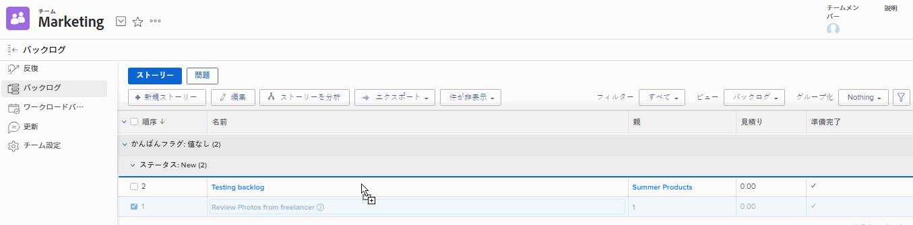
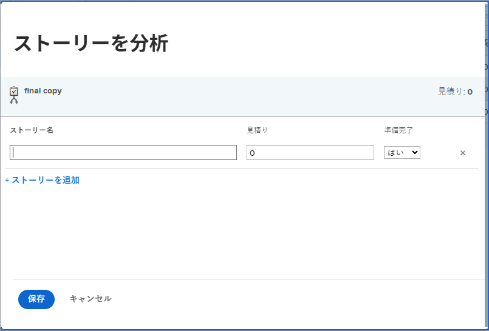
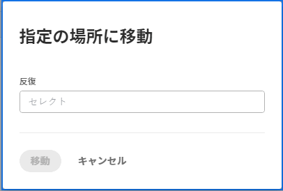

# アジャイルバックログを管理

以下の作業項目は、チームが使用しているアジャイル方法論に応じて、アジャイルチームに割り当てて、チームのバックログにストーリーとして追加できます。

* **[!UICONTROL スクラムアジャイルチーム]：** タスクとイシューをアジャイルチームに割り当て、バックログに追加できます。
* **[!UICONTROL かんばんアジャイルチーム]：** タスクをアジャイルチームに割り当て、バックログに追加できます。ユーザーは、アジャイルストーリーボードから直接バックログを表示できます（[[!UICONTROL かんばんボードへのバックログ]の追加](../../agile/use-kanban-in-an-agile-team/view-the-backlog-on-the-kanban-board.md)を参照）。チームはこのバックログを使用し、作業キューに優先順位を付けて管理します。

タスクまたはイシューは、[!DNL Adobe Workfront] の任意の場所からチームに割り当てることができます（その後、チームバックログに追加されます）。例えば、1 つのチームに複数のプロジェクトから作業割り当てを割り当てることができます。

>[!NOTE]
>
>複数のチームをバックログ項目に追加した場合、タスクまたはイシューは、プライマリチームのバックログにのみ表示されます。プライマリチームは、最初に割り当てられたチームです。

## アクセス要件

この記事の手順を実行するには、次のアクセス権が必要です。

<table style="table-layout:auto"> 
 <col> 
 </col> 
 <col> 
 </col> 
 <tbody> 
  <tr> 
   <td role="rowheader"><strong>[!DNL Adobe Workfront] プラン</strong></td> 
   <td> 
任意
 </td> 
  </tr> 
  <tr> 
   <td role="rowheader"><strong>[!DNL Adobe Workfront] ライセンス</strong></td> 
   <td> 
新規： [!UICONTROL Standard]

または

現在： [!UICONTROL Work] 以降
 </td> 
  </tr> 
  <tr> 
   <td role="rowheader"><strong>アクセスレベル設定</strong></td> 
   <td> 
新規： [!UICONTROL Standard]

または

現在： [!UICONTROL Worker] 以降
 </td> 
  </tr> 
  <tr> 
   <td role="rowheader"><strong>オブジェクト権限</strong></td> 
   <td> 
ストーリーが存在するプロジェクトへの[!UICONTROL Manage]アクセス権
  </td> 
  </tr> 
 </tbody> 
</table>

この表の情報の詳細については、 [Workfrontドキュメントのアクセス要件](/help/quicksilver/administration-and-setup/add-users/access-levels-and-object-permissions/access-level-requirements-in-documentation.md).

## バックログでのストーリーの作成と管理

* [ストーリーの並べ替え](#reorder-stories)
* [[!UICONTROL 分類] ストーリー](#break-down-stories)
* [ストーリーの編集](#edit-stories)

### ストーリーの並べ替え {#reorder-stories}

ドラッグ＆ドロップを使用して、バックログリスト内のストーリーを並べ替えることができます。

1. ストーリーの並べ替えを行うアジャイルバックログに移動します。
1. **[!UICONTROL ビュー]**&#x200B;ドロップダウンメニューで、**[!UICONTROL バックログ]**&#x200B;ビュー、または&#x200B;**[!UICONTROL 注文]**&#x200B;列を含むカスタムビューを選択します。

   >[!NOTE]
   >
   >タスクまたはイシューにアジャイルチームが割り当てられており、プロジェクトのステータスが「現在」と等しくない場合は、バックログに表示されません。ただし、注文列のバックログ数には影響します。

1. 1 つ以上のストーリーを選択し、バックログに表示する順にドラッグします。\
   

### ストーリーの分類 {#break-down-stories}

バックログ内のストーリーのサイズは異なるので、ユーザーは反復で使用可能なサイズにストーリーを分類できます。ストーリーを分類すると、ストーリーが表すタスクにサブタスクが作成され、バックログの元のタスクが置き換えられます。親タスクまたはそのサブタスクをアジャイルチームに割り当てることはできますが、両方を同時にチームに割り当てることはできません。

>[!NOTE]
>
>ストーリーを分類する際は、次の制限事項を考慮してください。
>
>* 分類できるのは、タスクを表すストーリーのみです。イシューを表すストーリーは分類できません。
>* ストーリーは、プロジェクトに関連付けられている場合にのみ分類できます。

ストーリーを分類するには：

1. 分類するストーリーが含まれているバックログに移動します。
1. 分類するストーリーを選択し、「**[!UICONTROL ストーリーを分析]**」をクリックします。\
   [!UICONTROL ストーリーを分析]ダイアログボックスが表示されます。\
   

1. ストーリーの名前と見積りを指定し、ストーリーの準備ができたかどうかを選択します。
1. 元のストーリーから別のストーリーを作成するには、「**[!UICONTROL ストーリーを追加]**」をクリックします。
1. 「**[!UICONTROL 保存]**」をクリックします。

### ストーリーの編集 {#edit-stories}

ストーリーは、 [!UICONTROL ストーリー] または [!UICONTROL 問題] プロジェクト内のタスクや問題を一括編集する場合と同様に、「バックログ」タブが表示されます。詳しくは、 [タスクを一括編集](../../manage-work/tasks/manage-tasks/edit-tasks.md#edit-tasks-in-bulk) in [タスクを編集](../../manage-work/tasks/manage-tasks/edit-tasks.md)、および [問題の編集](../../manage-work/issues/manage-issues/edit-issues.md).

## バックログでの新しいストーリーの作成 {#create-new-stories-on-the-backlog}

バックログから直接ストーリーを作成するか、既存のタスクまたはイシューをアジャイルチームに割り当てることで、バックログに新しいストーリーを作成できます。

* [バックログからストーリーを作成する](#create-a-story-from-the-backlog)
* [アジャイルチームにタスクまたはイシューを割り当てる](#assign-a-task-or-issue-to-an-agile-team)

### バックログからストーリーを作成する {#create-a-story-from-the-backlog}

バックログからストーリーを作成すると、ストーリーはタスクまたはイシューとしてプロジェクト内に作成されます。バックログからストーリーをイシューとして作成することはできません。

バックログからストーリーを作成する手順は、次のとおりです。

1. Adobe Workfront の右上隅にある&#x200B;**[!UICONTROL メインメニュー]**&#x200B;アイコン  をクリックするか、または（使用可能な場合）左上隅にある&#x200B;**[!UICONTROL メインメニュー]**&#x200B;アイコン  をクリックして、「**[!UICONTROL チーム]**」をクリックします。

1. （オプション） **[!UICONTROL チームの切り替え]** アイコン をクリックし、ドロップダウンメニューから新しいスクラムチームを選択するか、検索バーでチームを検索して、表示されたら選択します。

1. 左パネルから「**[!UICONTROL バックログ]**」を選択します。
1. タスクを作成するかイシューを作成するかに応じて、次のいずれかの操作を実行します。

   * **タスクを作成するには：**「**[!UICONTROL ストーリー]**」をクリックします。

   * **イシューを作成するには：** クリック **[!UICONTROL 問題]**.

1. 「**[!UICONTROL 新規ストーリー]**」または「**[!UICONTROL 新規イシュー]**」をクリックします。

1. 次の情報を指定します。

   <table style="table-layout:auto">
    <col>
    <col>
    <tbody>
     <tr>
      <td role="rowheader"><strong>[!UICONTROL Story Name]</strong></td>
      <td> ストーリーの名前を入力します。</td>
     </tr>
     <tr>
      <td role="rowheader"><strong>[!UICONTROL Description]</strong></td>
      <td>（オプション）ストーリーの説明を入力します。</td>
     </tr>
     <tr>
      <td role="rowheader"><strong>[!UICONTROL Ready]</strong></td>
      <td> ストーリーをイテレーションに追加する準備ができているかどうかを選択します。この設定は情報提供のみを目的としています。この設定のステータスに関係なく、ストーリーをイテレーションに追加できます。</td>
     </tr>
     <tr>
      <td role="rowheader"><strong>[!UICONTROL Estimate]</strong></td>
      <td>ストーリーのポイントまたは時間単位の推定値を指定します。見積もりはバーンダウンチャートに影響を与えます。イテレーションのバーンダウンチャートは、各ストーリーに正確な見積もりが含まれる場合にのみ正確です。（ポイントの見積もりを指定する場合は、各ポイントが表す時間数をチーム設定で既に指定している必要があります。）</td>
     </tr>
     <tr>
      <td role="rowheader"><strong>[!UICONTROL Parent Project]</strong></td>
      <td>このストーリーを作成するプロジェクトの名前の入力を開始し、ドロップダウンリストに表示されたら名前をクリックします。 プロジェクトのステータスは [!UICONTROL Current] に設定する必要があります。プロジェクトのステータスが [!UICONTROL Current] 以外の場合は、ドロップダウンメニューには表示されません。</td>
     </tr>
     <tr>
      <td role="rowheader"><strong>[!UICONTROL Parent Task]</strong></td>
      <td>（オプション）このストーリーが従属する親タスクの名前の入力を開始し、ドロップダウンリストに表示されたら、名前をクリックします。</td>
     </tr>
     <tr>
      <td role="rowheader"><strong>[!UICONTROL Custom Forms]</strong></td>
      <td> （オプション）このストーリーに追加するカスタムフォームを選択します。</td>
     </tr>
    </tbody>
   </table>

1. 「**[!UICONTROL ストーリーを保存]**」をクリックします。

### アジャイルチームにタスクまたはイシューを割り当てる {#assign-a-task-or-issue-to-an-agile-team}

アジャイルチームにタスクまたはイシューを割り当てることができます。割り当て後、タスクまたはイシューはチームバックログに新しいストーリーとして表示されます。

アジャイルチームにタスクまたはイシューを割り当てるには、次の手順に従います。

1. 割り当てるタスクが含まれているプロジェクトに移動します。
1. リストからタスクまたはイシューを選択します。
1. 「**[!UICONTROL 編集]**」をクリックします。
1. 「**[!UICONTROL 割り当て]**」をクリックします。
1. （オプション）既存の担当者を削除します。
1. 「**[!UICONTROL 割り当て先を追加]**」をクリックします。
1. タスクまたはイシューに割り当てるアジャイルチームの名前の入力を開始し、ドロップダウンリストに表示されたらチーム名をクリックします。
1. 「**[!UICONTROL 変更を保存]**」をクリックします。\
   タスクまたはイシューがチームのバックログで利用できるようになりました。

## バックログへのストーリーの移動またはバックログからのストーリーの移動

{#move-stories-from-the-backlog-to-an-iteration-or-kanban-board}

* [バックログからイテレーションまたは + ボードにストーリーを移動する](#move-stories-from-the-backlog-to-an-iteration-or--board)
* [既存のストーリーをバックログに移動する](#move-existing-stories-to-the-backlog)
* [バックログからストーリーを書き出す](#export-stories-from-the-backlog)

### バックログからイテレーションまたは + ボードにストーリーを移動する

1. アジャイルチームのバックログに移動します。
1. イテレーションまたはかんばんボードに移動するストーリーを選択し、**[!UICONTROL その他]**／**[!UICONTROL 指定の場所に移動]**&#x200B;をクリックします。\
   ストーリーを[!UICONTROL かんばん]ボードに移動すると、[!UICONTROL ストーリーをかんばんに移動]ボードが表示されます。\
   ストーリーをある反復に移動させる場合、[!UICONTROL ストーリーを反復に移動]ダイアログボックスが表示されます。\
   

1. 次のいずれかの操作を行います。

   * **スクラムチームの場合：**「**[!UICONTROL 反復の選択]**」フィールドで、ストーリーを移動する反復を選択します。

   * **かんばんチームの場合：**「**[!UICONTROL かんばんボードの選択]**」フィールドで、チームの[!UICONTROL かんばん]ボードを選択します。（かんばんチームは 1 つの[!UICONTROL かんばん]ボードのみを持つことができます。）

1. 「**[!UICONTROL ストーリーを移動]**」をクリックします。

### 既存のストーリーをバックログに移動 {#move-existing-stories-to-the-backlog}

チームがまだストーリーに取り組む準備ができていないと判断した場合は、ストーリーをバックログに移動できます。

詳しくは、[アジャイルストーリーの移動](../../agile/work-in-an-agile-environment/move-an-agile-story.md)を参照してください。

### バックログからストーリーの書き出し {#export-stories-from-the-backlog}

バックログから直接 1 つ以上のストーリー（タスクやイシューを含む）を書き出すことができます。

[データの書き出し](../../reports-and-dashboards/reports/creating-and-managing-reports/export-data.md)の説明に従って、[!DNL Workfront] でその他のデータを書き出すのと同じ方法でバックログからストーリーを書き出します。
