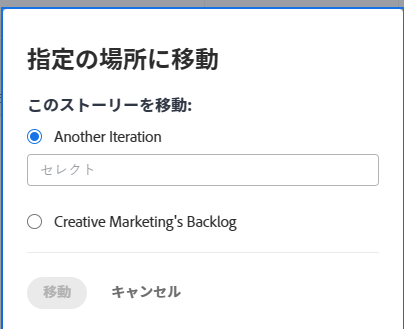

# アジャイルストーリーの移動

アジャイルストーリーは、別のイテレーション（スクラムチームの場合）またはバックログ（かんばんチームとスクラムチームの場合）に移動できます。

## アクセス要件

この記事の手順を実行するには、次のアクセス権が必要です。

<table style="table-layout:auto"> 
 <col> 
 </col> 
 <col> 
 </col> 
 <tbody> 
  <tr> 
   <td role="rowheader"><strong>[!DNL Adobe Workfront] プラン*</strong></td> 
   <td> 
任意
 </td> 
  </tr> 
  <tr> 
   <td role="rowheader"><strong>[!DNL Adobe Workfront] ライセンス*</strong></td> 
   <td> 
[!UICONTROL Work] 以上
 </td> 
  </tr> 
  <tr> 
   <td role="rowheader"><strong>アクセスレベル設定*</strong></td> 
   <td> 
[!UICONTROL Worker] 以上
 
メモ：アクセス権がない場合は、アクセスレベルに追加の制限が設定されているかを [!DNL Workfront] 管理者にお問い合わせください。[!DNL Workfront] 管理者がアクセスレベルを変更する方法について詳しくは、<a href="../../administration-and-setup/add-users/configure-and-grant-access/create-modify-access-levels.md" class="MCXref xref">カスタムアクセスレベルの作成または変更</a>を参照してください。
 </td> 
  </tr> 
  <tr> 
   <td role="rowheader"><strong>オブジェクト権限</strong></td> 
   <td> 
ストーリーに対する[!UICONTROL Manage]アクセス権
 
追加のアクセス権のリクエストについて詳しくは、<a href="../../workfront-basics/grant-and-request-access-to-objects/request-access.md" class="MCXref xref">オブジェクトへのアクセス権のリクエスト</a>を参照してください。
 </td> 
  </tr> 
 </tbody> 
</table>

&#42;ご利用のプラン、ライセンスタイプまたはアクセス権を確認するには、[!DNL Workfront] 管理者にお問い合わせください。

## イテレーションまたはかんばんボードからバックログにストーリーを移動

1. バックログに移動するストーリーが含まれる、イテレーションまたはかんばんボードに移動します。
1. ページ上部にあるイテレーションの見出しをクリックします。
1. 「**[!UICONTROL ストーリー]**」タブで、移動するストーリーを選択します。
1. **[!UICONTROL その他]**／**[!UICONTROL 指定の場所に移動]**&#x200B;をクリックします。

   **[!UICONTROL ストーリーを移動]**&#x200B;ダイアログボックスが表示されます。

   

1. *team_name* のバックログを選択します。\
   上記の例では、チーム名は「**マーケティング**」です。

1. 「**[!UICONTROL ストーリーを移動]**」をクリックします。

## ストーリーを別のイテレーションに移動

Scrum チームの別のイテレーションにストーリーを移動できます。

>[!NOTE]
>
>「**[!UICONTROL 指定の場所に移動]**」オプションは、イテレーションの親ストーリーには使用できません。サブタスクは別のイテレーションにのみ移動できます。

1. 移動するストーリーを含むイテレーションに移動します。
1. ページ上部にあるイテレーションの見出しをクリックします。
1. 「**[!UICONTROL ストーリー]**」タブで、移動するストーリーを選択します。
1. **[!UICONTROL その他]**／**[!UICONTROL 指定の場所に移動]**&#x200B;をクリックします。

   **[!UICONTROL ストーリーを移動]**&#x200B;ダイアログボックスが表示されます。

   

1. **[!UICONTROL 別のイテレーション]**&#x200B;を選択し、ドロップダウンメニューで、ストーリーを移動するイテレーションを選択します。

   >[!NOTE]
   >
   >作業アイテムの[!UICONTROL 予定開始日]と[!UICONTROL 予定完了日]は、[!UICONTROL チームの編集]ページの設定に影響されます。詳しくは、[[!UICONTROL 設定]作業アイテムをイテレーションに追加する際に日付を適用する方法](../../agile/get-started-with-agile-in-workfront/configure-scrum.md#configur5)記事の、[スクラムの設定](../../agile/get-started-with-agile-in-workfront/configure-scrum.md)を参照してください。

1. 「**[!UICONTROL ストーリーを移動]**」をクリックします。
