# Adobe App Builder を使用した Workfront のカスタムアプリケーションの作成

Adobe App Builder を活用した Workfront UI 拡張機能を使用すると、顧客およびパートナーはカスタマイズされたユーザーエクスペリエンスを作成できます。 これらのツールは、効率性を高め、シームレスで連続性のある顧客体験を提供し、ユーザー満足度を大幅に向上させ、企業独自のビジョンを実現するのに役立ちます。

たとえば、Workfront UI拡張機能がない場合、プロジェクトマネージャーは、Workfrontと別のタイムトラッキングシステムを切り替えて時間を記録する必要があるかもしれません。 UI拡張機能を利用すれば、タイムトラッキングをWorkfront体験に直接統合し、ワークフローを合理化して時間を節約できます。 さらに、カスタムコンポーネントを追加して、使いやすさを向上させ、反復的なタスクを自動化し、メタデータのタグ付けやコンテンツプレビューなどの機能を使用してコンテンツ管理を強化することもできます。 Adobe App Builderは、拡張性と堅牢なID管理（IMS）も提供し、あらゆる規模での安全で効率的なカスタマイズを実現します。

WorkfrontのUI拡張機能には、次のような重要な利点があります。

* 正確なカスタマイズ：標準的なソフトウェアインターフェイスでは、あらゆるビジネス要件を満たすことができないことがよくあります。 UI拡張機能を使用すると、開発者はデフォルトユーザーインターフェイスを変更および拡張して、特定のビジネスニーズに対応できます。
* システム統合：UI拡張機能は、他のシステムの統合を促進し、シームレスなワークフローとデータの一貫性を確保します。
* スケーラビリティ：ビジネスの成長に伴い、UI拡張機能を開発して新しい機能を追加することができます。完全なシステムの見直しを行う必要はありません。
* 開発時間の短縮：事前に構築された拡張ポイントとツールにより、カスタム機能の実装に必要な時間と労力が大幅に削減されます。
* ユーザー導入の強化：ユーザーエクスペリエンスを最適化すれば、ソフトウェアの導入を大幅に促進できます。 ユーザーの好みに合わせて設計されたカスタム UI要素は、導入率と全体的な満足度を高めることができます。
* WorkfrontのUI拡張機能を活用することで、効率性、統合、ユーザー満足度を向上させる、カスタマイズされたユーザーエクスペリエンスを構築できます。

Adobe App Builderでアプリケーションを作成した後、Workfront管理者は、レイアウトテンプレートを使用して、そのアプリケーションをWorkfrontのメインメニューと左側のナビゲーションパネルに追加できます。 レイアウトテンプレートを使用しているユーザーは、アプリケーションをクリックすると、アプリケーションを個別に開く代わりに、Workfrontに埋め込まれたアプリケーションが表示されます。

この記事では、App Builderにアクセスし、テンプレートを使用してアプリケーションを作成する方法について説明します。

レイアウトテンプレートにカスタムアプリケーションを追加する方法については、[&#x200B; レイアウトテンプレートを使用したメインメニューのカスタマイズ &#x200B;](/help/quicksilver/administration-and-setup/customize-workfront/use-layout-templates/customize-main-menu.md)および[&#x200B; レイアウトテンプレートを使用した左側のパネルのカスタマイズ &#x200B;](/help/quicksilver/administration-and-setup/customize-workfront/use-layout-templates/customize-left-panel.md)を参照してください。

## 前提条件

以下が必要です。

* IMS対応のWorkfront アカウント
* ノード v18とnpmを持つ開発マシン
* App Builder ライセンス

## Adobe App Builderへのアクセス

UI 拡張機能を作成するには、Adobe Developer Console の Adobe App Builder にアクセスできる必要があります。

その他の手順については、[Adobe Developer サイト &#x200B;](https://developer.adobe.com/uix/docs/guides/get-access/)を参照してください。

### Adobe Admin Consoleへの開発者の追加

>[!IMPORTANT]
>
>次のすべての手順で、適切なIMS組織を選択していることを確認してください。 複数の組織に属している場合は、間違った組織を選択することもできます。 適切な組織（通常は右上隅に表示）の下で行動していることを確認してください。

1. 実稼動環境に移動します。https://adminconsole.adobe.com/
1. **ユーザー** セクションで、**開発者** > **開発者を追加**&#x200B;をクリックします。

   

   >[!NOTE]
   >
   >開発者を管理するオプションが表示されない場合、開発者アクセスを許可する製品はありません。

1. ユーザーのメールアドレスを追加します。 Admin Console内から既に追加されている既存のユーザーを検索する必要があります。
1. 必要な製品を開発者プロファイルに追加し、**保存**&#x200B;をクリックします。

   

### App Builderにアクセス

企業がApp Builderを購入するには、担当のアカウントマネージャーと協力する必要があります。

AppBuilderが適切に設定されている場合は、新しいプロジェクトの作成の一環として、「テンプレートからプロジェクトを作成」が表示されます。

## Adobe Developer Consoleでの新しいプロジェクトの作成

UI拡張機能を構築するには、Adobe Developer Consoleを使用する必要があります。

その他の手順については、[Adobe Developer サイト &#x200B;](https://developer.adobe.com/uix/docs/guides/creating-project-in-dev-console/)を参照してください。

1. Adobe IDでAdobe Developer Consoleにログインします。
1. アカウント、プロファイル、組織を選択します。
1. クイックスタート領域の「**テンプレートからプロジェクトを作成**」をクリックするか、**新規プロジェクトを作成/ テンプレートからプロジェクト**&#x200B;をクリックします。

   >[!IMPORTANT]
   >
   >テンプレートからプロジェクトを作成するオプションが表示されない場合は、Admin Consoleで設定が正しくなく、App Builder カタログにアクセスできません。 このオプションは、AppBuilderにアクセスできる場合にのみ表示されます。

   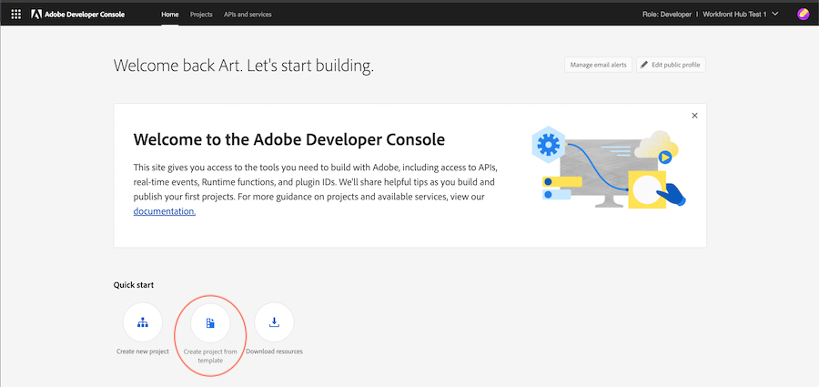

1. **App Builder**&#x200B;を選択します。
1. **プロジェクトタイトル**&#x200B;と&#x200B;**アプリ名**&#x200B;を入力します。 どちらもデフォルトですが、値をカスタマイズすると、後で必要なプロジェクトを特定しやすくなります。
1. **実行時を含める**&#x200B;を選択したままにします。
1. 「**保存**」をクリックします。

## Adobe Developer（aio） CLIの使用

Adobeには、App Builder アプリケーションの作成に使用できるオープンソース CLIが用意されています。

その他の手順については、GitHubとAdobe Developer サイトを参照してください。

* https://github.com/adobe/aio-cli
* https://developer.adobe.com/app-builder/docs/getting_started/first_app/

1. ツールをインストールするには、（最初にノード v18を使用していることを確認してください）実行：`npm install -g @adobe/aio-cli`。
1. ターミナルを起動し、次のコマンドでAIOにログインします：`aio login`。 適切なIMS組織へのログインに問題がある場合は、`aio login -f`を試してログインプロンプトを強制的に実行します。 `aio where`を使用して、正しいIMS組織にログインしている組織を確認します。 詳細については、`aio config`を使用してください。
1. 次を実行して、アプリの設定を開始します：`aio app init example-app` 「example-app」をアプリ名に置き換えてください。 アプリ名がわからない場合は、コマンド `aio console project list`を使用してアプリ名のリストを表示できます。
1. 指定されたオプションから組織とプロジェクトを選択します。

   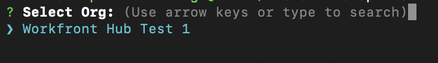
   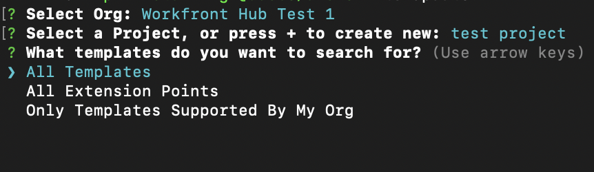

1. 利用可能なすべてのテンプレートを参照し、プロジェクトの&#x200B;**@adobe/workfront-ui-ext-tpl**&#x200B;を選択します。

   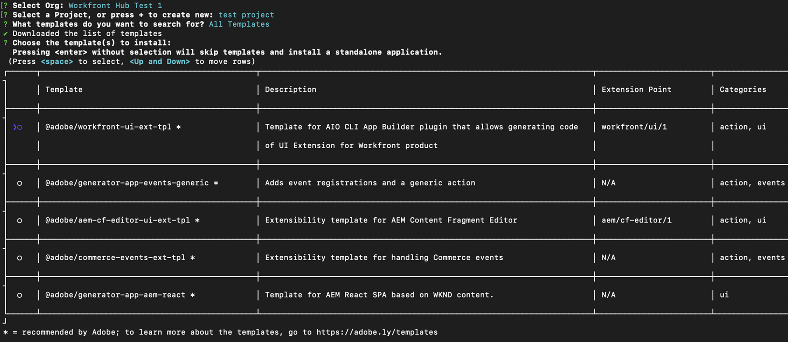

1. Adobe Developer Consoleで作成したプロジェクト名を選択して入力します。

   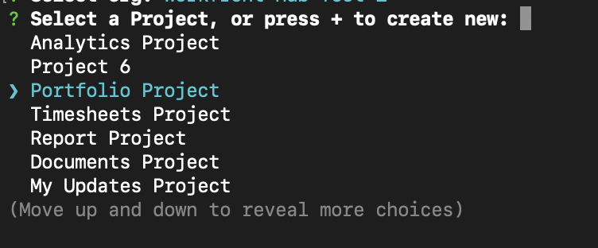

1. アプリケーションのプロンプトに答えます。

   * 拡張機能に名前を付けます。
   * 拡張機能の機能の概要を説明します。
   * 最初に使用する初期バージョン番号を選択します。
   * テンプレートは、「次に何をしたいですか？」というプロンプトが表示された際に「メインメニュー項目にカスタムボタンを追加」を選択すると、プライマリナビゲーションボタンのコードを作成します。

   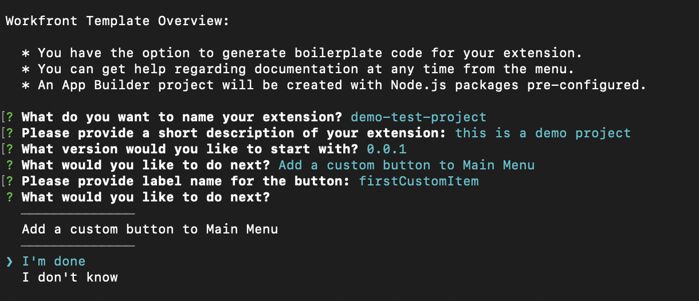

1. 「完了」を選択して、完了を確認します。 テンプレートからのコード生成が処理中です。

   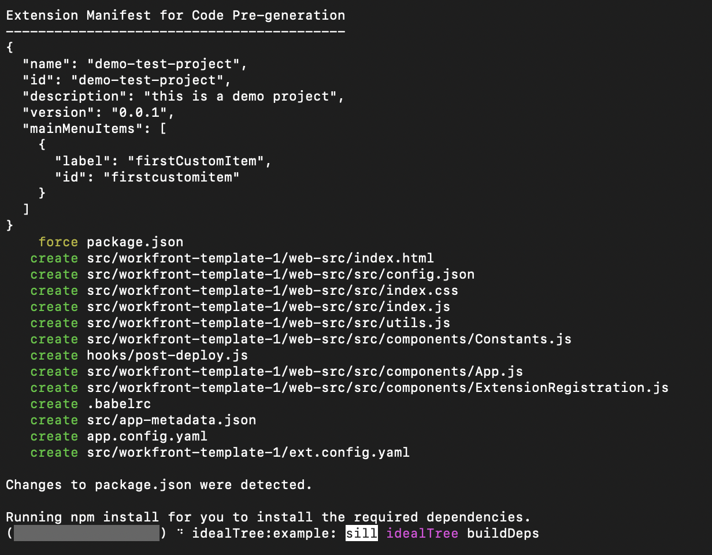

1. アプリの初期化が完了したというメッセージが表示されるまで待ちます。 次に、プロジェクトをIDEで開き（Visual Studio Codeをお勧めします）、src フォルダーにアクセスします。

   プロジェクト内のフォルダーとファイルについて詳しくは、[Adobe開発者向けサイト &#x200B;](https://developer.adobe.com/app-builder/docs/get_started/app_builder_get_started/first-app#anatomy-of-an-app-builder-application)を参照してください。

プロジェクト内のフォルダーとファイルについて詳しくは、[Adobe Developer サイト &#x200B;](https://developer.adobe.com/app-builder/docs/get_started/app_builder_get_started/first-app#anatomy-of-an-app-builder-application)を参照してください。

## VSCodeでの拡張機能のビルド

Workfrontのメインメニューまたはセカンダリナビゲーション（左パネル）を使用してナビゲーションを有効にするには、App.js ファイル設定が必要です。

ExtensionRegistration.js ファイル設定は、Workfront レイアウトテンプレートに拡張機能を表示するために必要です。

次の例では、UI拡張機能を使用して、Workfrontのメインメニューとオブジェクトの左側のパネルにカスタムアプリケーションを追加する方法を示します。

### ExtensionRegistration.jsの設定

Workfrontのメインメニューでカスタムアプリケーションを許可するには：

1. ExtensionRegistration.jsに移動します。

   ExtensionRegistration関数には、次のコードが表示されます。 このコードは、テンプレートによって作成されました。 このコードを追加して、追加のメニュー項目を作成できます。 必ずIDとURLを置き換えてください。

   ```
   mainMenu: { 
   
           getItems() { 
   
               return [ 
   
               { 
   
                   id: 'main-menu-label', 
   
                   url: '/index.html#/main-menu-label', 
   
                   label: 'Main menu label', 
   
                   icon: icon1, 
   
               }, 
   
               ]; 
   
           }, 
   
           } 
   ```

1. 次のコードスニペットを追加します。

   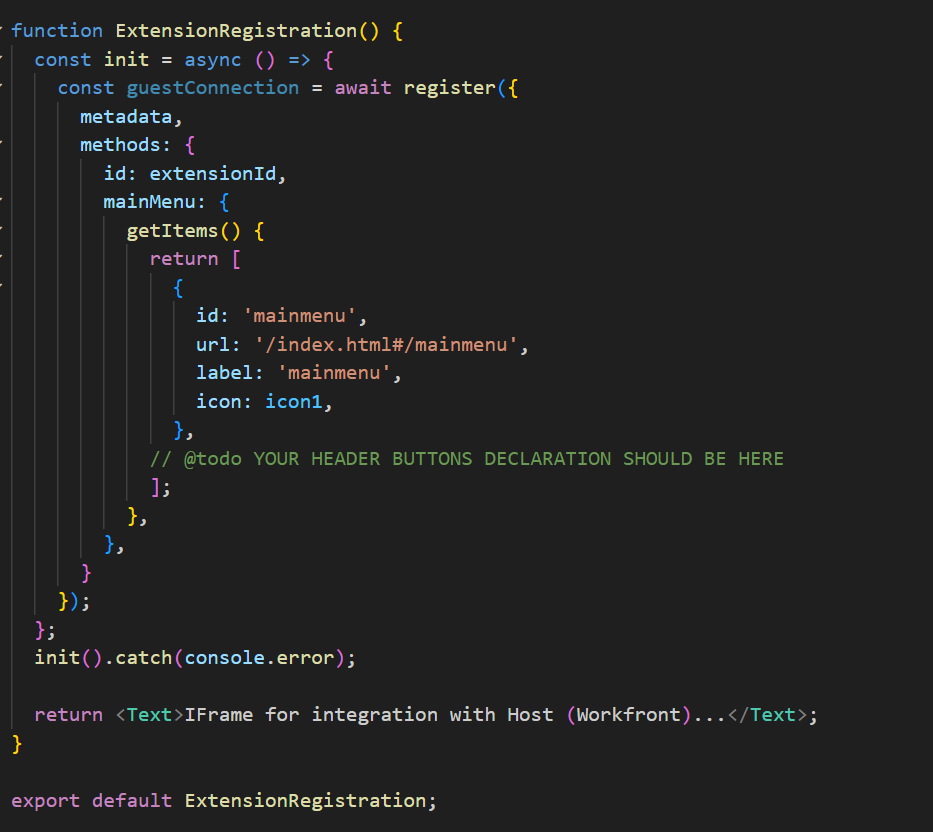

   この例は、メインメニュー項目を示しています。 ID、ラベル、アイコン、URLを、アプリケーションの正しい名前に更新する必要があります。 複数の項目を追加する場合は、IDが一意であることを確認してください。

1. 作業を保存します。

### Workfrontの左側のパネルナビゲーションでカスタムアプリケーションを許可する

Workfrontの左側のパネルナビゲーションでカスタムアプリケーションを許可するには：

1. ExtensionRegistration.jsに移動します。
1. ExtensionRegistration関数に、次のコードスニペットを追加します。

   ```
   secondaryNav: {
   
   TASK: {  
   
       getItems() {       return [         {           id: "TASK", 
   
   label: "My TASK",           icon: metricsIcon,           url: "/myTask",  
   
           },  
   
       ];  
   
       },  
   
   },  
   
   },  
   ```

   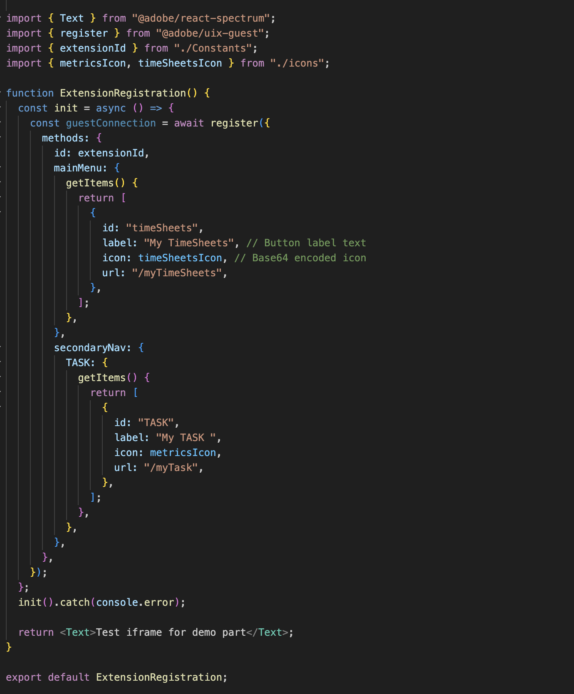

   * 次の例は、「マイタスク」という左側のパネルナビゲーション項目を示しています。 ID、ラベル、アイコン、URLを、アプリケーションの正しい名前に更新する必要があります。
   * 次の使用例は、Project オブジェクトの種類の左側のパネルのナビゲーション項目を示します。 これらのアイテムは、Workfrontでサポートされているオブジェクトごとに個別に作成する必要があります。 プロジェクト、タスク、イシュー、ポートフォリオ、およびプログラムのオブジェクトを使用できます。

1. 作業を保存します。

### Workfront カスタムフォームを使用したアプリの埋め込み

フォームウィジェット拡張ポイントは、Adobe WorkfrontのUI拡張機能で、Workfront カスタムフォーム内に埋め込むことができるカスタムウィジェットを作成できます。 ナビゲーション項目やメニューオプションを追加する他の拡張ポイントとは異なり、ウィジェットは、カスタムフォームフィールド内の専用パネルにカスタムコンテンツを表示する方法を提供します。

ウィジェットは、Workfront カスタムフォームにフォームフィールドとして追加できるモジュール式UI コンポーネントです。 カスタムフォームのインターフェイス内でカスタム機能、データビジュアライゼーション、外部コンテンツを直接表示する方法を提供し、ユーザーがフォームに入力しながらカスタムロジックを操作できるようにします。

#### ウィジェット拡張機能の設定

メインメニューとセカンダリナビゲーションのUI拡張ポイントと同様に、「ウィジェット」拡張ポイントは、通常`ExtensionRegistration.js` フィールド内の`ExtensionRegistration` コンポーネントのmethods オブジェクト内で設定されます。 つまり、フォームウィジェットを使用するには、app.jsで有効なルートを使用して`extesionregistration`に「ウィジェット」項目を追加する必要があるだけです。

```
javascript 


Apply to ExtensionReg... 

widgets: { 

  getItems() { 

    return [ 

      { 

        id: "test2", 

        url: "/index.html#/widgets1", 

        label: "Test Widget with dimensions", 

        dimensions: { 

          height: 450, 

          width: 300, 

          maxHeight: 600, 

          maxWidth: 400, 

        }, 

      }, 

      { 

        id: "test", 

        url: "/index.html#/widgets1", 

        label: "Test Widget without dimensions", 

      }, 

    ]; 

  }, 

}, 
```

#### ウィジェット設定プロパティ

**必要なプロパティ**

* id （文字列）: ウィジェットの一意の識別子。 拡張機能のすべてのウィジェットで一意である必要があります。

* url （文字列）: ウィジェットのコンテンツへのURL パス。 これは、ウィジェットコンポーネントをレンダリングする拡張機能のルートを指している必要があります。

* ラベル（文字列）：カスタムフォームフィールド選択インターフェイスに表示されるウィジェットの表示名。

**オプションのプロパティ**

* 寸法（オブジェクト）: ウィジェットの表示寸法を指定します。 すべてのプロパティはオプションであり、可能なディメンションは次のとおりです。

* 高さ（数値）: ウィジェットの高さ（ピクセル単位）

* 幅（数値）: ウィジェットの幅（ピクセル単位）

* maxHeight （number）: ウィジェットの最大高さ（ピクセル単位）

* maxWidth （number）: ウィジェットの最大幅（ピクセル単位）

**Dimensionのプロパティ**

ディメンション オブジェクトを使用すると、ウィジェットのサイズとレイアウトの制約を制御できます。

* 高さと幅：ウィジェットの初期/優先サイズを設定します

* maxHeight and maxWidth: ウィジェットが大きすぎないようにするために、上限を設定します

* レスポンシブ動作：ウィジェットは、次の制約の中でレスポンシブにできます

* フォームの統合：ディメンションを使用すると、フォームフィールドのレイアウト内でウィジェットが適切に収まるようにできます

#### Dimension設定の例

```
// Fixed size widget 

dimensions: { 

  height: 300, 

  width: 250, 

} 

// Flexible height with width constraint 

dimensions: { 

  width: 300, 

  maxHeight: 500, 

} 

// Height constraint only 

dimensions: { 

  height: 400, 

  maxWidth: 350, 

} 

// No dimensions - uses default sizing 

{} 
```

#### コンテキストデータ

ウィジェットは、以下を含む他の拡張ポイントと同じ共有コンテキストにアクセスできます。

* auth: IMS トークンを含む認証情報

* objCode: オブジェクトタイプコード（TASK、PROJECT、ISSUEなど）

* objID: オブジェクト識別子

* ホスト名：Workfront インスタンスのホスト名

* プロトコル：接続プロトコル

* ユーザー：現在のユーザー情報

* isLoginAs: ユーザーが別のユーザーとしてログインしているかどうか

* isInBulkEditing: フォームが現在一括編集モードにある場合。 その場合、コンテキストにはオブジェクト IDの複数の値が含まれます。

#### Workfront カスタムフォームへのウィジェットの追加

「UI拡張機能」フィールドタイプを使用して、Workfront カスタムフォームにアプリを埋め込むことができます。 フィールドを追加したら、フォームウィジェットを選択すると、ウィジェットのリストは、IMS組織内のアクティブなアプリまたは`extensionoverride=TRUE`時にローカルでアクティブなアプリケーションに基づきます。

カスタムフォームの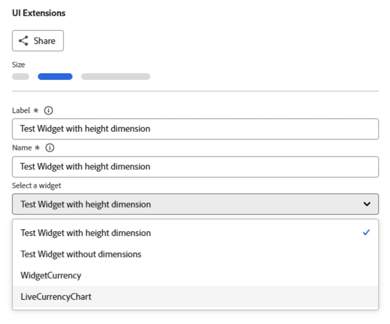

### App.jsの設定

1. App.jsに移動します。

1. テンプレートは、メインメニューオプションのルートになります。 ルートは、URL パスとそれらのパス用にレンダリングされるコンポーネントとのマッピングを定義します。 ルートを追加するには、次のコードスニペットを使用します。必ず正確なパスとエレメントを自分のパスに置き換えてください。

   ```
       <Route 
   
               exact path="custom-application" 
   
               element={<Customapplication />} 
   
           /> 
   ```

   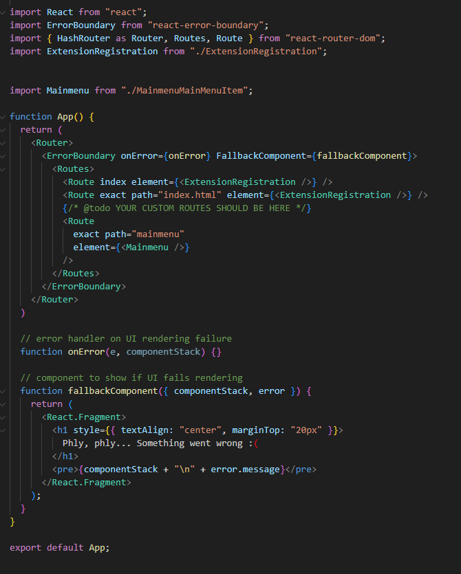
1. 作業を保存します。

アプリケーションの開発と実行について詳しくは、[Adobe開発者向けサイト &#x200B;](https://developer.adobe.com/app-builder/docs/get_started/app_builder_get_started/first-app#develop-the-application)を参照してください。


## 共有コンテキスト

共有コンテキストは、WorkfrontからUI拡張機能にデータを共有するために使用されます。 共有コンテキストを通じて使用可能なデータには、ユーザーデータとアプリケーションコンテキストが含まれます。


### ユーザー

WorkfrontのUI拡張機能は、ユーザーデータを共有します。 共有コンテキストを通じて使用できるユーザーオブジェクトには、WorkfrontのユーザーIDとユーザーのメールアドレスが含まれます。

`user = (conn?.sharedContext?.get("user")); // {ID: '1', email: 'test@aaa.com'} userID = user.ID userEmail = user.email`

### アプリケーションコンテキスト

セカンダリのナビゲーション拡張機能ポイントを使用してカスタムアプリケーションを追加する場合、カスタムアプリケーションではプロジェクト IDやドキュメント IDなどのコンテキストデータを使用するのが一般的です。 これらのデータの場合、共有コンテキストにはオブジェクトコードとオブジェクト IDが含まれます。

ドキュメントのアプリケーションコンテキストを取得する例を次に示します。

`context = conn?.sharedContext; // Using the connection created above, grab the document details from the host tunnel. // conn?.host?.document?.getDocumentDetails().then(setDocDetails);`

## Workfrontでのアプリのテスト

Workfront用のApp Builder アプリケーションを開発する際に、アプリを公開せずにWorkfront内でテストする必要がある場合があります。

App Builder アプリ内で、ローカル開発用に`aio app run`を開始できます。 これにより、URL （通常は`https://localhost:9080`など）が提供されます。 または、`aio app deploy`を実行して静的なAdobe ドメインを取得することもできます。 後で使用する場合は、これらのURLに注意してください。

次に、ブラウザーで開発する特定のページに移動します。 開発者ツールを開き、workfront.comまたはworkfront.adobe.comのローカルストレージにアクセスします。 ここで、エントリを追加する必要があります。 キーとして`extensionOverride`を使用し、以前にメモしたApp Builder URLを値として使用します。

設定が正しく完了した場合、Workfrontでレイアウトテンプレートページをリロードすると、App Builder アプリケーションのボタンが表示されます。 オブジェクトのメインメニューと左側のパネルにアプリボタンを追加し、それらの領域にアプリボタンが正しく表示されることを確認します。

その他の手順については、AEMの例を用いて、Adobe Developer サイトで説明します。https://developer.adobe.com/uix/docs/guides/preview-extension-locally/

### Chrome バージョン 142以降でローカルテストを許可するフラグを無効にする

Chrome バージョン 142では、ローカルネットワークアクセス制限が導入されています。 これらの制限は、ローカルのテスト環境に影響を与える可能性があります。

この問題を解決するには、次のChrome設定で対応するフラグをオフにして、ローカル ネットワーク アクセス チェックを無効にする必要があります：`chrome://flags/#local-network-access-check`。

フラグを無効にするには

1. Chromeを開き、アドレスバーに`chrome://flags`と入力し、**Enter**&#x200B;を押します。
1. 上部の検索バーに、**ローカルネットワークアクセスチェック**&#x200B;と入力します。
1. 「**ローカルネットワークアクセスの確認**」フラグの横にあるドロップダウンメニューをクリックし、「無効」を選択します。
1. 画面の下部に表示される「**再起動**」ボタンをクリックして、変更を適用します。

## アプリケーションを公開し、送信を承認する

アプリケーションを公開して承認するには、[Adobe Developer サイト &#x200B;](https://developer.adobe.com/uix/docs/guides/publication/)の手順に従います。
