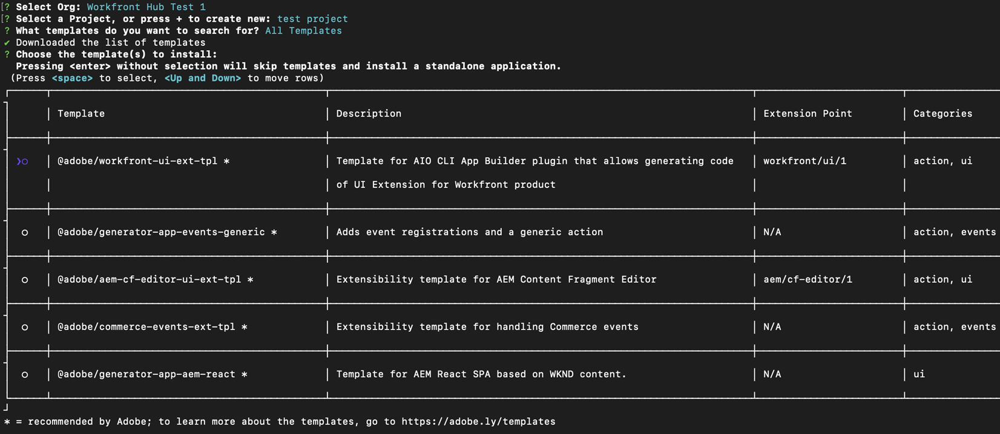
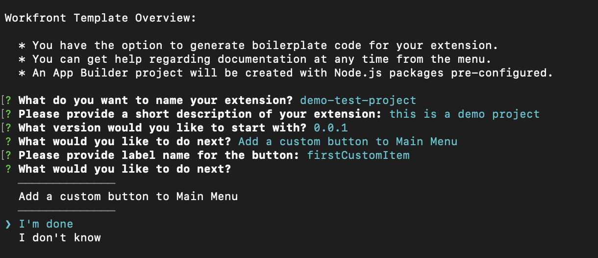

# Adobe App Builderを使用したWorkfrontのカスタムアプリケーションの作成

Adobe App Builderを活用したWorkfront UI 拡張機能を使用すると、お客様およびパートナーはカスタマイズされたユーザーエクスペリエンスを作成できます。 これらのツールは、効率を高め、シームレスでつながりのあるエクスペリエンスを提供し、ユーザー満足度を大幅に向上させ、企業が独自のビジョンを実現するのに役立ちます。

例えば、Workfront UI Extensions がない場合、プロジェクト管理者はWorkfrontと、時間を記録する別の時間追跡システムを切り替える必要が生じる場合があります。 UI 拡張機能を使用すると、時間の追跡をWorkfront エクスペリエンスに直接統合し、ワークフローを合理化して時間を節約できます。 さらに、カスタムコンポーネントを追加すると、メタデータのタグ付けやコンテンツのプレビューなどの機能により、使いやすさを向上させ、繰り返しのタスクを自動化し、コンテンツ管理を強化することができます。 Adobe App Builderは、拡張性と堅牢な IMS （Identity Management）を提供し、あらゆる規模で安全で効率的なカスタマイズを保証します。

Workfront UI 拡張機能には、次のような主な利点があります。

* 正確なカスタマイズ：標準的なソフトウェアインターフェイスでは、すべてのビジネス要件を満たすことができないことが多くあります。 UI 拡張機能を使用すると、開発者は、デフォルトのユーザーインターフェイスを変更および拡張して、特定のビジネスニーズに対応できます。
* システム統合：UI 拡張により他のシステムとの統合が容易になり、シームレスなワークフローとデータの一貫性が確保されます。
* スケーラビリティ：企業の成長に合わせて、システムを完全に見直すことなく、UI 拡張機能を開発して新しい機能を追加できます。
* 開発時間の短縮：事前定義済みの拡張ポイントとツールにより、カスタム機能の実装に必要な時間と労力が大幅に削減されます。
* ユーザーによる導入の強化：ユーザーエクスペリエンスが最適化されると、ソフトウェアの導入を大幅に促進できます。 ユーザーの好みに合わせて設計されたカスタム UI 要素により、採用率と全体的な満足度を高めることができます。
* Workfront UI 拡張機能を利用すると、効率性、統合性、ユーザー満足度を高めるために、カスタマイズされたユーザーエクスペリエンスを作成できます。

Adobe App Builderでアプリケーションが作成されたら、Workfront管理者は、レイアウトテンプレートを使用して、そのアプリケーションをWorkfrontのメインメニューと左側のナビゲーションパネルに追加できます。 レイアウトテンプレートを使用しているユーザーがアプリケーションをクリックすると、個別に開く代わりに、Workfrontに埋め込まれたアプリケーションが表示されます。

ここでは、App Builderにアクセスし、テンプレートを使用してアプリケーションを作成する方法を説明します。

レイアウトテンプレートにカスタムアプリケーションを追加する方法については、[ レイアウトテンプレートを使用してメインメニューをカスタマイズする ](/help/quicksilver/administration-and-setup/customize-workfront/use-layout-templates/customize-main-menu.md) および [ レイアウトテンプレートを使用して左側のパネルをカスタマイズする ](/help/quicksilver/administration-and-setup/customize-workfront/use-layout-templates/customize-left-panel.md) を参照してください。

## 前提条件

以下が必要です。

* IMS が有効なWorkfront アカウント
* ノード v18 および npm を持つ開発マシン
* App Builder ライセンス

## Adobe App Builderへのアクセス

UI 拡張機能を作成するには、Adobe Developer ConsoleのAdobe App Builderにアクセスできる必要があります。

その他の手順については、[Adobe Developer サイト ](https://developer.adobe.com/uix/docs/guides/get-access/) を参照してください。

### Adobe Admin Consoleへの開発者の追加

>[!IMPORTANT]
>
>次の手順のすべてに適切な IMS 組織を選択していることを確認します。 複数の組織に属している場合は、間違った組織を選択する可能性があります。 通常は右上隅にリストされている適切な組織の下で作業していることを確認します。

1. 実稼動に移動します。https://adminconsole.adobe.com/

1. 「**ユーザー**」セクションで、**開発者**/**開発者を追加** をクリックします。

   

   >[!NOTE]
   >
   >開発者を管理するオプションが表示されない場合、開発者がアクセスできる製品はありません。

1. ユーザーのメールアドレスを追加します。 Admin Console内から追加済みの既存のユーザーを検索する必要があります。

1. 開発者プロファイルに必要な製品を追加して、「**保存**」をクリックします。\
   

### App Builderへのアクセスの取得

組織がApp Builderを購入するには、担当のアカウントマネージャーと協力する必要があります。

AppBuilder が正しく設定されている場合は、新しいプロジェクトの作成の一部として、テンプレートからプロジェクトを作成が表示されます。

## Adobe Developer Consoleで新規プロジェクトを作成します

UI 拡張機能を構築するには、Adobe Developer Consoleを使用する必要があります。

その他の手順については、[Adobe Developer サイト ](https://developer.adobe.com/uix/docs/guides/creating-project-in-dev-console/) を参照してください。

1. Adobe IDを使用してAdobe Developer Consoleにログインします。

1. アカウント、およびプロファイルまたは組織を選択します。

1. クイックスタート領域で **テンプレートからプロジェクトを作成** をクリックするか、**新規プロジェクトを作成/テンプレートからプロジェクト** をクリックします。

   >[!IMPORTANT]
   >
   >「テンプレートからプロジェクトを作成する」オプションが表示されない場合は、Admin Console内の設定が誤っており、App Builder カタログにアクセスできません。 このオプションは、AppBuilder にアクセスできる場合にのみ表示されます。

   

1. 「**App Builder**」を選択します。

1. **プロジェクトタイトル** および **アプリ名** を入力します。 どちらもデフォルト値がありますが、値をカスタマイズすると、後で必要なプロジェクトを特定しやすくなります。

1. **ランタイムを含む** が選択されたままにします。

1. **保存**&#x200B;をクリックします。

## Adobe Developer（aio） CLI の使用

Adobeには、App Builder アプリケーションの作成に使用できるオープンソース CLI が用意されています。

その他の手順については、GitHub とAdobe Developer サイトを参照してください。

* https://github.com/adobe/aio-cli
* https://developer.adobe.com/app-builder/docs/getting_started/first_app/

1. ツールをインストールするには、（最初にノード v18 を使用していることを確認して） `npm install -g @adobe/aio-cli` を実行します。
1. ターミナルを起動し、次のコマンドで AIO にログインします：`aio login`。 正しい IMS 組織へのログインで問題が発生した場合は、`aio login -f` 試行して強制的にログインプロンプトを表示させます。 `aio where` を使用して、正しい IMS 組織にログインしている組織を確認します。 詳細については、`aio config` を使用してください。
1. 次を実行してアプリの設定を開始 `aio app init example-app` ます。「example-app」をアプリ名に置き換えてください。 アプリ名が不明な場合は、コマンド `aio console project list` を使用してアプリ名のリストを確認できます。
1. 提供されたオプションから組織とプロジェクトを選択します。
   
   

1. 使用可能なすべてのテンプレートを参照し、プロジェクトの **@adobe/workfront-ui-ext-tpl** を選択します。
   
1. を選択し、Adobe Developer Consoleで作成したプロジェクト名を入力します。
   

1. アプリケーションのプロンプトに答えます。

   * 拡張機能に名前を付けます。
   * 拡張機能の機能の説明的な概要を提供します。
   * 開始する初期バージョン番号を選択します。
   * 「次に何を行いますか？」というプロンプトが表示されたときに「メインメニュー項目にカスタムボタンを追加する」を選択した場合、テンプレートによってプライマリナビゲーションボタンのコードが作成されます。

   

1. 「完了」を選択して完了を確認します。 テンプレートからのコード生成が進行中です。
   
1. アプリの初期化が完了したことを示すメッセージが表示されるまで待ちます。 次に、IDE でプロジェクトを開き（Visual Studio Code をお勧めします）、src フォルダーにアクセスします。

   プロジェクト内のフォルダーおよびファイルについて詳しくは、[Adobe開発者向けサイト ](https://developer.adobe.com/app-builder/docs/get_started/app_builder_get_started/first-app#anatomy-of-an-app-builder-application) を参照してください。

プロジェクト内のフォルダーおよびファイルについて詳しくは、[Adobe Developerのサイト ](https://developer.adobe.com/app-builder/docs/get_started/app_builder_get_started/first-app#anatomy-of-an-app-builder-application) を参照してください。

## VSCode での拡張機能の構築

Workfrontのメインメニューまたはセカンダリナビゲーション（左パネル）を使用したナビゲーションを有効にするには、App.js ファイル設定が必要です。

Workfront レイアウトテンプレートで拡張機能を表示するには、ExtensionRegistration.js ファイル設定が必要です。

次の例は、UI Extensions を使用して、Workfrontのメインメニューとオブジェクトの左パネルにカスタムアプリケーションを追加する方法を示しています。

### ExtensionRegistration.js の設定

Workfrontのメインメニューでカスタムアプリケーションを許可するには：

1. ExtensionRegistration.js に移動します。

ExtensionRegistration 関数に、次のコードが表示されます。 このコードは、テンプレートによって作成されました。 このコードを追加して、追加のメニュー項目を作成できます。 ID と URL を必ず置き換えてください。

    ```
    mainMenu: {
    
    getItems （） {
    
    return [
    
    {
    
    id: &#39;main-menu-label&#39;,
    
    url: &#39;/index.html#/main-menu-label&#39;,
    
    label: &#39;Main menu label&#39;,
    
    icon: icon1,
    
    },
    
    ];
    
    },
    
    }
    ```

1. 次のコードスニペットを追加します。
   
この例では、メイン メニュー項目を示します。 ID、ラベル、アイコン、URL を、アプリケーションに適した名前に更新する必要があります。 複数の項目を追加する場合は、ID が一意であることを確認します。

1. 作業内容を保存します。

### Workfrontの左側のパネルナビゲーションでのカスタムアプリケーションの許可

Workfrontの左側のパネルナビゲーションでカスタムアプリケーションを許可するには：

1. ExtensionRegistration.js に移動します。
1. ExtensionRegistration 関数に、次のコードスニペットを追加します。

   ```
   secondaryNav: {  
   
   TASK: {  
   
       getItems() {       return [         {           id: "TASK", 
   
   label: "My TASK",           icon: metricsIcon,           url: "/myTask",  
   
           },  
   
       ];  
   
       },  
   
   },  
   
   },  
   ```

   

   * 次の例は、My Task という左側のパネルのナビゲーション項目を示しています。 ID、ラベル、アイコン、URL を、アプリケーションに適した名前に更新する必要があります。

   * 次の使用例は、プロジェクト オブジェクトの種類の左側のパネルのナビゲーション項目を示します。 これらの項目は、Workfrontでサポートされているオブジェクトごとに個別に作成する必要があります。 使用できるオブジェクトは、プロジェクト、タスク、イシュー、ポートフォリオ、プログラムです。

1. 作業内容を保存します。

### Workfront カスタムフォームを使用したアプリの埋め込み

フォームウィジェット拡張ポイントは、Adobe Workfrontの UI 拡張機能で、Workfrontのカスタムフォームに埋め込めるカスタムウィジェットを作成できます。 ナビゲーション項目やメニューオプションを追加する他の拡張ポイントとは異なり、ウィジェットはカスタムフォームフィールド内の専用パネルにカスタムコンテンツを表示する方法を提供します。

ウィジェットは、Workfrontのカスタムフォームにフォームフィールドとして追加できるモジュール型 UI コンポーネントです。 カスタムフォームインターフェイス内で直接カスタム機能、データビジュアライゼーション、外部コンテンツを表示する方法を提供し、ユーザーがフォームに入力する際にカスタムロジックを操作できるようにします。

#### ウィジェット拡張機能の設定

メインメニューとセカンダリナビゲーションの UI 拡張ポイントと同様に、「ウィジェット」拡張ポイントは、通常は `ExtensionRegistration` フィールドにある `ExtensionRegistration.js` コンポーネントのメソッドオブジェクト内で設定されます。 つまり、Forms ウィジェットを使用する場合は、app.js の有効なルートを持つ `extesionregistration` で「ウィジェット」項目を追加するだけで済みます。

```
javascript 


Apply to ExtensionReg... 

widgets: { 

  getItems() { 

    return [ 

      { 

        id: "test2", 

        url: "/index.html#/widgets1", 

        label: "Test Widget with dimensions", 

        dimensions: { 

          height: 450, 

          width: 300, 

          maxHeight: 600, 

          maxWidth: 400, 

        }, 

      }, 

      { 

        id: "test", 

        url: "/index.html#/widgets1", 

        label: "Test Widget without dimensions", 

      }, 

    ]; 

  }, 

}, 
```

#### ウィジェット設定プロパティ

**必須プロパティ**

* id （文字列）：ウィジェットの一意の ID。 拡張機能のすべてのウィジェットで一意である必要があります。

* url （文字列）：ウィジェットのコンテンツの URL パス。 これは、ウィジェットコンポーネントをレンダリングする拡張機能のルートを指す必要があります。

* ラベル（文字列）: カスタムフォームフィールドの選択インターフェイスに表示されるウィジェットの表示名。

**オプションのプロパティ**

* dimensions （object）: ウィジェットの表示サイズを指定します。 すべてのプロパティはオプションで、可能なディメンションはこれだけです。

* 高さ（数値）：ウィジェットの高さ（ピクセル単位）。

* 幅（数値）：ウィジェットの幅（ピクセル単位）。

* maxHeight （数値）：ウィジェットの最大の高さ（ピクセル単位）

* maxWidth （数値）：ウィジェットの最大幅（ピクセル単位）

**Dimension プロパティ**

ディメンションオブジェクトを使用すると、ウィジェットのサイズとレイアウトの制約を制御できます。

* 高さと幅：ウィジェットの初期/優先サイズを設定します

* maxHeight と maxWidth：ウィジェットが大きくなりすぎないように上限を設定します

* レスポンシブ動作：ウィジェットは、次の制約内で応答できます

* フォーム統合：ディメンションは、ウィジェットがフォームフィールドのレイアウトに適切に収まることを確認するのに役立ちます

#### Dimension設定の例

```
// Fixed size widget 

dimensions: { 

  height: 300, 

  width: 250, 

} 

// Flexible height with width constraint 

dimensions: { 

  width: 300, 

  maxHeight: 500, 

} 

// Height constraint only 

dimensions: { 

  height: 400, 

  maxWidth: 350, 

} 

// No dimensions - uses default sizing 

{} 
```

#### コンテキストデータ

ウィジェットは、次のような他の拡張ポイントと同じ共有コンテキストにアクセスできます。

* 認証：IMS トークンを含む認証情報

* objCode: オブジェクトタイプコード（タスク、プロジェクト、イシューなど）

* objID: オブジェクト識別子

* ホスト名：Workfront インスタンスのホスト名

* protocol：接続プロトコル

* ユーザー：現在のユーザー情報

* isLoginAs: ユーザーが別のユーザーとしてログインしているかどうか

* isInBulkEditing：現在フォームが一括編集モードである場合。 その場合、コンテキストにはオブジェクト ID の複数の値が含まれます。

#### Workfront カスタムフォームへのウィジェットの追加

アプリは、「UI Extensions」フィールドタイプを使用して、Workfront カスタムフォームに埋め込むことができます。 フィールドに追加してフォームウィジェットを選択すると、ウィジェットのリストは、IMS 組織内のアクティブなアプリまたは `extensionoverride=TRUE` 定されたときにローカルでアクティブになっているアプリケーションに基づきます。


### App.js の設定

1. App.js に移動します。

1. テンプレートは、メインメニューオプションのルートになります。 ルートは、URL パスと、これらのパス用にレンダリングされるコンポーネントとのマッピングを定義します。 ルートを追加するには、次のコードスニペットを使用して、正確なパスと要素を自分のものに置き換えてください。

   ```
       <Route 
   
               exact path="custom-application" 
   
               element={<Customapplication />} 
   
           /> 
   ```

   
1. 作業内容を保存します。

アプリケーションの開発と実行について詳しくは、[Adobe開発者向けサイト ](https://developer.adobe.com/app-builder/docs/get_started/app_builder_get_started/first-app#develop-the-application) を参照してください。


## 共有コンテキスト

共有コンテキストは、Workfrontから UI 拡張機能にデータを共有するために使用されます。 共有コンテキストを通じて利用可能なデータは、ユーザーデータとアプリケーションコンテキストを含む。


### ユーザー

Workfrontの UI 拡張機能は、ユーザーデータを共有します。 共有コンテキストを通じて使用可能なユーザーオブジェクトには、Workfront ユーザー ID とユーザーのメールアドレスが含まれます。

`user = (conn?.sharedContext?.get("user")); // {ID: '1', email: 'test@aaa.com'} userID = user.ID userEmail = user.email `

### アプリケーションコンテキスト

セカンダリのナビゲーション拡張機能ポイントを使用してカスタムアプリケーションを追加する場合、カスタムアプリケーションでプロジェクト ID やドキュメント ID などのコンテキストデータを使用するのが一般的です。 これらのデータの場合、共有コンテキストには、オブジェクトコードとオブジェクト ID が含まれます。

次に、ドキュメントのアプリケーションコンテキストを取得する例を示します。

`context = conn?.sharedContext; // Using the connection created above, grab the document details from the host tunnel. // conn?.host?.document?.getDocumentDetails().then(setDocDetails); `

## Workfrontでのアプリのテスト

App Builder アプリケーションをWorkfront用に開発する際に、アプリを公開せずにWorkfront内でテストする必要が生じる場合があります。

App Builder アプリ内で、ローカル開発の `aio app run` を開始できます。 これにより、URL （通常は `https://localhost:9080`）が提供されます。 または、`aio app deploy` を実行して静的Adobe ドメインを取得することもできます。 今後の使用のために、これらの URL をメモしておいてください。

次に、ブラウザーで開発対象の特定のページに移動します。 開発者ツールを開き、workfront.comまたはworkfront.adobe.comのローカルストレージにアクセスします。 ここでは、エントリを追加する必要があります。 キーとして `extensionOverride` を使用し、値として前述のApp Builder URL を使用します。

設定が正しく完了した場合、Workfrontでレイアウトテンプレートページをリロードすると、App Builder アプリケーションのボタンが表示されます。 オブジェクトのメインメニューと左側のパネルにアプリのボタンを追加し、それらの領域に正しく表示されることを確認します。

Adobe Developer サイトで、AEMの例を使用した追加手順を参照できます（https://developer.adobe.com/uix/docs/guides/preview-extension-locally/）。

## 申請の公開と送信の承認

アプリを公開して承認するには、[Adobe Developer サイト ](https://developer.adobe.com/uix/docs/guides/publication/) の手順に従います。