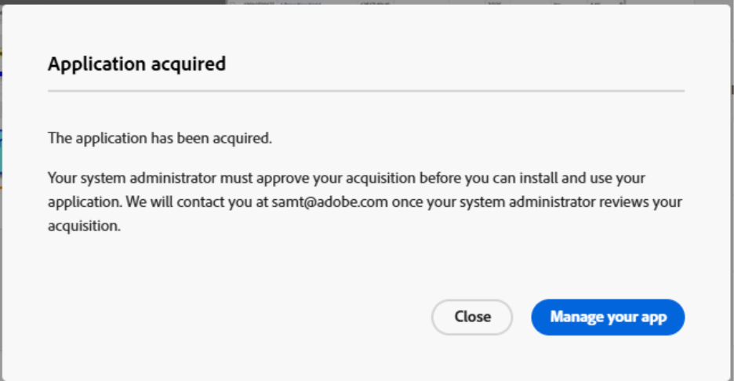
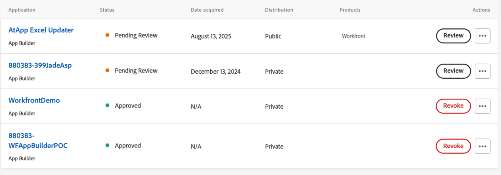
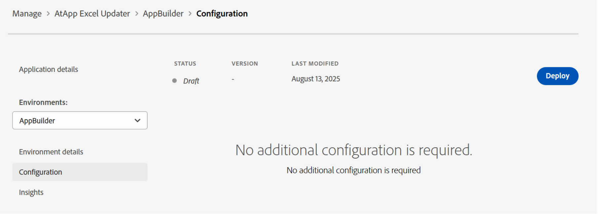
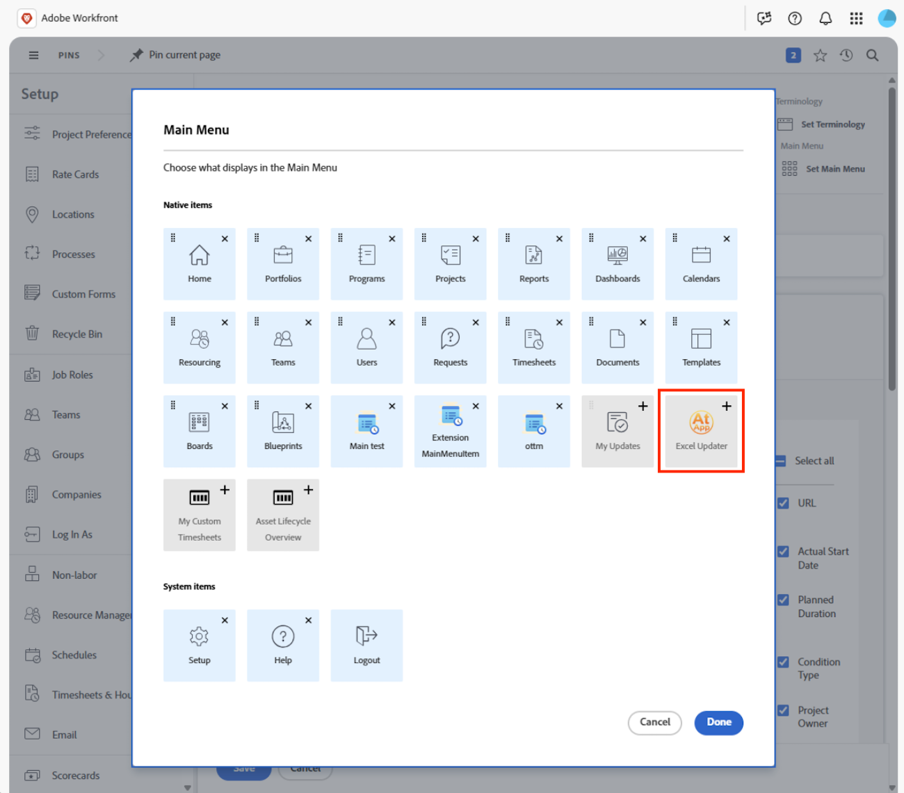

# Adobe Exchange からのアプリの取得とインストール

Workfront用のパートナー構築アプリをAdobe Exchangeから直接インストールできるようになりました。 この機能は、生産性を向上させ、オペレーションを合理化し、Workfrontの機能を拡張する専用ツールを提供する、成長を続けるAdobeパートナーのエコシステムと、顧客を結びつけます。 Adobe Exchangeでは、UI拡張機能を利用して、Workfrontにシームレスに統合されるアプリを検索してインストールできます。

Adobe Exchangeは、Adobe Workfrontを含むAdobe Experience Cloudのあらゆるアプリケーションや拡張機能を統合できる、マーケットプレイスです。 Workfrontのお客様は、機能を強化し、ワークフローを合理化し、外部システムと統合するアプリを検索してインストールすることができます。

## Adobe パートナーアプリ

Workfront Partner Networkは、Adobe App BuilderとWorkfront UI Extensionsを利用して、拡張性が高く安全なスケーラブルなアプリケーションを構築する独立系ソフトウェアベンダー（ISV）である、テクノロジーパートナーのエコシステムです。

Workfrontのパートナーは、Workfront UI拡張機能を活用しています。これは、Workfrontのインターフェイスにアプリを直接埋め込むことができる、強力なフレームワークです。 Adobe Exchangeからインストールすると、Workfront管理者はこれらのアプリケーションをレイアウトテンプレートに追加し、毎日のワークフロー内でユーザーが表示してアクセスできるようにすることができます。 このシームレスな統合により、ユーザーはWorkfrontから離れることなく、ダッシュボード、承認フロー、キャンペーントラッカーなどのパートナー構築のツールを利用できます。

### AtApp

#### リアルタイムの結果を、Adobe Workfront内で

AtAppは、Adobe Workfrontの顧客と連携し、日々のボトルネックを予測可能な成果を伴う繰り返し可能なソリューションに変換します。 ソリューションのライブラリを拡大することで、人々が作業している場所からのライブデータを活用し、正確性、スピード、説明責任を促進しています。 AtAppは、リーダーが今何が起こっているかを見て、次に何が起こるべきかを計画することを可能にします。 ユーザーは、現在利用可能でインストールする準備ができているAtAppStore Adobe Exchange アプリを探索し、現在の優先事項に一致するものを選択し、ニーズの拡大に合わせて拡張することができます。

* [Excel Updater](https://exchange.adobe.com/apps/ec/abtt1rq7o9/atapp-excel-updater): Excel Updater ソリューションでは、APIの学習、コードの記述、サーバーのセットアップを行うことなく、Workfrontにデータを統合するための費用対効果の高いパスを提供します。これは、1回のデータ読み込みと定期的なデータ読み込みの両方に最適です。

* [Recalc Helper](https://exchange.adobe.com/apps/ec/abv755903t/atapp-recalc-helper): Recalc Helper ソリューションを使用すると、選択したフィルターに一致するすべての項目について、カスタムフォームの計算式、プロジェクトのタイムライン、またはプロジェクトの財務をWorkfront内から簡単に再計算できます。

* UberTimesheet :UberTimesheet ソリューションは、Workfrontの導入を促進し、拡大することができます。

### Workfocus

WorkFocusは、Adobe Workfront、Workfront Fusion、Workfront Planning、Firefly、AEM Assets、エンタープライズオートメーションを専門とするAdobeゴールドソリューションパートナーです。 アドビは、独自のFCoE アプリケーションを搭載したFusion Center of Excellence （FCoE）を設立することで、企業が責任を持って自動化を拡張できるよう支援します。

#### Fusion Center of Excellence （FCoE）アプリケーション

WorkFocus Fusion Center of Excellence アプリケーションにより、企業はAdobe Workfront Fusionの価値を企業全体で管理、拡張、最大化することができます。

多くの企業は、Adobe Workfront Fusionのシナリオの断片化、自動化の所有権や価値に関する可視性の制限、一貫性のない標準、自動化の無秩序な拡散などに苦慮しています。 FCoE アプリケーションは、Fusion自動化のための一元的な記録システムを提供することで、これらの課題を解決します。

主な機能は次のとおりです。

* Adobe Workfront Fusion シナリオの一元的なガバナンスと所有権
* 導入からサポートまでのシナリオライフサイクル管理
* ROIと価値実現の追跡
* エンタープライズグレードの基準、ドキュメント、エラー処理
* 企業による導入に対応する拡張性の高い運用モデル

その結果、価値実現までの時間が短縮され、リスクが軽減され、Fusionからの測定可能なビジネス影響が得られます。

#### WorkFocusの基本を学ぶ

WorkFocus チームは、企業にFusion Center of Excellenceのカスタムデモを予約し、アプリケーションの無料トライアルを設定するよう促しています。

今後のロードマップには、2026年のWorkfrontコアセンターオブエクセレンスとWorkfront計画センターオブエクセレンスのリリースが含まれます。 企業は、Adobe Fusion Center of Excellenceのクライアントとして、今後のソリューションのロードマップに影響を与え、Adobe Workfront governanceの未来を形作る手助けをすることができます。

WorkFocusは、Adobe Workfront、Workfront Fusion、Workfrontプランニング、Firefly、AEM Assets、エンドツーエンドのContent Supply chainをまたいで、戦略的パートナーとして機能する方法を議論したいと考えています。

## 前提条件と権限

**App Builder プロビジョニング**

* お客様は、Adobe Admin ConsoleでApp Builderをプロビジョニングする必要があります。 これは、Adobe Exchangeからアプリケーションをインストールするための前提条件です。

**エンタープライズ組織の管理者または開発者**

* アプリを検索し、**Get**&#x200B;をクリックして、インストールを続行できます。

* アプリが組織内のユーザーによって既に取得されている場合、代わりに&#x200B;**インストール開始**&#x200B;または&#x200B;**管理**&#x200B;が表示される場合があります。

**管理者以外のユーザー**

* 取得を開始する可能性がありますが、ログインを求めるメッセージが表示され、アプリに管理者の同意や特別なライセンスが必要な場合は制限が発生する可能性があります。

## Adobe Exchange からのアプリの取得とインストール

Adobeをご利用のお客様は、Adobe Exchange Marketplaceから直接アプリケーションを参照、検索、インストールし、Workfront内で利用できます。

Adobe App Builderで構築されたアプリケーションは、Adobe Exchange上の&#x200B;_App Builder アプリケーション_&#x200B;として一覧表示されます。 各アプリのリストには、顧客がアプリの価値を理解するのに役立つドキュメント、スクリーンショット、使用方法の説明が記載されています。

Workfrontのアプリケーションを表示するには、Adobe Exchangeに移動し、Workfront互換アプリケーションを検索します。 また、Workfront App Builder アプリのリストをフィルタリングすることもできます。

1. 左側のパネルで&#x200B;**Experience Cloud**&#x200B;をクリックします。
1. 左側のパネルで、**Product**&#x200B;を見つけ、**Workfront**&#x200B;を選択します。
1. **アプリの種類**&#x200B;を展開し、**App Builder**&#x200B;を選択します。

### アプリの入手

アプリは、Adobe Exchangeから購入するか、インストールを許可する必要がありますが、アプリ開発者からのライセンスが必要です。

アプリを取得するには

1. アプリの名前をクリックします。
1. アプリリストの右上隅にあるボタンをクリックします。
1. 「**はい、続行**」をクリックし、エンドユーザー使用許諾契約に同意します。
   

### システム管理者のアクション

ユーザーがAdobe Exchangeからアプリを取得すると、次のメッセージが表示される場合があります。_アプリケーションをインストールして使用する前に、システム管理者が取得を承認する必要があります。_

つまり、インストールを続行するには、アプリで管理者レベルの承認が必要です。 システム管理者は、次の領域からリクエストを見つけることができます。

**通知**

システム管理者には、通常、組織内のユーザーがアプリを取得すると、メールで通知が届きます。

**Admin Console**

システム管理者は、[https://adminconsole.adobe.com/](https://adminconsole.adobe.com/)でAdmin Consoleにログインし、製品/アプリ統合に移動して、取得またはリクエストされたすべてのアプリを表示できます。

システム管理者がリクエストにアクセスできるようになると、アプリケーションのレビューと承認を行うことができます。 一部のアプリでは、管理者にデータアクセスの同意を求め、製品プロファイルや特定のユーザーにアプリを割り当てる場合があります。

承認されると、アプリはインストールできるようになります。

## アプリのインストール

アプリを取得したら、Workfrontに直接インストールできます。 管理者は、Workfront インターフェイスを通じてインストール済みアプリを管理し、適切に設定され、ユーザーがアクセスできるようにします。

1. インストールするアプリを見つけ、画面の右側にあるアクションメニューを開きます。
1. 「アプリの詳細を表示」をクリックします。
1. 画面の左側にある環境を選択するか、新しい環境を追加します。
1. 「**デプロイ**」をクリックします。
   
1. インストールまたは使用権限を割り当てます（必要な場合）。

   組織が製品プロファイルまたはユーザーグループを介したアプリアクセスを制御している場合は、ユーザーがインストールと使用を続行できるように、アプリを適切なプロファイルまたはグループに割り当てます。

## レイアウトテンプレートに追加

デプロイすると、パートナーアプリはWorkfront レイアウトテンプレートで使用できるようになります。 アプリをプライマリまたはセカンダリのナビゲーションに追加して、Workfrontで使用できます。

レイアウトテンプレートにアプリを追加するには、レイアウトテンプレートを開き、メインメニューまたはセカンダリメニュー領域に移動します。 「追加」アイコンを使用してアプリを追加します。

## アプリサポートへのお問い合わせ

Adobe Exchangeからインストールされた拡張機能は、アプリオーナーによってサポートされています。 アプリの管理から、**サポートを受ける**&#x200B;をクリックすると、問題に関するヘルプを受け取ることができます。
