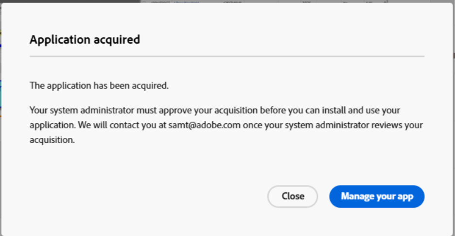

# Adobe Exchangeからアプリを取得してインストールする

パートナーが作成したWorkfront用アプリをAdobe Exchangeから直接インストールできるようになりました。 この機能により、生産性の向上、オペレーションの合理化、Adobeの機能拡張を実現する専用ツールを提供するWorkfront パートナーのエコシステムが拡大します。 Adobe Exchangeを通じて、お客様は、UI 拡張機能を使用してWorkfrontにシームレスに統合するアプリを見つけてインストールできます。

Adobe Exchangeは、Adobe Workfrontを含むAdobe Experience Cloud全体のサードパーティアプリケーション、拡張機能および統合の中心的なマーケットプレイスです。 Workfrontのお客様は、機能の強化、ワークフローの合理化、外部システムとの統合を実現するアプリを探してインストールできます。

## Adobe パートナーアプリ

Workfront パートナーネットワークは、テクノロジーパートナー（Adobe App BuilderおよびWorkfront UI 拡張機能を使用して、スケーラブル、安全、かつ拡張可能なアプリを構築する独立系ソフトウェアベンダー（ISV）による、ますます成長するエコシステムです。

Workfront パートナーは、Workfront UI 拡張機能を活用しています。これは、Workfront インターフェイスにアプリを直接埋め込むことができる強力なフレームワークです。 Adobe Exchangeからインストールすると、Workfront管理者はこれらのアプリをレイアウトテンプレートに追加し、ユーザーが日々のワークフローで表示したりアクセスしたりできるようにします。 このシームレスな統合により、ユーザーは、Workfrontを離れることなく、ダッシュボード、承認フロー、キャンペーントラッカーなどのパートナーが作成したツールを操作できます。

### AtApp

#### Adobe Workfront内でリアルタイムの結果を直接確認できる

Adobe Workfrontのお客様と提携し、日常のボトルネックを予測可能な結果の繰り返し可能なソリューションに変えます。 アドビのソリューションライブラリの拡大により、従業員が作業する場所でライブデータを使用して、精度、速度、説明責任を高めることができます。 リーダーが今何が起こっているかを確認し、次に何が起こるべきかを計画するのを助けることができます。 現在利用可能でインストール準備が整っている AtAppStore Adobe Exchange アプリを確認し、現在の優先度に合ったものを選択してから、ニーズの拡大に合わせて拡張します。

* [Excel Updater](https://exchange.adobe.com/apps/ec/abtt1rq7o9/atapp-excel-updater):Excel Updater ソリューションを使用すると、API の学習、コードの記述、サーバーのセットアップを行わなくても、コスト効率に優れた方法でWorkfrontにデータを統合できます。このソリューションは、1 回限りのデータ読み込みと繰り返しのデータ読み込みの両方に最適です。

* [Recalc Helper](https://exchange.adobe.com/apps/ec/abv755903t/atapp-recalc-helper):Recalc Helper ソリューションは、選択したフィルターに一致するすべてのアイテムのカスタムフォームの計算式、プロジェクトのタイムライン、プロジェクトの財務を、Workfront内から簡単に再計算する簡単な方法を提供します。

* UberTimesheet: UberTimesheet ソリューションは、すべてのユーザーがブラウザ、タブレット、スマートフォンから時間を簡単かつ便利に追跡できるようにすることで、ユーザーのWorkfrontの採用状況を改善および拡大できます。

### Workfocus

Workfocus は、Workfront向けの高度な自動化および統合ソリューションを提供します。 彼らのアプリは以下に焦点を当てています。

* タイムラインの合理化

* Fusion ワークフローの自動化

* インスタンス間の共同作業の有効化

Workfocus アプリは、Workfront内でネイティブに動作するように設計されており、UI 拡張機能を活用して、生産性を向上させ手作業を軽減する強力なツールをユーザーに提供します。

## 前提条件と権限

**App Builder プロビジョニング**

* お客様は、Adobe Admin ConsoleでApp Builderをプロビジョニングしている必要があります。 これは、Adobe Exchangeからアプリをインストールするための前提条件です。

**エンタープライズ組織管理者または開発者**

* アプリを検索し、**取得** をクリックして、インストールを続行できます。

* 組織内のユーザーがアプリを既に取得している場合は、代わりに **インストールを開始** または **管理** が表示される場合があります。

**管理者以外のユーザー**

* 買収を開始する場合もありますが、ログインを求めるプロンプトが表示され、アプリに管理者の同意または特別なライセンスが必要な場合は制限が発生する可能性があります。

## Adobe Exchangeからアプリを取得してインストールする

Adobeのお客様は、Adobe Exchange Marketplace から直接アプリを参照、検索およびインストールして、Workfront内で使用できます。

Adobe App Builderで作成されたアプリは、Adobe Exchangeでは _0}App Builder アプリケーション } として表示されます。_&#x200B;各アプリリストには、顧客がアプリの価値を理解するのに役立つドキュメント、スクリーンショット、使用手順が含まれています。

Workfrontのアプリを表示するには、Adobe Exchangeに移動して、Workfront互換アプリを検索します。 Workfront App Builder アプリのリストをフィルタリングすることもできます。

1. 左側のパネルで **0}Experience Cloud} をクリックします。**
1. 左側のパネルで **Product** を見つけ、「**Workfront**」を選択します。
1. 「**アプリの種類**」を展開し、「**App Builder**」を選択します。

### アプリを取得

アプリは、Adobe Exchangeから購入するか、インストールを許可する必要がありますが、アプリ開発者からのライセンスが必要になる場合があります。

アプリを取得するには

1. アプリの名前をクリックします。
1. アプリリストの右上隅にあるボタンをクリックします。
1. **はい、続行** をクリックし、使用許諾契約書に同意します。
   

### システム管理者向けのアクション

ユーザーがAdobe Exchangeからアプリを取得すると、次のメッセージが表示される場合があります。_アプリケーションをインストールして使用するには、システム管理者が取得を承認する必要があります。_

つまり、インストールを続行するには、管理者レベルの承認が必要です。 システム管理者は、次の領域からリクエストを検索できます。

**通知**

システム管理者には、通常、組織内のユーザーがアプリを取得すると、メールで通知されます。

**Admin Console**

システム管理者は、[https://adminconsole.adobe.com/](https://adminconsole.adobe.com/) でAdmin Consoleにログインし、製品/アプリ統合に移動して、取得したすべてのアプリやリクエストしたすべてのアプリを表示できます。

システム管理者はリクエストへのアクセス権を持つと、アプリケーションをレビューおよび承認できます。 一部のアプリでは、管理者にデータアクセスに同意するよう求め、アプリを製品プロファイルまたは特定のユーザーに割り当てる場合があります。

承認されると、アプリケーションをインストールできるようになります。

## アプリのインストール

取得したアプリは、Workfrontに直接インストールできます。 管理者はWorkfront インターフェイスを通じて、インストール済みのアプリを管理でき、アプリが適切に設定され、ユーザーからアクセスできることを確認できます。

1. インストールするアプリを見つけ、画面の右側にあるアクション メニューを開きます。
1. 「アプリの詳細を表示」をクリックします。
1. 画面の左側で環境を選択するか、新しい環境を追加します。
1. **デプロイ** をクリックします。
   
1. インストール権限または使用権限を割り当てます（必要な場合）。

   組織が製品プロファイルまたはユーザーグループを介してアプリへのアクセスを制御している場合は、ユーザーがインストールを続行して使用できるように、アプリを適切なプロファイルまたはグループに割り当てます。

## レイアウトテンプレートに追加

デプロイすると、パートナーアプリをWorkfront レイアウトテンプレートで使用できるようになります。 アプリを追加して、Workfrontで使用するプライマリナビゲーションまたはセカンダリナビゲーションを行うことができます。

アプリをレイアウトテンプレートに追加するには、レイアウトテンプレートを開き、メインメニューまたはセカンダリメニュー領域に移動します。 「追加」アイコンを使用してアプリを追加します。

## アプリのサポートに連絡

Adobe Exchangeからインストールされる拡張機能は、アプリの所有者によってサポートされます。 「アプリを管理」で「**サポートを受ける**」をクリックして、問題に関するヘルプを受けることができます。