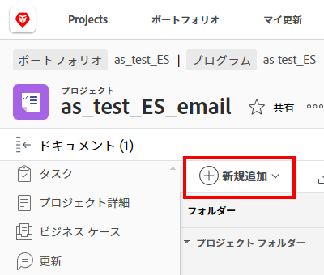

# ファイルシステムから Adobe Workfront へのドキュメントの追加

Adobe Workfront の次のエリアで、プロジェクト、タスクまたはイシューにドキュメントを追加できます。

* グローバルドキュメント領域
* Workfront オブジェクトのドキュメント領域
* Workfrontボード上の接続済みカード

また、新しいバージョンのドキュメントをアップロードし、Google Drive、Dropbox、Microsoft OneDrive など、サードパーティのクラウドベンダーからのドキュメントへのリンクを追加することもできます。新しいバージョンのドキュメントの追加について詳しくは、[新しいバージョンのドキュメントのアップロード](../../documents/managing-documents/upload-new-document-version.md)を参照してください。サードパーティのクラウドベンダーからのドキュメントの追加について詳しくは、[外部アプリケーションからのドキュメントのリンク](../../documents/adding-documents-to-workfront/link-documents-from-external-apps.md)を参照してください。

Workfront にアップロードできるファイルの種類とサイズに制限はありません。ただし、正常に完了するには、5 分以内にアップロードが完了し、十分なストレージ容量があることが必要です。

ドキュメントの新しいバージョンを Workfront にアップロードする方法について詳しくは、[新しいバージョンのドキュメントのアップロード](../../documents/managing-documents/upload-new-document-version.md)を参照してください。

## アクセス要件

以下が必要です。

<table style="table-layout:auto"> 
 <col> 
 <col> 
 <tbody> 
  <tr> 
   <td role="rowheader">Adobe Workfront プラン*</td> 
   <td> 
 任意
 </td> 
  </tr> 
  <tr> 
   <td role="rowheader">Adobe Workfront ライセンス*</td> 
   <td> 
リクエスト以上
 </td> 
  </tr> 
  <tr> 
   <td role="rowheader">アクセスレベル設定*</td> 
   <td> 
ドキュメントへのアクセスを編集
 
メモ：まだアクセス権がない場合は、アクセスレベルに追加の制限が設定されていないかどうか Workfront 管理者にお問い合わせください。Workfront 管理者がアクセスレベルを変更する方法について詳しくは、<a href="../../administration-and-setup/add-users/configure-and-grant-access/create-modify-access-levels.md" class="MCXref xref">カスタムアクセスレベルの作成または変更</a>を参照してください。
 </td> 
  </tr> 
 </tbody> 
</table>

&#42;保有するプラン、ライセンスタイプ、アクセス権を確認するには、Workfront 管理者に問い合わせてください。

## Workfront へのドキュメントの追加

ワークステーションのファイルシステムから、新しいドキュメントを Workfront に追加できます。また、Google Drive や SharePoint などのサードパーティアプリケーションからドキュメントをリンクすることもできます。

>[!NOTE]
>
>ドキュメントのアップロードではサイズ制限はありませんが、ドキュメントのダウンロードは 4 GB に制限されます。

ドキュメントを追加するには：

1. 新しいドキュメントを追加するプロジェクト、タスク、またはイシューに移動します。
1. 「**ドキュメント**」タブをクリックし、**新規追加**&#x200B;ドロップダウンメニューをクリックします。

   

1. 追加するドキュメントの種類に応じて、次のいずれかの操作を行います。

   <table style="table-layout:auto"> 
    <col> 
    <col> 
    <tbody> 
     <tr> 
      <td role="rowheader">ワークステーションのファイルシステムからのドキュメントのアップロード</td> 
      <td> 
       <ol> 
        <li value="1"><strong>新規追加</strong>ドロップダウンメニューから、<strong>ドキュメント</strong>を選択します。</li> 
        <li value="2"> 
ワークステーション上のファイルシステムから、追加するドキュメントを参照して選択します。 
 
Shift キーを押しながら追加のファイルを選択すると、複数のドキュメントを選択できます。
 </li> 
        <li value="3">「<strong>開く</strong>」をクリックします。</li> 
       </ol> 
       
<b>メモ</b>：ファイルマネージャーから直接ドキュメントリストにファイルをドラッグ＆ドロップすることもできます。</td> 
     </tr> 
     <tr> 
      <td role="rowheader">Google Drive や SharePoint などのサードパーティアプリケーションからのドキュメントのアップロード</td> 
      <td> 
       <ol> 
        <li value="1"> 
<strong>新規追加</strong>ドロップダウンメニューから、<strong>From &lt;name_of_third-party_application&gt;</strong> を選択します。
 
例えば、Google Drive からドキュメントをアップロードするには、<strong>From Google Drive</strong> をクリックします。
 </li> 
        <li value="2"> 
プロンプトに従って、サードパーティアプリケーションでドキュメントを選択します。 
 
リンクされたドキュメントについて詳しくは、<a href="../../documents/adding-documents-to-workfront/link-documents-from-external-apps.md" class="MCXref xref">外部アプリケーションからのドキュメントのリンク</a>を参照してください。
 </li> 
       </ol> </td> 
     </tr> 
     <tr> 
      <td role="rowheader">別の Workfront ユーザーからのドキュメントのリクエスト</td> 
      <td> 
       <ol> 
        <li value="1"><strong>新規追加</strong>ドロップダウンメニューから、<strong>ドキュメントのリクエスト</strong>を選択します。</li> 
        <li value="2"><strong>誰からリクエストしますか</strong>ボックスに、ドキュメントをリクエストするユーザーの名前を入力します。</li> 
        <li value="3"><strong>リクエスト内容を伝える</strong>ボックスに、ドキュメントの名前を入力します。</li> 
        <li value="4"> 
<strong>リクエストを送信</strong>をクリックします。
 
リクエストが「ドキュメント」タブに表示されます。
 
ドキュメントのリクエストについて詳しくは、<a href="../../documents/adding-documents-to-workfront/request-a-document.md" class="MCXref xref">ドキュメントのリクエスト</a>を参照してください。
 </li> 
       </ol> </td> 
     </tr> 
    </tbody> 
   </table>

## ドキュメントのセキュリティ

Workfront サイトは、ドキュメントを介してウイルスやその他の悪質なコンテンツがサイトに入るのを次の方法で防ぎます。

* [Workfront が破損ファイルを検出する方法](#how-workfront-detects-corrupted-files)
* [ファイル名の制限](#file-name-restrictions)

### Workfront が破損ファイルを検出する方法 {#how-workfront-detects-corrupted-files}

ドキュメントスキャンは、リクエストに応じてのみ、組織に対して有効になっています。

ドキュメントスキャンが有効な場合、25 MB 未満のファイルはアップロード時にスキャンされます。25 MB を超えるファイルはスキャンされません。

Workfront が破損したドキュメントを検出すると、Workfront はアップロードプロセスを中断し、ファイルが破損していることを示すメッセージが表示されます。また、Workfront が悪質な可能性のあるコンテンツを検出し、ファイルの削除が予定されている場合にも、メール通知が送信されます。

破損ファイルは、手動で削除しない限り、検出後 24 時間以内に削除されます。破損したファイルを削除すると、Workfront はこのアクションを更新として追跡します。Workfront による削除を許可した場合、更新は記録されません。

### ファイル名の制限 {#file-name-restrictions}

Workfront にアップロードされるファイルの名前には、特定の文字を含めることができません。ファイル名に `< > { }` のいずれかの文字が含まれている場合、その文字はファイルのアップロード時にファイル名から削除されます。
