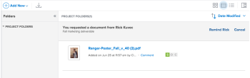

# ファイルシステムからAdobe Workfrontにドキュメントを追加する

Adobe Workfrontの次の領域で、プロジェクト、タスクまたはイシューにドキュメントを追加できます。

* 「グローバルドキュメント」領域
* Workfrontオブジェクトのドキュメント領域

また、新しいバージョンのドキュメントをアップロードし、Google Drive、Dropbox、Microsoft OneDrive など、サードパーティのクラウドベンダーからのドキュメントへのリンクを追加することもできます。 新しいバージョンのドキュメントの追加について詳しくは、 [新しいバージョンのドキュメントをアップロード](../../documents/managing-documents/upload-new-document-version.md). サードパーティのクラウドベンダーからのドキュメントの追加について詳しくは、 [外部アプリケーションからドキュメントをリンク](../../documents/adding-documents-to-workfront/link-documents-from-external-apps.md).

Workfrontにアップロードできるファイルの種類とサイズに制限はありません。 ただし、正常に完了するには、5 分以内にアップロードが完了し、十分なストレージ容量が必要です。

ドキュメントの新しいバージョンをWorkfrontにアップロードする方法について詳しくは、 [新しいバージョンのドキュメントをアップロード](../../documents/managing-documents/upload-new-document-version.md).

## アクセス要件

以下が必要です。

<table style="table-layout:auto"> 
 <col> 
 <col> 
 <tbody> 
  <tr> 
   <td role="rowheader">Adobe Workfront plan*</td> 
   <td> 
 任意
 </td> 
  </tr> 
  <tr> 
   <td role="rowheader">Adobe Workfrontライセンス*</td> 
   <td> 
リクエスト以上
 </td> 
  </tr> 
  <tr> 
   <td role="rowheader">アクセスレベル設定*</td> 
   <td> 
ドキュメントへのアクセスを編集
 
注意：まだアクセス権がない場合は、Workfront管理者に、アクセスレベルに追加の制限を設定しているかどうかを問い合わせてください。 Workfront管理者がアクセスレベルを変更する方法について詳しくは、 <a href="../../administration-and-setup/add-users/configure-and-grant-access/create-modify-access-levels.md" class="MCXref xref">カスタムアクセスレベルの作成または変更</a>.
 </td> 
  </tr> 
 </tbody> 
</table>

&#42;保有しているプラン、ライセンスの種類、アクセス権を確認するには、Workfront管理者に問い合わせてください。

## Workfrontにドキュメントを追加

新しいドキュメントは、ワークステーションのファイルシステムからWorkfrontに追加できます。 また、Google Drive やSharePointなどのサードパーティアプリケーションからドキュメントをリンクすることもできます。

>[!NOTE]
>
>ドキュメントのアップロードではサイズ制限はありませんが、ドキュメントのダウンロードは 4 GB に制限されます。

ドキュメントを追加するには：

1. 新しいドキュメントを追加するプロジェクト、タスク、またはタスクに移動します。
1. 次をクリック： **ドキュメント** 「 」タブで、 **新規追加** ドロップダウンメニュー。

   

1. 追加するドキュメントの種類に応じて、次のいずれかの操作を行います。

   <table style="table-layout:auto"> 
    <col> 
    <col> 
    <tbody> 
     <tr> 
      <td role="rowheader">ワークステーションにファイルシステムからドキュメントをアップロード</td> 
      <td> 
       <ol> 
        <li value="1">次の <strong>新規追加</strong> ドロップダウンメニューで、「 <strong>文書。</strong></li> 
        <li value="2"> 
ワークステーション上のファイルシステムから、追加するドキュメントを参照して選択します。 
 
Shift キーを押しながら追加のファイルを選択すると、複数のドキュメントを選択できます。
 </li> 
        <li value="3">クリック <strong>開く</strong>.</li> 
       </ol> </td> 
     </tr> 
     <tr> 
      <td role="rowheader">Google Drive やSharePointなどのサードパーティアプリケーションからドキュメントをアップロードする</td> 
      <td> 
       <ol> 
        <li value="1"> 
次の <strong>新規追加</strong> ドロップダウンメニューで、「 <strong>送信者 &lt;name_of_third-party_application&gt;</strong>.
 
例えば、Google Drive からドキュメントをアップロードするには、 <strong>Google Drive から</strong>.
 </li> 
        <li value="2"> 
画面の指示に従って、サードパーティアプリケーションでドキュメントを選択します。 
 
リンクされたドキュメントの詳細については、 <a href="../../documents/adding-documents-to-workfront/link-documents-from-external-apps.md" class="MCXref xref">外部アプリケーションからドキュメントをリンク</a>.
 </li> 
       </ol> </td> 
     </tr> 
     <tr> 
      <td role="rowheader">別のWorkfrontユーザーからのドキュメントのリクエスト</td> 
      <td> 
       <ol> 
        <li value="1">次の <strong>新規追加</strong> ドロップダウンメニューで、「 <strong>ドキュメントのリクエスト</strong>.</li> 
        <li value="2">内 <strong>誰からリクエストしているか</strong> ボックスに、ドキュメントを要求するユーザーの名前を入力します。</li> 
        <li value="3">内 <strong>リクエスト内容を伝える</strong> ボックスに、ドキュメントの名前を入力します。</li> 
        <li value="4"> 
クリック <strong>リクエストを送信</strong>.
 
リクエストが「ドキュメント」タブに表示されます。
 
  
 
ドキュメントのリクエストについて詳しくは、 <a href="../../documents/adding-documents-to-workfront/request-a-document.md" class="MCXref xref">ドキュメントのリクエスト</a>.
 </li> 
       </ol> </td> 
     </tr> 
    </tbody> 
   </table>

## Document Security

Workfrontサイトは、次の方法でドキュメントを介してウイルスやその他の悪意のあるコンテンツがサイトに入るのを防ぎます。

* [Workfrontが破損したファイルを検出する方法](#how-workfront-detects-corrupted-files)
* [ファイル名の制限](#file-name-restrictions)

### Workfrontが破損したファイルを検出する方法 {#how-workfront-detects-corrupted-files}

Workfrontは、ドキュメントのアップロード時にウイルスをスキャンします。 破損したドキュメントをアップロードしようとすると、Workfrontはアップロードプロセスを中断し、ファイルが破損していることを示すメッセージが表示されます。 また、Workfrontが悪意の可能性のあるコンテンツを検出し、ファイルの削除が予定されている場合にも、電子メール通知が送信されます。\
破損したファイルは、手動で削除しない限り、検出後 24 時間以内にすべて削除されます。 破損したファイルを削除した場合、Workfrontはこのアクションを更新として追跡します。 Workfrontによる削除を許可した場合、更新は記録されません。

### ファイル名の制限 {#file-name-restrictions}

Workfrontにアップロードされたファイルには、ファイル名に特定の文字を含めることはできません。 ファイル名に次の文字のいずれかが含まれている場合、ファイルのアップロード時にその文字がファイル名から削除されます。 `< > { }`.
