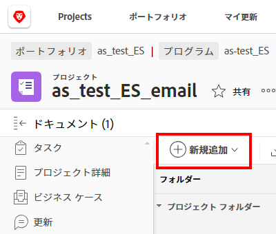

# ファイルシステムから Adobe Workfront へのドキュメントの追加

Workfrontには現在、ドキュメント エリアの 2 つのバージョン（従来のドキュメント エリアと新しいドキュメント エリア）があります。 使用するバージョンは、組織が従来のWorkfront ストレージとエンタープライズストレージのどちらに属しているかによって異なります。 これらのストレージタイプについて詳しくは、[Adobe エンタープライズストレージの概要 &#x200B;](/help/quicksilver/review-and-approve-work/esm-overview.md) を参照してください。

Workfrontへのドキュメントの追加は、組織が使用するドキュメントエリアのバージョンによって異なります。

* [従来のドキュメント領域でファイルシステムからにドキュメントを追加します](#add-documents-from-your-file-system-in-the-legacy-documents-area)
* [Workfrontの新しいドキュメントエリアにドキュメントを追加する](#add-documents-to-workfront-in-the-new-documents-area)

## アクセス要件

+++ 展開すると、この記事の機能のアクセス要件が表示されます。

<table style="table-layout:auto"> 
 <col> 
 <col> 
 <tbody> 
  <tr> 
   <td role="rowheader">Adobe Workfront パッケージ</td> 
   <td> 
 任意
 </td> 
  </tr> 
  <tr> 
   <td role="rowheader">Adobe Workfront ライセンス*</td> 
   <td> 
   
コントリビューター以上
 
   
リクエスト以上
 </td> 
  </tr> 
  <tr> 
   <td role="rowheader">アクセスレベル設定</td> 
   <td> 
従来のWorkfront ストレージ：ドキュメントへの編集アクセス
 
   
エンタープライズストレージ：ドキュメントへの編集アクセスは、デフォルトで有効になっており、変更できません

   </td> 
  </tr> 
 </tbody> 
</table>

詳しくは、[Workfront ドキュメントのアクセス要件](/help/quicksilver/administration-and-setup/add-users/access-levels-and-object-permissions/access-level-requirements-in-documentation.md)を参照してください。

+++

## ファイルシステムのドキュメントをレガシードキュメント領域に追加します

組織が従来のWorkfront ストレージを使用している場合、Workfrontでドキュメントにアクセスすると、従来のドキュメント領域が表示されます。 Workfront ストレージについて詳しくは、[Adobe エンタープライズストレージと従来のWorkfront ストレージの違い &#x200B;](/help/quicksilver/review-and-approve-work/esm-overview.md#differences-between-adobe-enterprise-storage-and-legacy-workfront-storage) を参照してください。

Adobe Workfront の次のエリアで、プロジェクト、タスクまたはイシューにドキュメントを追加できます。

* グローバルドキュメント領域
* Workfront オブジェクトのドキュメント領域
* Workfront ボード上の接続されているカード

また、新しいバージョンのドキュメントをアップロードし、Google Drive、Dropbox、Microsoft OneDrive など、サードパーティのクラウドベンダーからのドキュメントへのリンクを追加することもできます。新しいバージョンのドキュメントの追加について詳しくは、[新しいバージョンのドキュメントのアップロード](../../documents/managing-documents/upload-new-document-version.md)を参照してください。サードパーティのクラウドベンダーからのドキュメントの追加について詳しくは、[外部アプリケーションからのドキュメントのリンク](../../documents/adding-documents-to-workfront/link-documents-from-external-apps.md)を参照してください。

Workfront にアップロードできるファイルの種類とサイズに制限はありません。ただし、正常に完了するには、5 分以内にアップロードが完了し、十分なストレージ容量があることが必要です。

ドキュメントの新しいバージョンを Workfront にアップロードする方法について詳しくは、[新しいバージョンのドキュメントのアップロード](../../documents/managing-documents/upload-new-document-version.md)を参照してください。

### Workfrontの従来のドキュメント エリアにドキュメントを追加する

ワークステーションのファイルシステムから、新しいドキュメントを Workfront に追加できます。また、Google Drive や SharePoint などのサードパーティアプリケーションからドキュメントをリンクすることもできます。

>[!IMPORTANT]
>
>* 一度に最大 150 個のドキュメントをアップロードできます。
>* ファイルサイズに制限はありません。
>* ドキュメントのダウンロードは 4 GB に制限されています。

ドキュメントを追加するには：

1. 新しいドキュメントを追加するプロジェクト、タスク、またはイシューに移動します。
1. 「**ドキュメント**」タブをクリックし、**新規追加**&#x200B;ドロップダウンメニューをクリックします。

   

1. 追加するドキュメントの種類に応じて、次のいずれかの操作を行います。

   <table style="table-layout:auto"> 
    <col> 
    <col> 
    <tbody> 
     <tr> 
      <td role="rowheader">ワークステーションのファイルシステムからのドキュメントのアップロード</td> 
      <td> 
       <ol> 
        <li value="1"><strong>新規追加</strong>ドロップダウンメニューから、<strong>ドキュメント</strong>を選択します。</li> 
        <li value="2"> 
ワークステーション上のファイルシステムから、追加するドキュメントを参照して選択します。 
 
Shift キーを押しながら追加のファイルを選択すると、複数のドキュメントを選択できます。
 </li> 
        <li value="3">「<strong>開く</strong>」をクリックします。</li> 
       </ol> 
       
<b>メモ</b>：ファイルマネージャーから直接ドキュメントリストにファイルをドラッグ＆ドロップすることもできます。</td> 
     </tr> 
     <tr> 
      <td role="rowheader">Google Drive や SharePoint などのサードパーティアプリケーションからのドキュメントのアップロード</td> 
      <td> 
       <ol> 
        <li value="1"> 
<strong>新規追加</strong>ドロップダウンメニューから、<strong>From &lt;name_of_third-party_application&gt;</strong> を選択します。
 
例えば、Google Drive からドキュメントをアップロードするには、<strong>From Google Drive</strong> をクリックします。
 </li> 
        <li value="2"> 
プロンプトに従って、サードパーティアプリケーションでドキュメントを選択します。 
 
リンクされたドキュメントについて詳しくは、<a href="../../documents/adding-documents-to-workfront/link-documents-from-external-apps.md" class="MCXref xref">外部アプリケーションからのドキュメントのリンク</a>を参照してください。
 </li> 
       </ol> </td> 
     </tr> 
     <tr> 
      <td role="rowheader">別の Workfront ユーザーからのドキュメントのリクエスト</td> 
      <td> 
       <ol> 
        <li value="1"><strong>新規追加</strong>ドロップダウンメニューから、<strong>ドキュメントのリクエスト</strong>を選択します。</li> 
        <li value="2"><strong>誰からリクエストしますか</strong>ボックスに、ドキュメントをリクエストするユーザーの名前を入力します。</li> 
        <li value="3"><strong>リクエスト内容を伝える</strong>ボックスに、ドキュメントの名前を入力します。</li> 
        <li value="4"> 
<strong>リクエストを送信</strong>をクリックします。
 
リクエストが「ドキュメント」タブに表示されます。
 
ドキュメントのリクエストについて詳しくは、<a href="../../documents/adding-documents-to-workfront/request-a-document.md" class="MCXref xref">ドキュメントのリクエスト</a>を参照してください。
 </li> 
       </ol> </td> 
     </tr> 
    </tbody> 
   </table>

## Workfrontの新しいドキュメントエリアにドキュメントを追加する

エンタープライズストレージモデルを使用して、プロジェクト、タスク、イシューにドキュメントを追加できます。 エンタープライズストレージについて詳しくは、[Adobe エンタープライズストレージの概要 &#x200B;](/help/quicksilver/review-and-approve-work/esm-overview.md) を参照してください。

新しいドキュメント領域では現在サポートされていない機能は次のとおりです。

* グローバルドキュメントエリアへのドキュメントのアップロード
* Google Drive、Dropbox、Microsoft OneDrive など、サードパーティクラウドベンダーのドキュメントへのリンクを追加します。
* ドキュメントのリクエスト
* フォルダーへのリンクのコピー
* ドキュメントのチェックアウト
* クリップボードからの画像の貼り付け
* スマートフォルダーの追加

### Workfrontの新しいドキュメントエリアにドキュメントを追加する

エンタープライズストレージを使用している場合、Workfrontでドキュメントにアクセスすると、新しいドキュメント エリアが表示されます。 エンタープライズストレージについて詳しくは、[Adobe エンタープライズストレージの概要 &#x200B;](/help/quicksilver/review-and-approve-work/esm-overview.md) を参照してください。

<!--
>[!IMPORTANT]
>
>* You can upload up to 150 documents at one time.
>* There is no limit on the file size. 
>* Document downloads are limited to 4GB.
-->

ドキュメントを追加するには：

1. 新しいドキュメントを追加するプロジェクト、タスク、またはイシューに移動します。
1. 左側のパネルで **ドキュメント** をクリックします。
1. ページの右側にある「**新規** をクリックするか、表示されるドロップゾーンにファイルをドラッグ&amp;ドロップします。 一度に複数のドキュメントを追加できます。

   

ドキュメントの新しいバージョンを Workfront にアップロードする方法について詳しくは、[新しいバージョンのドキュメントのアップロード](../../documents/managing-documents/upload-new-document-version.md)を参照してください。

## エンタープライズストレージのドキュメントセキュリティ

Workfrontは、次の方法で、ウイルスやその他の悪意のあるコンテンツがドキュメントを介してサイトに入るのを防ぎます。

**Workfront が破損ファイルを検出する方法**

エンタープライズストレージモデルを使用すると、オブジェクトに対してドキュメントスキャンが自動的に有効になります。

500 MB 未満のすべてのファイルは、アップロード時にスキャンされます。 500 MB を超えるファイルはスキャンされません。 Workfrontで破損しているドキュメントが検出されると、自動的に削除されます。

**ファイル名の制限**

この統合はAdobe エンタープライズストレージを使用して構築されるので、プロジェクトとドキュメントを管理する際に認識しておくべき構造と命名規則がいくつかあります。

* オブジェクト名は一意である必要があり、複製できません
* Adobe エンタープライズストレージには、階層ツリー内の同じ親を持つピアオブジェクトに対して、一意の名前が必要です
* ドキュメントが同じプロジェクトに属している場合、ドキュメントに同じ名前を付けることはできません
* ドキュメント名に次の特殊文字を含めることはできません：`\ / : * ? " | < >`
* ドキュメント名は最大 255 文字に制限されています

これらの制限を念頭に置いて、Workfrontは、競合を防ぐために必要に応じてオブジェクトまたはドキュメントの名前を自動的に変更します。

## 従来のWorkfront ストレージの Document Security

Workfront サイトは、次の方法で、ウイルスやその他の悪意のあるコンテンツがドキュメントを介してサイトに入るのを防ぎます。

**Workfront が破損ファイルを検出する方法**

ドキュメントスキャンは、リクエストに応じてのみ、組織に対して有効になっています。

ドキュメントスキャンが有効な場合、25 MB 未満のファイルはアップロード時にスキャンされます。25 MB を超えるファイルはスキャンされません。

Workfrontで破損しているドキュメントが検出されると、ファイルが破損していることを示すメッセージが表示されます。 また、Workfront が悪質な可能性のあるコンテンツを検出し、ファイルの削除が予定されている場合にも、メール通知が送信されます。

破損ファイルは、手動で削除しない限り、検出後 24 時間以内に削除されます。破損したファイルを削除すると、Workfront はこのアクションを更新として追跡します。Workfront による削除を許可した場合、更新は記録されません。

**ファイル名の制限**

Workfront にアップロードされるファイルの名前には、特定の文字を含めることができません。ファイル名に `! # % * \ | ' " / ? < > { } [ ]` のいずれかの文字が含まれている場合、その文字はファイルのアップロード時にファイル名から削除されます。
