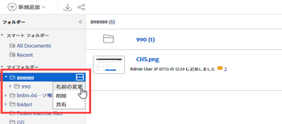
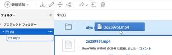

# 外部アプリケーションからドキュメントをリンク

次のソースから、ドキュメントとフォルダーをAdobe Workfrontにリンクできます。

<table style="table-layout:auto"> 
 <col> 
 <col> 
 <tbody> 
  <tr> 
   <td role="rowheader">既存のサードパーティクラウドドキュメントプロバイダー</td> 
   <td>これには、次のものが含まれます。 
    <ul> 
     <li>Box</li> 
     <li>Dropbox</li> 
     <li>Dropbox事業</li> 
     <li>WebDAM</li> 
     <li>Microsoft OneDrive</li> 
     <li>Microsoft SharePoint</li> 
     <li>Google Drive</li> 
    </ul></td> 
  </tr> 
  <tr> 
   <td role="rowheader">Workfront Proof </td> 
   <td>Workfrontの配達確認で最初に作成した配達確認をWorkfront内で利用できるようにします。 この機能を使用するには、Pro Workfront Plan 以降が必要です。 利用可能な様々なプランについて詳しくは、 <a href="https://www.workfront.com/plans">Workfront Plans</a>.</td> 
  </tr> 
  <tr data-mc-conditions="QuicksilverOrClassic.Quicksilver"> 
   <td role="rowheader">Experience Manager Assets Essentials </td> 
   <td>Experience Manager Assets Essentials からWorkfrontにドキュメントをリンクできます。 詳しくは、 <a href="../../documents/adobe-workfront-for-experience-manager-assets-essentials/workfront-for-aem-asset-essentials.md" class="MCXref xref"> Adobe Workfront for Experience Manager Assets Essentials</a>.</td> 
  </tr> 
  <tr> 
   <td role="rowheader">Workfront DAM </td> 
   <td>追加の購入が必要です。 </td> 
  </tr> 
  <tr> 
   <td role="rowheader">その他のドキュメントプロバイダー（カスタムドキュメントの統合を通じて）</td> 
   <td> 
この機能を使用するには、Pro Workfront Plan 以降が必要です。 利用可能な様々なプランについて詳しくは、 <a href="https://www.workfront.com/plans">Workfront Plans</a>.
 </td> 
  </tr> 
 </tbody> 
</table>

ドキュメントやフォルダーをリンクする前に、Workfront管理者がドキュメントプロバイダーごとに、またはカスタムドキュメント統合用に、この機能を有効にする必要があります。詳しくは、 [ドキュメント統合の設定](../../administration-and-setup/configure-integrations/configure-document-integrations.md).

Workfrontに直接アップロードされたドキュメントを使用する場合と同じ方法で、外部クラウドプロバイダーにリンクされたドキュメントの配達確認や承認をおこなうことができます。

## アクセス要件

以下が必要です。

<table style="table-layout:auto"> 
 <col> 
 <col> 
 <tbody> 
  <tr> 
   <td role="rowheader">Adobe Workfront plan*</td> 
   <td> 
 任意
 </td> 
  </tr> 
  <tr> 
   <td role="rowheader">Adobe Workfrontライセンス*</td> 
   <td> 
リクエスト以上
 </td> 
  </tr> 
  <tr> 
   <td role="rowheader">アクセスレベル設定*</td> 
   <td> 
ドキュメントへのアクセスを編集
 
注意：まだアクセス権がない場合は、Workfront管理者に、アクセスレベルに追加の制限が設定されているかどうかを問い合わせてください。 Workfront管理者がアクセスレベルを変更する方法について詳しくは、 <a href="../../administration-and-setup/add-users/configure-and-grant-access/create-modify-access-levels.md" class="MCXref xref">カスタムアクセスレベルの作成または変更</a>.
 </td> 
  </tr> 
 </tbody> 
</table>

&#42;保有するプラン、ライセンスの種類、アクセス権を確認するには、Workfront管理者に問い合わせてください。

## ドキュメントストレージ

外部アプリケーションからWorkfrontにリンクされたドキュメントは、Workfront内ではなく、外部クラウドプロバイダーに保存されます。

次の例外が適用されます。

* ドキュメントサービスで提供されると、サムネール画像とプレビュー画像がWorkfrontサーバーに保存される場合があります。
* Workfrontで校正を使用すると、ドキュメントがコピーされ、校正サーバーに追加されます。

## 外部アプリケーションからWorkfrontにドキュメントをリンク

既存のドキュメントを外部のクラウドプロバイダーにリンクすることができます。 これには共有ドキュメントも含まれます。

* [前提条件](#prerequisites)
* [外部ドキュメントをWorkfrontにリンク](#link-an-external-document-to-workfront)
* [リンクされたドキュメントの新しいバージョンを追加する](#add-a-new-version-of-a-linked-document)
* [Workfront Proof ドキュメントのリンク](#link-workfront-proof-documents)
* [Workfront内でGoogleドキュメントを作成する](#create-a-google-document-from-within-workfront)

### 前提条件 {#prerequisites}

ドキュメントやフォルダーをリンクする前に、Workfront管理者がドキュメントプロバイダーごとに、またはカスタムドキュメント統合用に、この機能を有効にする必要があります。詳しくは、 [ドキュメント統合の設定](../../administration-and-setup/configure-integrations/configure-document-integrations.md).

### 外部ドキュメントをWorkfrontにリンク {#link-an-external-document-to-workfront}

GoogleやMicrosoft OneDrive などの外部アプリケーションからWorkfrontにドキュメントをリンクできます。

>[!IMPORTANT]
>
>Dropboxは、ファイルパスに基づいてドキュメントを保存します。 このため、Dropboxからリンクされたファイルを移動、名前変更または削除すると、Workfrontからはアクセスできなくなります。

1. 次に移動： **ドキュメント** ドキュメントを挿入するWorkfrontの領域。
1. クリック **新規追加**&#x200B;次に、ドキュメントをWorkfrontにリンクする外部ドキュメントプロバイダーをクリックします。

   例えば、Dropboxからドキュメントをリンクするには、 **開始Dropbox**.

   既に認証済みの外部プロバイダーがリストの上部に表示されます。

1. （条件付き）外部サービスへのログインを求められた場合は、表示されるボックスにサービスのログイン資格情報を入力し、 **ログイン**.
1. （条件付き）外部アプリケーションを認証するよう求められた場合、 **許可** 」ボタンをクリックします。

   これは 1 回だけ実行する必要があります。

1. ( **外部ファイルとフォルダのリンク** 表示されるボックスに、検索する項目の名前を入力し、 **入力** を使用すると、どのフォルダーに格納されているかに関係なく、外部アプリケーションからのすべての結果を表示できます。

   または

   リンクするドキュメントを参照して選択します。

   複数のドキュメントを選択することもできますが、現在のビューで選択したドキュメントのみがリンクされます。 例えば、ドキュメントを選択してフォルダーに移動すると、最初に選択したドキュメントはリンクされません。

1. （条件付き） Workfront DAM のお客様の場合、 **サムネール** アイコンをクリックして、ファイルをサムネール画像として表示します。

   >[!NOTE]
   >
   >Workfront DAM をご利用のお客様は、Workfront DAM からドキュメントをリンクする際にサムネールを表示できます。 また、Workfront DAM のユーザーには、Dropboxやボックスなどの他のサービスでサムネールが表示される場合があります。 ただし、Workfront内でのWorkfront DAM 以外のサービスのサムネールの表示はサポートされておらず、SharePointまたはGoogle Drive からドキュメントをリンクするときにサムネールが表示されることはありません。

1. クリック **リンク**.

   Workfrontでは、ドキュメントの横にクラウドプロバイダーのアイコンが表示されます。

   >[!NOTE]
   >
   >Box にリンクされているドキュメントの場合、Box 内のドキュメントへのリンクは、ページを更新するまで表示されません。

### リンクされたドキュメントの新しいバージョンを追加する {#add-a-new-version-of-a-linked-document}

外部アプリケーションから、Workfrontにリンクされた新しいバージョンのドキュメントを追加できます。

1. 次に移動： **ドキュメント** ドキュメントがリンクされている領域を選択し、リンクされているドキュメントを選択します。

   >[!IMPORTANT]
   >
   >新しいバージョンを作成するには、ドキュメントがリンクされたフォルダーの外部にある必要があります。

1. クリック **新規追加** > **バージョン**&#x200B;次に、外部のドキュメントプロバイダーをクリックします。

   例えば、Dropboxから新しいバージョンのドキュメントをリンクするには、 **開始Dropbox**.

   既に認証済みの外部プロバイダーがリストの上部に表示されます。

1. （条件付き）外部サービスへのログインを求められた場合は、表示されるボックスにサービスのログイン資格情報を入力し、 **ログイン**.
1. （条件付き）外部アプリケーションを認証するよう求められた場合は、 **許可**.

   これは 1 回だけ実行する必要があります。

1. ( **外部ファイルとフォルダのリンク** 表示されるボックスに、検索する項目の名前を入力し、 **入力** を使用すると、どのフォルダーに格納されているかに関係なく、外部アプリケーションからのすべての結果を表示できます。

   または

   リンクするドキュメントを参照して選択します。

   複数のドキュメントを選択できますが、現在のビューで選択したドキュメントのみがリンクされます。 例えば、ドキュメントを選択してフォルダーに移動すると、最初に選択したドキュメントはリンクされません。

1. （条件付き） Workfront DAM のお客様の場合、 **サムネール** アイコンをクリックして、ファイルをサムネール画像として表示します。

   >[!NOTE]
   >
   >Workfront DAM をご利用のお客様は、Workfront DAM からドキュメントをリンクする際にサムネールを表示できます。 また、Workfront DAM のユーザーには、Dropboxやボックスなどの他のサービスでサムネールが表示される場合があります。 ただし、Workfront内でのWorkfront DAM 以外のサービスのサムネールの表示はサポートされておらず、SharePointまたはGoogle Drive からドキュメントをリンクするときにサムネールが表示されることはありません。

1. クリック **リンク**.

   Workfrontでは、ドキュメントの横にクラウドプロバイダーのアイコンが表示され、外部のクラウドプロバイダーにリンクされていることを示します。

   >[!NOTE]
   >
   >Box にリンクされているドキュメントの場合、Box 内のドキュメントへのリンクは、ページを更新するまで表示されません。

ファイルシステムからWorkfrontにアップロードしたドキュメントの新しいバージョンを追加する方法については、 [ファイルシステムからAdobe Workfrontにドキュメントを追加する](../../documents/adding-documents-to-workfront/add-documents-from-file-system.md#adding-new-versions-of-documents) in [ファイルシステムからAdobe Workfrontにドキュメントを追加する](../../documents/adding-documents-to-workfront/add-documents-from-file-system.md).

### Workfront Proof ドキュメントのリンク {#link-workfront-proof-documents}

Workfrontの配達確認に最初に存在したWorkfrontに配達確認をリンクできます。 Workfrontの配達確認から配達確認をリンクすると、その配達確認に関連付けられたすべてのコメントやその他のメタデータをWorkfrontで使用できます。

Workfrontの配達確認で表示アクセス権を持つ配達確認のみをリンクできます。

1. 次に移動： **ドキュメント** ドキュメントを挿入するWorkfrontの領域。
1. クリック **新規追加**&#x200B;を選択し、次に **Workfront Proof から**.

   >[!NOTE]
   >
   >このメニューのオプションは、環境で設定されているサードパーティプロバイダーによって異なる場合があります。

1. Adobe Analytics の **リンク** 配達確認 **から** Workfrontの配達確認ボックスが表示されたら、Workfrontで使用可能にする配達確認の名前を入力します。

   入力すると、リストがフィルターされます。

1. リンクする配達確認を 10 件まで選択します。

   配達確認が既にWorkfrontのドキュメントに関連付けられているので、淡色表示になっている配達確認名はリンクできません。

1. クリック **リンク**.

   配達確認の最新バージョンは、Workfrontにリンクされています。 配達確認を開くと、すべてのバージョンが校正ビューアで使用できます。

### Workfront内でGoogleドキュメントを作成する {#create-a-google-document-from-within-workfront}

Workfront内から新しいGoogleドキュメントを作成できます。 他のクラウドプロバイダー向けの新しいドキュメントをWorkfront内から作成することはできません。

1. 次に移動： **ドキュメント** ドキュメントを挿入するWorkfrontの領域。
1. クリック **新規追加** > **Google File**&#x200B;次に、作成するGoogleドキュメントの種類を選択します。

1. 作成するGoogle Doc のタイプを選択します。
1. 次の場合、 **Google Drive アカウントを追加** ボックスが表示され、 **Google ドライブを認証**.

   Googleドキュメントが **ドキュメント** タブをクリックします。

   >[!NOTE]
   >
   > 「My Drive」と「Shared with Me」に、2 つの異なる結果が表示されます。 [ マイドライブ ] にファイルが見つからない場合は、[ 自分と共有 ] フォルダを確認してください。

## Workfrontのドキュメントを更新し、外部クラウドプロバイダーにリンクする

ドキュメントをWorkfrontから外部のクラウドプロバイダーにアップロードしてリンクできます。 これにより、ドキュメントのストレージがWorkfrontから外部クラウドプロバイダーに移動します。 外部アプリケーションでドキュメントを変更すると、Workfrontでドキュメントが自動的に更新されます。

Workfrontにアクセスできないユーザーは、外部アプリケーションにアクセスできる場合は、そのドキュメントを外部アプリケーションで表示できます。

1. Workfrontでアップロードするドキュメントを選択します。
1. クリック **その他** >**送信先**&#x200B;次に、リンクされたドキュメントを保存するクラウドプロバイダーを選択します。

   「その他」メニューも使用できます。  をクリックして、ドキュメントの詳細ページでこれをおこないます。

1. ドキュメントを保存するプロバイダーのアプリケーション内のフォルダーを選択します。

   これには、プロバイダーのアプリケーション内の任意のフォルダー（共有フォルダーを含む）を指定できます。

1. 「**保存**」をクリックします。

   ドキュメント名の横に外部プロバイダーのロゴが表示され、ドキュメントがWorkfrontにリンクされ、外部クラウドプロバイダーによって保存されたことを示します。

   

## フォルダーのリンク

Workfrontと外部のクラウドプロバイダーの間でフォルダーをリンクすると、フォルダーとそのすべてのコンテンツがリンクされます。 Workfrontアクセス権を持たないユーザーが外部ドキュメントアプリケーションからファイルを追加、削除、変更すると、変更内容がWorkfrontに同期されます。 次の節では、フォルダーとサブフォルダーをリンクする方法について説明します。

* [フォルダーのアクセス権](#folder-access-rights)
* [1 つ以上の外部フォルダーのリンク](#link-one-or-more-external-folders)
* [リンクされたフォルダーにサブフォルダーを追加する](#add-subfolders-to-a-linked-folder)

### フォルダーのアクセス権 {#folder-access-rights}

外部のドキュメントアプリケーションからフォルダーコンテンツを同期する場合、Workfrontは、元々フォルダーをリンクしたユーザーの資格情報を使用します。 これにより、次のようなユーザーエクスペリエンスが得られます。

* 外部アプリケーションのファイルやフォルダーの表示アクセス権を持たず、Workfrontでリンクされたフォルダーを表示するアクセス権を持っている場合、ユーザーは、Workfrontでファイルやフォルダーの名前のみを表示でき、内容は表示できません。
* 他のユーザーがWorkfrontにリンクしたWorkfront内のリンクされたフォルダー内のコンテンツ（リンクされたフォルダー内のサブフォルダーなど）にアクセスすると、コンテンツは、コンテンツにアクセスするユーザーの資格情報ではなく、元々リンクしたユーザーのWorkfrontログイン資格情報を使用してWorkfrontに同期されます。

>[!IMPORTANT]
>
>* もともとフォルダーをリンクしていたユーザーがWorkfrontシステムから削除された場合、ユーザーはWorkfrontを使用して、リンクされたフォルダーのコンテンツにアクセスできなくなります。 この場合、外部アプリケーションのフォルダーに対する権限を持つアクティブなWorkfrontユーザーが、フォルダーを再リンクする必要があります。
>* フォルダーをリンクしたユーザーが外部アプリケーションにアクセスできなくなった場合、Workfrontはフォルダーのコンテンツにアクセスできなくなります。 この問題は、例えば、フォルダーを最初にリンクしたユーザーが会社を離れた場合に発生する可能性があります。 引き続きアクセスできるように、フォルダーへのアクセス権を持つユーザーは、フォルダーを再リンクする必要があります。

### 1 つ以上の外部フォルダーのリンク {#link-one-or-more-external-folders}

1. フォルダーを追加するWorkfrontの領域に移動し、「  **ドキュメント**  をクリックします。

1. クリック **新規追加**&#x200B;次に、フォルダーをWorkfrontにリンクする外部ドキュメントプロバイダーをクリックします。
1. （条件付き）外部サービスをまだ承認していない場合は、外部プロバイダーのログイン資格情報を指定して、 **ログイン**.

   既に認証済みの外部プロバイダーがリストの上部に表示されます。

1. Adobe Analytics の **外部ファイルとフォルダのリンク** ボックスが表示されたら、リンクするフォルダを参照して選択します。

   または

   検索するフォルダーの名前を入力し、 **入力**.

   複数のフォルダを選択できますが、現在のビューで選択したフォルダのみがリンクされます。 例えば、フォルダーを選択してフォルダーに移動した場合、最初に選択したフォルダーはリンクされません。

   >[!NOTE]
   >
   >Google Drive からフォルダーをリンクする場合は、個人用ドライブ（マイドライブ）とチームドライブ内のフォルダーのみをリンクできます。 「自分と共有」領域からフォルダをリンクすることはできません。

1. クリック **リンク**.

   Workfrontでは、フォルダーの横に、クラウドプロバイダーのロゴが表示され、外部のクラウドプロバイダーにリンクされていることを示します。

1. （オプション） Workfrontのフォルダー名が外部ドキュメントアプリケーションのフォルダー名と異なるようにフォルダー名を変更するには、 **フォルダー** 」セクションで、その他メニューをクリックします。   フォルダー名の横に表示される **名前を変更**.

   

外部アプリケーションのフォルダーの名前は変更されません。

### リンクされたフォルダーにサブフォルダーを追加する  {#add-subfolders-to-a-linked-folder}

既存のリンクフォルダー内に新しいフォルダーを作成できます。 別のフォルダーを既存のリンクされたフォルダーにドラッグすることもできます。

1. 既存のリンクフォルダー内に新しいフォルダーを作成するには、既存のフォルダーに移動し、新しいフォルダーを作成します。詳しくは、 [ドキュメントフォルダーの作成](../../documents/organizing-documents/create-documents-folder.md).

   または

   既存のフォルダを既存のリンクフォルダにドラッグするには、サブフォルダが必要なドキュメント領域に移動し、リンクフォルダにドラッグします。

   

   >[!NOTE]
   >
   >既存のWorkfrontフォルダーをリンクされたフォルダーにドラッグする場合、次の制限が適用されます。
   >
   >* ドラッグするフォルダーは、まだリンクされておらず、既にリンクされているコンテンツを含めることはできません。
   >* ドラッグするフォルダー（その内容を含む）は 50 MB を超えることはできません。

## リンクされたフォルダーにドキュメントを追加する

Workfrontを使用してリンクされたフォルダーにドキュメントを追加すると、自動的にリンクされたドキュメントとして追加されます。

1. ドキュメントを保存するリンク先のフォルダを選択し、 **新規追加/ドキュメント**」をクリックし、ドキュメントを参照してフォルダーに追加します。

   または

   Adobe Analytics の **ドキュメント** ドキュメントを作成する領域で、ドキュメントをリンクされたフォルダーにドラッグします。

   ドキュメントの新しいバージョンが外部アプリケーションで自動的に作成され、Workfrontにリンクされます。

>[!NOTE]
>
> * ドキュメントの移動中は、ドキュメントオプションは使用できません。 ドキュメントをExperience Manager Assetsに移動すると、はWorkfrontのドキュメントリストに表示されなくなります。
>
> * ドキュメントの移動中にドキュメントに対しておこなったアクションや編集は、Experience Manager Assetsのドキュメントには表示されないので、失われます。

## リンクされたドキュメントまたはフォルダーの削除

リンクされたドキュメントまたはフォルダーを外部アプリケーションから削除した場合、そのドキュメントまたはフォルダーは、Workfrontからも削除するまで、Workfrontシステムに残ります。

1. リンクされたドキュメントまたはフォルダーを選択し、 **削除**.
1. 表示される確認ボックスで、 **はい、リンクを解除します**.

   ドキュメントのリンクがWorkfrontサイトから解除されました。 外部アプリケーションの影響を受けません。

## リンクされたドキュメントとフォルダーの名前変更について

リンクされたドキュメントまたはフォルダーの名前を変更すると、変更は、そのドキュメントまたはフォルダーを作成したアプリケーションでのみ表示されます。 例えば、Workfrontでリンクされたドキュメントの名前を変更した場合、新しい名前はWorkfrontでのみ表示されます。

Workfrontと外部アプリケーションで名前を一致させる場合は、名前を両方の場所で変更する必要があります。

>[!IMPORTANT]
>
>DropboxにリンクされているWorkfront内のドキュメントの名前を変更しないでください。変更すると、Workfront内のファイルにアクセスできなくなります。 代わりに、Dropboxのファイル名を変更し、ファイルを再同期します。 [外部アプリケーションからドキュメントをリンク](#synchronizing-changes-made-on-a-linked-document).
