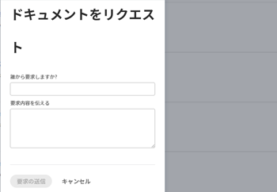

# ドキュメントをリクエスト

ドキュメントをサポートする任意のオブジェクトに関するドキュメントをリクエストできます。

## アクセス要件

以下が必要です。

<table style="table-layout:auto"> 
 <col> 
 <col> 
 <tbody> 
  <tr> 
   <td role="rowheader">Adobe Workfront プラン*</td> 
   <td> 
 任意
 </td> 
  </tr> 
  <tr> 
   <td role="rowheader">Adobe Workfront ライセンス*</td> 
   <td> 
リクエスト以上
 </td> 
  </tr> 
  <tr> 
   <td role="rowheader">アクセスレベル設定*</td> 
   <td> 
ドキュメントへのアクセスを編集
 
メモ：まだアクセス権がない場合は、アクセスレベルに追加の制限が設定されていないかどうか Workfront 管理者にお問い合わせください。Workfront 管理者がアクセスレベルを変更する方法について詳しくは、<a href="../../administration-and-setup/add-users/configure-and-grant-access/create-modify-access-levels.md" class="MCXref xref">カスタムアクセスレベルの作成または変更</a>を参照してください。
 </td> 
  </tr> 
 </tbody> 
</table>

&#42;ご利用のプラン、ライセンスタイプまたはアクセス権を確認するには、Workfront 管理者にお問い合わせください。

## ドキュメントをリクエスト

1. リクエストしたドキュメントを配置するエリアに移動します。
1. 「**ドキュメント**」タブをクリックします。
1. **新規追加**&#x200B;ドロップダウンメニューをクリックします。

1. 「**ドキュメントをリクエスト**」をクリックします。

   ドキュメントをリクエストダイアログボックスが表示されます。

   

1. ドキュメントをリクエストするユーザーの名前を入力し始め、ドロップダウンリストに表示されたら選択します。オプションとして表示されるのは、ライセンスを持つ Adobe Workfront ユーザーのみです。

   >[!NOTE]
   >
   >アカウントの[従来のライセンスの概要](../../administration-and-setup/add-users/access-levels-and-object-permissions/wf-licenses.md)が有効である場合、任意のメールアドレスにリクエストを送信できます。[システムセキュリティの環境設定の指定](../../administration-and-setup/manage-workfront/security/configure-security-preferences.md)にある設定では、これらの外部メールユーザーが、Workfront とやり取りする前にパスワードを作成する必要があるかどうかを決定します。

1. ドキュメントをリクエストする理由を説明します。
1. 「**リクエストを送信**」をクリックします。

   ユーザーに対してリクエストを行うと、ドキュメントエリアにプレースホルダーが追加されます。ユーザーに通知したり、このプレースホルダーからリクエストをキャンセルしたりできます。ユーザーは、Workfront 通知とリクエストに関するメールを受け取ります。

   この環境設定が有効な場合、ユーザーはメール通知とアプリ内通知を受け取ります。電子メール通知について詳しくは、 [独自の電子メール通知を変更する](../../workfront-basics/using-notifications/activate-or-deactivate-your-own-event-notifications.md).

   メール通知に含まれるリンクをクリックして、ドキュメントをアップロードできます。また、アプリ内通知をクリックすることもできます。各オプションを選択すると、ユーザープロファイルページに移動し、リクエストしたドキュメントをアップロードできます。

1. ドキュメントをアップロードした後、リクエストしたユーザーは自分の&#x200B;**ドキュメント**&#x200B;エリアでドキュメントにアクセスできます。

   任意の Workfront ページの右上隅にあるユーザープロファイル画像をクリックし、自分の名前をクリックして「**ドキュメント**」タブをクリックすると、自分の&#x200B;**ドキュメント**&#x200B;エリアにアクセスできます。
