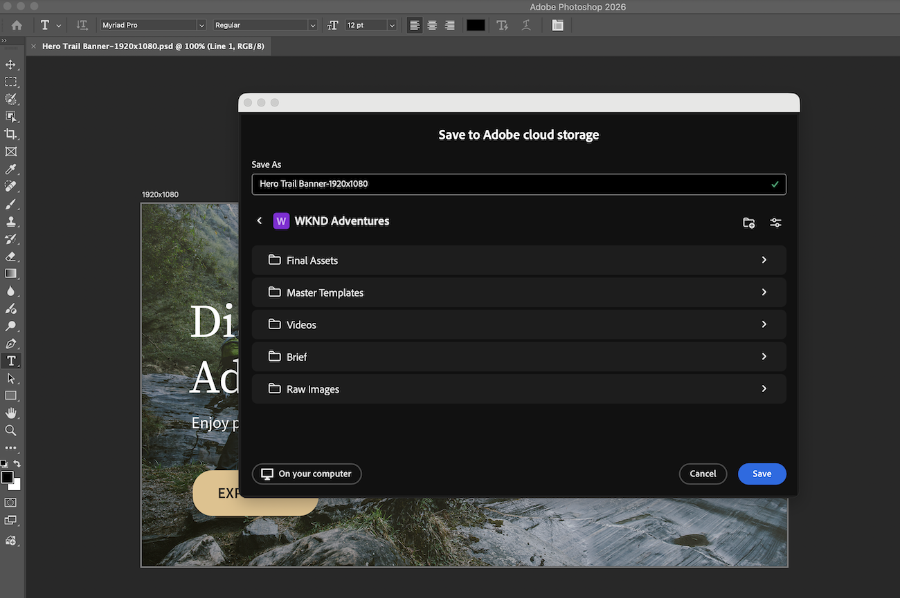

# Creative Cloud アプリケーションでのWorkfront ドキュメントの使用

Workfront プロジェクトをCreative Cloud プロジェクトパネルで使用できるようになったら、Photoshop、Illustrator、またはInDesignから直接ドキュメントを操作できます。

## 前提条件

* 組織は、Adobe クラウドストレージをサポートするWorkfrontのバージョンを使用している必要があります。
* WorkfrontとPhotoshop、Illustrator、またはInDesignは、同じAdobe Identity Management System （IMS）組織で使用権限を持っている必要があります。

## アクセス要件

+++ 展開すると、この記事の機能のアクセス要件が表示されます。

<table style="table-layout:auto"> 
 <col> 
 <col> 
 <tbody> 
  <tr> 
   <td role="rowheader">Adobe Workfront版</td> 
   <td>Adobe クラウドストレージが有効になっているWorkflow Ultimate</td> 
  </tr> 
  <tr> 
   <td role="rowheader">オブジェクト権限</td> 
   <td>
      
プロジェクトへのアクセスを表示して、Creative Cloud プロジェクトパネルでプロジェクトを表示する

      
プロジェクトへのアクセス権を編集して、プロジェクトを追加、編集、削除する

   </td> 
  </tr> 
 </tbody> 
</table>

詳しくは、[Workfront ドキュメントのアクセス要件](/help/quicksilver/administration-and-setup/add-users/access-levels-and-object-permissions/access-level-requirements-in-documentation.md)を参照してください。

+++

## Workfront プロジェクトへのアクセス

Workfront プロジェクトのドキュメントフォルダー構造は、プロジェクトパネルに反映されます。 プロジェクトフォルダーからドキュメントを開いて編集し、保存すると、変更内容がWorkfrontに表示されます。

>[!NOTE]
>
>従来のWorkfront ストレージプロジェクトは、プロジェクトパネル（Adobe クラウドストレージプロジェクトのみ）ではサポートされていません。

Photoshop、IllustratorまたはInDesignでWorkfront プロジェクトにアクセスするには：

1. Photoshop、Illustrator、またはInDesignを開きます。
1. アプリの左側にある&#x200B;**プロジェクト** パネルで、開くWorkfront プロジェクトを選択します。

   

1. プロジェクトでドキュメントを開いて編集します。 変更内容を保存すると、Workfront プロジェクトに自動的に保存されます。

>[!TIP]
>
>Word文書やExcel文書など、Photoshop、Illustrator、InDesignで開けないファイル形式を編集するには、代わりにAdobe Cloud Driveを使用します。 詳しくは、[Adobe Cloud Driveの概要](/help/quicksilver/documents/adobe-cloud-drive/adobe-cloud-drive-overview.md)を参照してください。

## Creative Cloud アプリからWorkfrontに新しいドキュメントを保存する

新しいファイルをWorkfrontに保存したり、既存のファイルの新しいコピーをPhotoshop、Illustrator、またはInDesignからWorkfrontに保存したりできます。

新しいドキュメントをWorkfrontに保存するには：

1. Photoshop、Illustrator、またはInDesignを開き、新しいファイルを作成します。
1. 上部メニューで、次のいずれかの操作を行います。
   * 新しいファイルを保存するには、**保存**&#x200B;をクリックします。
   * 既存のファイルの新しいコピーを保存するには、**別名で保存**&#x200B;をクリックします。
1. **別名で保存** ダイアログで、**クラウドドキュメントに保存**&#x200B;を選択し、必要なWorkfront プロジェクトを選択します。

   >[!NOTE]
   >
   >Workfront プロジェクトに既にドキュメントを保存している場合、「別名で保存」ダイアログが開きません。 Workfront プロジェクトを選択したり、別のフォルダーに保存したり、別のWorkfront プロジェクトを選択したりできます。

   

1. ドキュメントフォルダーを選択し、**保存**&#x200B;をクリックします。 フォルダーを選択しない場合、ドキュメントはプロジェクトのルートフォルダーに保存されます。

   

## 文書の承認を依頼する

Workfrontでドキュメントの承認機能を追加するには、Photoshop、Illustrator、InDesignからアップロードしたドキュメント、または他のドキュメントと同じAdobe Cloud Driveからアップロードしたドキュメントを使用します。 詳しくは、[ ドキュメント承認ワークフローの作成](/help/quicksilver/review-and-approve-work/document-reviews-and-approvals/manage-document-approvals/create-a-document-approval.md)を参照してください。

## Creative Cloud アプリからWorkfrontでドキュメントのバージョンを管理する

Photoshop、Illustrator、またはInDesignからWorkfrontにドキュメントを保存すると、保存した変更内容が「バージョン」タブの「現在のファイル」に表示され、「新しい更新」バッジが付けられます。

ドキュメントの新しいバージョンをアップロードするのではなく、現在のファイルに対して承認をリクエストできます。 詳しくは、[現在のファイルに対する承認のリクエスト ](#request-approval-on-the-current-file)を参照してください。

### 現在のファイルに対する承認の要求

Workfrontで現在の文書ファイルの承認をリクエストするには：

1. 承認を依頼するドキュメントが含まれているWorkfrontのプロジェクトに移動します。
1. ドキュメントを開き、「**バージョン**」タブに移動します。
1. 現在のファイルで、**詳細** メニューをクリックし、**承認依頼**&#x200B;をクリックします。
1. **承認を依頼** ダイアログで、[ ドキュメント承認ワークフローの作成](/help/quicksilver/review-and-approve-work/document-reviews-and-approvals/manage-document-approvals/create-a-document-approval.md)の手順に従って承認を作成します。

   

