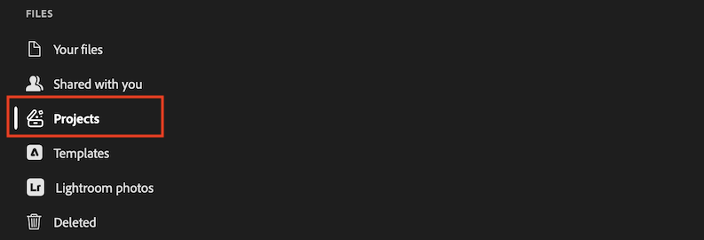

# Creative Cloud アプリケーションでのWorkfront ドキュメントの使用

Workfront プロジェクトをCreative Cloud プロジェクトパネルで使用できるようになったら、Photoshop、Illustrator、またはInDesignから直接ドキュメントを操作できます。

## 前提条件

* 組織は、Adobe クラウドストレージをサポートするWorkfrontのバージョンを使用している必要があります。
* WorkfrontとPhotoshop、Illustrator、またはInDesignは、同じAdobe Identity Management System （IMS）組織で使用権限を持っている必要があります。

## アクセス要件

+++ 展開すると、この記事の機能のアクセス要件が表示されます。

<table style="table-layout:auto"> 
 <col> 
 <col> 
 <tbody> 
  <tr> 
   <td role="rowheader">Adobe Workfront版</td> 
   <td>Adobe クラウドストレージが有効になっているWorkflow Ultimate</td> 
  </tr> 
  <tr> 
   <td role="rowheader">オブジェクト権限</td> 
   <td>
      
プロジェクトへのアクセスを表示して、Creative Cloud プロジェクトパネルでプロジェクトを表示する

      
プロジェクトへのアクセス権を編集して、プロジェクトを追加、編集、削除する

   </td> 
  </tr> 
 </tbody> 
</table>

詳しくは、[Workfront ドキュメントのアクセス要件](/help/quicksilver/administration-and-setup/add-users/access-levels-and-object-permissions/access-level-requirements-in-documentation.md)を参照してください。

+++

## Workfront プロジェクトへのアクセス

Workfront プロジェクトのドキュメントフォルダー構造は、プロジェクトパネルに反映されます。 プロジェクトフォルダーからドキュメントを開いて編集し、保存すると、変更内容がWorkfrontに表示されます。

>[!NOTE]
>
>従来のWorkfront ストレージプロジェクトは、プロジェクトパネル（Adobe クラウドストレージプロジェクトのみ）ではサポートされていません。

Photoshop、IllustratorまたはInDesignでWorkfront プロジェクトにアクセスするには：

1. Photoshop、Illustrator、またはInDesignを開きます。
1. アプリの左側にある&#x200B;**プロジェクト** パネルで、開くWorkfront プロジェクトを選択します。

   

1. プロジェクトでドキュメントを開いて編集します。 変更内容を保存すると、Workfront プロジェクトに自動的に保存されます。

>[!TIP]
>
>Word文書やExcel文書など、Photoshop、Illustrator、InDesignで開けないファイル形式を編集するには、代わりにAdobe Cloud Driveを使用します。 詳しくは、[Adobe Cloud Driveの概要](/help/quicksilver/documents/adobe-cloud-drive/adobe-cloud-drive-overview.md)を参照してください。

## 文書の承認を依頼する

Workfrontでドキュメントの承認機能を追加するには、Photoshop、Illustrator、InDesignからアップロードしたドキュメント、または他のドキュメントと同じAdobe Cloud Driveからアップロードしたドキュメントを使用します。 詳しくは、[&#x200B; ドキュメント承認ワークフローの作成](/help/quicksilver/review-and-approve-work/document-reviews-and-approvals/manage-document-approvals/create-a-document-approval.md)を参照してください。

<!--
need to verify
Creating an approval on a Creative Cloud document also creates a new version of the document. For more information, see [Manage document versions](/help/quicksilver/documents/managing-documents/manage-document-versions.md#view-the-current-file-during-an-approval).
-->