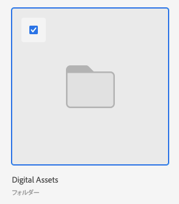

# Experience Manager Assets Essentials のアセットとフォルダーのリンク

Experience Manager Assets Essentialsのアセットまたはフォルダーを、ドキュメントをサポートする任意のAdobe Workfront オブジェクトにリンクできます。

Content Advisorを使用してExperience Manager Assetsのアセットとフォルダーをリンクするには、[Experience Manager Assetsを利用したContent Advisorでアセットとフォルダーをリンクする](/help/quicksilver/documents/adobe-workfront-for-experience-manager-assets-essentials/link-to-aem.md)を参照してください。

## アクセス要件

+++ 展開すると、この記事の機能のアクセス要件が表示されます。

<table style="table-layout:auto"> 
 <col> 
 <col> 
 <tbody> 
  <tr> 
   <td role="rowheader">Adobe Workfront パッケージ</td> 
   <td> 
 任意
 </td> 
  </tr> 
  <tr> 
   <td role="rowheader">Adobe Workfront ライセンス</td> 
   <td> 
   
コントリビューター以上
 
   
リクエスト以上
 </td> 
  </tr> 
  <tr> 
   <td role="rowheader">その他の製品</td> 
   <td>Experience Manager as a Cloud Service または Assets Essentials を使用するには、Admin Console に製品にユーザーとして追加されている必要があります。</td> 
  </tr> 
   <tr> 
    <td role="rowheader">Experience Manager 権限</td> 
    <td>フォルダーへの書き込みアクセス権が必要です。</td> 
   </tr>
  <tr> 
   <td role="rowheader">アクセスレベル設定</td> 
   <td> 
ドキュメントへのアクセスを編集
 </td> 
  </tr> 
  <tr> 
   <td role="rowheader">オブジェクト権限</td> 
   <td> 
表示アクセス権またはそれ以上の権限
 </td> 
  </tr> 
 </tbody> 
</table>

この表の情報について詳しくは、[Workfront ドキュメントのアクセス要件](/help/quicksilver/administration-and-setup/add-users/access-levels-and-object-permissions/access-level-requirements-in-documentation.md)を参照してください。

+++

## 前提条件

開始する前の確認事項。

* Workfront 管理者は、Experience Manager 統合を設定する必要があります。詳しくは、[Experience Manager Assets Essentials統合の設定](/help/quicksilver/documents/adobe-workfront-for-experience-manager-assets-essentials/setup-asset-essentials.md)を参照してください。

## Experience Manager Assets Essentialsからアセットをリンクする

1. ドキュメントを追加する Workfront の&#x200B;**ドキュメント**&#x200B;エリアに移動します。
1. 「**新規追加**」を選択して、管理者が設定した Experience Manager 統合を選択します。

   >[!NOTE]
   >
   >Workfront管理者は、この統合の任意の名前を選択できるので、Experience Manager Assets Essentialsに関する具体的な言及は含まれません。

1. 目的のアセットを選択します。

   

1. 「**選択**」をクリックします。

## Experience Manager Assets Essentialsから新しいバージョンをリンクする

Experience Manager Assets Essentialsから新しいアセットを取得し、新しいバージョンとして既存のアセットに追加できます。 ドキュメントが既にリンクされており、Experience Manager Assets Essentialsに新しいバージョンが追加されている場合、新しいバージョンはWorkfrontに自動的に表示されます。

新しいバージョンをリンクするには：

1. ドキュメントを追加する Workfront の&#x200B;**ドキュメント**&#x200B;エリアに移動します。
1. 新しいバージョンに置き換えるアセットを選択します。リンクされたフォルダー内に新しいバージョンのアセットを作成することはできません。
1. **新規追加**／**バージョン**&#x200B;で、管理者が設定した Experience Manager 統合を選択します。

   >[!NOTE]
   >
   >Workfront管理者は、この統合の任意の名前を選択できるので、Experience Manager Assets Essentialsには特に言及しない場合があります。

1. リンクするアセットを選択します。

1. 「**選択**」をクリックします。

## Experience Manager Assets Essentialsからフォルダーをリンクする

フォルダー内の個々のアセットを表示する権限は、Experience Manager Assets Essentialsの権限に依存します。

1. フォルダーを作成する Workfront の&#x200B;**ドキュメント**&#x200B;エリアに移動します。
1. 「**新規追加**」を選択して、管理者が設定した Experience Manager 統合を選択します。

   >[!NOTE]
   >
   >Workfront管理者は、この統合の任意の名前を選択できるので、Experience Manager Assets Essentialsには特に言及しない場合があります。

1. 目的のフォルダーを選択します。

   

1. 「**選択**」をクリックします。

## 考慮事項

* Content Advisor機能は、Assets Essentialsでは使用できません。 Content Advisorを使用してアセットとフォルダーをリンクするには、[Experience Manager Assetsを利用したContent Advisorでアセットとフォルダーをリンクする](/help/quicksilver/documents/adobe-workfront-for-experience-manager-assets-essentials/link-to-aem.md)を参照してください。

* Assets Essentials から送信されたアセットは、Workfront のドキュメントストレージ全体にはカウントされません。Workfront から Assets Essentials にアップロードおよび送信されたドキュメントは、全体的なストレージにカウントされます。

* メタデータフィールドは、WorkfrontからExperience Manager Assets Essentialsにアセットを送信するときに最初にマッピングされます。 Workfront 管理者がオブジェクトメタデータの同期を有効にしている場合、どちらかのアプリケーションで変更されたフィールドは最新の状態に保たれます。
