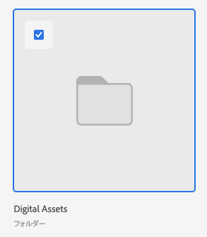

# Experience Manager AssetsまたはAssets Essentialsからのアセットおよびフォルダーのリンク

Experience Manager AssetsまたはAssets Essentialsのアセットまたはフォルダーを、ドキュメントをサポートしている任意のAdobe Workfrontオブジェクトにリンクできます。 Assets Essentialsから送信されたアセットは、Workfrontのドキュメントストレージ全体にはカウントされません。 WorkfrontからAssets Essentialsにアップロードされ、送信されたドキュメントは、全体的なストレージにカウントされます。

アセットをWorkfrontからExperience Manager AssetsまたはAssets Essentialsに送信する際に、メタデータフィールドが最初にマッピングされます。 Workfront管理者がオブジェクトメタデータの同期を有効にしている場合、どちらかのアプリケーションで変更されたフィールドは最新の状態に保たれます。

## アクセス要件

以下が必要です。

<table style="table-layout:auto"> 
 <col> 
 <col> 
 <tbody> 
  <tr> 
   <td role="rowheader">Adobe Workfront plan*</td> 
   <td> 
 任意
 </td> 
  </tr> 
  <tr> 
   <td role="rowheader">Adobe Workfrontライセンス*</td> 
   <td> 
リクエスト以上
 </td> 
  </tr> 
  <tr> 
   <td role="rowheader">製品</td> 
   <td>as a Cloud ServiceのExperience ManagerまたはAssets Essentialsがあり、ユーザーとして製品に追加されている必要があります。Admin Console。</td> 
  </tr> 
   <tr> 
    <td role="rowheader">Experience Manager権限</td> 
    <td>フォルダーへの書き込みアクセス権が必要です。</td> 
   </tr>
  <tr> 
   <td role="rowheader">アクセスレベル設定*</td> 
   <td> 
ドキュメントへのアクセスを編集
 
注意：まだアクセス権がない場合は、Workfront管理者に、アクセスレベルに追加の制限を設定しているかどうかを問い合わせてください。 Workfront管理者がアクセスレベルを変更する方法について詳しくは、 <a href="../../administration-and-setup/add-users/configure-and-grant-access/create-modify-access-levels.md" class="MCXref xref">カスタムアクセスレベルの作成または変更</a>.
 </td> 
  </tr> 
  <tr> 
   <td role="rowheader">オブジェクト権限</td> 
   <td> 
アクセス権以上の表示
 
追加のアクセス権のリクエストについて詳しくは、 <a href="../../workfront-basics/grant-and-request-access-to-objects/request-access.md" class="MCXref xref">オブジェクトへのアクセスのリクエスト </a>.
 </td> 
  </tr> 
 </tbody> 
</table>

&#42;保有しているプラン、ライセンスの種類、アクセス権を確認するには、Workfront管理者に問い合わせてください。

## 前提条件

始める前に

* Workfront管理者は、統合を設定する必要があります。 詳しくは、 [Experience Manager Assets統合の設定](/help/quicksilver/administration-and-setup/configure-integrations/configure-aacs-integration.md) または [Experience Manager Assets Essentials 統合の設定](/help/quicksilver/documents/adobe-workfront-for-experience-manager-assets-essentials/setup-asset-essentials.md).

## Experience Manager AssetsまたはAssets Essentialsからのアセットのリンク

Experience Manager AssetsまたはAssets EssentialsからWorkfrontにアセットをリンクできます。 アセットをリンクすると、次の操作が可能になります。

* [リンクされたアセットのExperience Manager AssetsまたはAssets Essentialsでの配達確認](../../documents/adobe-workfront-for-experience-manager-assets-essentials/proof-linked-asset-aem.md)
* [新しいバージョンのドキュメントをアップロード](../../documents/managing-documents/upload-new-document-version.md)

1. 次に移動： **ドキュメント** ドキュメントを追加するWorkfrontの領域。
1. 選択 **新規追加**」で、管理者が設定したExperience Manager統合を選択します。

   >[!NOTE]
   >
   >Workfrontの管理者は、この統合に対して任意の名前を選択できるので、Assets やAssets Essentialsについては特に言及できません。

1. 使用するアセットを選択します。

   

1. クリック **選択**.

## Experience Manager AssetsまたはAssets Essentialsからのフォルダーのリンク

フォルダー内の個々のアセットを表示する権限は、Experience Manager AssetsまたはAssets Essentialsの権限に依存します。

1. 次に移動： **ドキュメント** フォルダーを作成するWorkfrontの領域です。
1. 選択 **新規追加**」で、管理者が設定したExperience Manager統合を選択します。

   >[!NOTE]
   >
   >Workfrontの管理者は、この統合に対して任意の名前を選択できるので、Assets やAssets Essentialsについては特に言及しない場合があります。

1. 使用するフォルダを選択します。

   

1. クリック **選択**.

## Experience Manager AssetsまたはAssets Essentialsから新しいバージョンをリンク

新しいアセットをAssets Essentialsから引き出し、新しいバージョンとして既存のアセットに追加できます。 ドキュメントが既にリンクされていて、新しいバージョンがAssets Essentialsに追加されている場合は、新しいバージョンがWorkfrontに自動的に表示されます。

Assets Essentialsから新しいバージョンをリンクするには：

1. 次に移動： **ドキュメント** ドキュメントを追加するWorkfrontの領域。
1. 新しいバージョンに置き換えるアセットを選択します。 リンクされたフォルダー内に新しいバージョンのアセットを作成することはできません。
1. 選択 **新規追加** > **バージョン**」で、管理者が設定したExperience Manager統合を選択します。

   >[!NOTE]
   >
   >Workfrontの管理者は、この統合に対して任意の名前を選択できるので、Assets やAssets Essentialsについては特に言及しない場合があります。

1. 目的のアセットを選択します。

   

1. クリック **選択**.

>[!TIP]
>
>に移動すると、アセットのすべてのバージョンを表示できます **ドキュメントの詳細** > **バージョン**.
