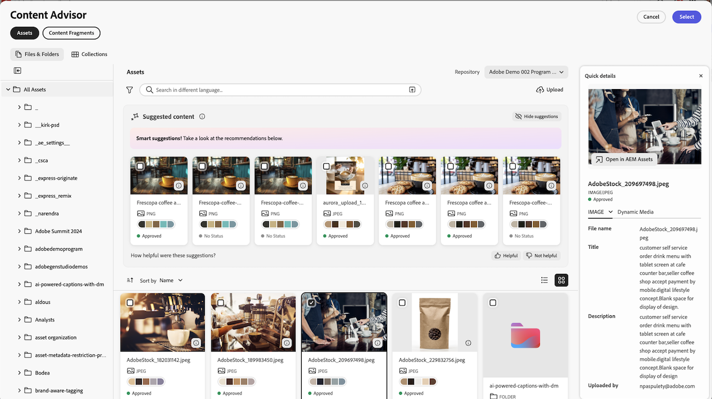

# Experience Manager AssetsのContent Advisorでコンテンツとフォルダーをリンクする

Content Advisorは、コンテキストに即したインテリジェントな発見をWorkfrontに直接提供し、コンテキストに基づいて承認済みの関連性の高いコンテンツを迅速に検索するのに役立ちます。 スマート提案、Dynamic Mediaのレンディション、詳細なアセットメタデータなどの機能を使用して、Workfrontから直接、コンテンツを効率的に評価および再利用できます。これにより、ブランドの一貫性を維持しながら、コンテンツ制作を迅速化できます。

Content Advisorを使用して、Experience Manager AssetsのコンテンツとフォルダーをWorkfrontにリンクできます。 リンクすると、Workfrontでコンテンツを表示および管理でき、Experience Manager Assetsでコンテンツに加えられた変更はWorkfrontに反映されます。

>[!IMPORTANT]
>
>組織がGenAI Rider契約への署名を拒否した場合でも、Content Advisorを使用してExperience Manager Assetsのアセットとフォルダーを選択できますが、AI 検索、スマートレコメンデーション、キャンペーンブリーフの分析など、AIを活用した機能にはアクセスできません。

## アクセス要件

+++ 展開すると、この記事の機能のアクセス要件が表示されます。

<table style="table-layout:auto"> 
 <col> 
 <col> 
 <tbody> 
  <tr> 
   <td role="rowheader">Adobe Workfront パッケージ</td> 
   <td> 
 任意
 </td> 
  </tr> 
  <tr> 
   <td role="rowheader">Adobe Workfront ライセンス</td> 
   <td> 
   
コントリビューター以上
 
   
リクエスト以上
 </td> 
  </tr> 
  <tr> 
   <td role="rowheader">その他の製品</td> 
   <td>Experience Manager as a Cloud Service または Assets Essentials を使用するには、Admin Console に製品にユーザーとして追加されている必要があります。</td> 
  </tr> 
   <tr> 
    <td role="rowheader">Experience Manager 権限</td> 
    <td>フォルダーへの書き込みアクセス権が必要です。</td> 
   </tr>
  <tr> 
   <td role="rowheader">アクセスレベル設定</td> 
   <td> 
ドキュメントへのアクセスを編集
 </td> 
  </tr> 
  <tr> 
   <td role="rowheader">オブジェクト権限</td> 
   <td> 
表示アクセス権またはそれ以上の権限
 </td> 
  </tr> 
 </tbody> 
</table>

この表の情報について詳しくは、[Workfront ドキュメントのアクセス要件](/help/quicksilver/administration-and-setup/add-users/access-levels-and-object-permissions/access-level-requirements-in-documentation.md)を参照してください。

+++

## 前提条件

開始する前の確認事項。

* Workfront 管理者は、Experience Manager 統合を設定する必要があります。詳しくは、[Experience Manager Assets as a Cloud Service 統合の設定](/help/quicksilver/administration-and-setup/configure-integrations/configure-aacs-integration.md)を参照してください。

* スマート提案またはキャンペーンブリーフ機能を使用するには、GenAI ライダーに署名する必要があります。 詳しくは、[Adobe アプリケーションでContent Advisorを使用してAEM コンテンツにアクセスする](https://experienceleague.adobe.com/en/docs/experience-manager-cloud-service/content/assets/manage/content-advisor-adobe-applications#content-advisor-ai-search)を参照してください。

## Content AdvisorでExperience Manager Assetsのコンテンツをリンクする

Content Advisorを使用して、Experience Manager AssetsのコンテンツをWorkfront内で直接リンクできるようになりました。 Content AdvisorはAssets Essentialsでは使用できません。

コンテンツをリンクするには：

1. ドキュメントを追加する Workfront の&#x200B;**ドキュメント**&#x200B;エリアに移動します。
1. 「**新規追加**」を選択して、管理者が設定した Experience Manager 統合を選択します。

   >[!NOTE]
   >
   >Workfront管理者は、この統合の任意の名前を選択できるので、Experience Manager Assetsについて具体的に言及していない場合があります。

1. Content Advisorを使用すると、次のことが可能になります。

   <table style="table-layout:auto">
   <tbody>
      <tr>
         <td><strong>AI 検索を使用してアセットを検索します。</strong>複数の言語、タイプミス、類義語をサポートし、クエリの背後にある意味と意図を理解するAIを活用した検索を使用します。</td>
         <td>詳しくは、「<a href="https://experienceleague.adobe.com/en/docs/experience-manager-cloud-service/content/assets/manage/content-advisor-adobe-applications#content-advisor-ai-search">よりスマートなアセット検出のためのAI 検索</a>」を参照してください。</td>
      </tr>
      <tr>
         <td><strong> コンテキストと意図に基づいてスマート提案を表示します。</strong> ホスト Adobe アプリケーションのコンテキストに応じたレコメンデーションを使用して、コンテンツのニーズに合ったアセットを見つけます。</td>
         <td>詳しくは、<a href="https://experienceleague.adobe.com/en/docs/experience-manager-cloud-service/content/assets/manage/content-advisor-adobe-applications#smart-suggestions-content-advisor"> コンテキストとインテントに基づくスマート提案</a>を参照してください。</td>
      </tr>
      <tr>
         <td><strong> キャンペーン概要をアップロードして、関連するアセットを見つけます。</strong> Content Advisorが分析して関連アセットを推奨できるように、PDF、DOCX、またはTXT キャンペーンの概要ドキュメントをアップロードします。</td>
         <td>詳細については、<a href="https://experienceleague.adobe.com/en/docs/experience-manager-cloud-service/content/assets/manage/content-advisor-adobe-applications#campaign-briefs-content-advisor"> キャンペーン概要を参照して、関連するアセットを見つけてください</a>。</td>
      </tr>
      <tr>
         <td><strong>Dynamic Media アセットのレンディションを表示して選択します。</strong>画像プリセット、スマート切り抜き、形式タイプなど、チャネルに最適化されたレンディションを参照し、Dynamic Media修飾子を適用して調整をリアルタイムでプレビューします。</td>
         <td>詳しくは、<a href="https://experienceleague.adobe.com/en/docs/experience-manager-cloud-service/content/assets/manage/content-advisor-adobe-applications#dynamic-media-renditions-content-advisor">使用できるDynamic Media アセットのレンディション </a>を参照してください。</td>
      </tr>
      <tr>
         <td><strong>Dynamic Media修飾子をレンディションに適用します。</strong>修飾子を追加してアセット レンディションをリアルタイムで変換し、ホスト アプリケーションのレンディションを選択する前に結果をプレビューします。</td>
         <td>詳しくは、<a href="https://experienceleague.adobe.com/en/docs/experience-manager-cloud-service/content/assets/manage/content-advisor-adobe-applications#dynamic-media-renditions-content-advisor">使用できるDynamic Media アセットのレンディション </a>を参照してください。</td>
      </tr>
      <tr>
         <td><strong> コンテンツフラグメントを検索して参照します。</strong> コンテンツフラグメントの検索、ライブサムネールプレビューの表示、ステータス（ドラフト、変更、公開済み）の確認、詳細なプロパティ、参照、バリエーションの検査を行います。</td>
         <td>詳しくは、<a href="https://experienceleague.adobe.com/en/docs/experience-manager-cloud-service/content/assets/manage/content-advisor-adobe-applications#content-fragments-discovery-content-advisor"> コンテンツフラグメントの検出</a>を参照してください。</td>
      </tr>
      <tr>
         <td><strong> アセットのメタデータにアクセスします。</strong> Assets ビューと一致するタイトル、説明、書式、サイズ、その他のメタデータタブ（製品、キャンペーン、タグ）などのアセットプロパティを確認します。</td>
         <td>詳しくは、「<a href="https://experienceleague.adobe.com/en/docs/experience-manager-cloud-service/content/assets/manage/content-advisor-adobe-applications#asset-metadata-content-advisor">Assets ビューと一致したアセットメタデータへのアクセス </a>」を参照してください。</td>
      </tr>
      <tr>
         <td><strong>定義済みフィルターを使用してアセットをフィルタリングします。</strong> ファイルの種類、ファイル形式、アセットの状態、ファイル サイズ、画像の幅、画像の高さ、変更日、作成日などのフィルターを使用して、アセットの結果を調整します。</td>
         <td>詳しくは、「<a href="https://experienceleague.adobe.com/en/docs/experience-manager-cloud-service/content/assets/manage/content-advisor-adobe-applications#filters-content-advisor">Assets ビューと一致するフィルターへのアクセス </a>」を参照してください。</td>
      </tr>
      <tr>
         <td><strong>検索を保存して再利用します。</strong>検索語句とフィルターオプションを指定して保存済みの検索条件を作成し、Experience Manager Assetsや他のAdobe アプリケーションで再利用できます。</td>
         <td>詳細については、<a href="https://experienceleague.adobe.com/en/docs/experience-manager-cloud-service/content/assets/manage/content-advisor-adobe-applications#saved-searches-content-advisor">最近の検索と保存された検索のアクセスと再利用</a>を参照してください。</td>
      </tr>
      <tr>
         <td><strong> コレクション間およびコレクション内のアセットを検索します。</strong>すべてのコレクションでアセットまたはコレクションを検索するか、検索を特定のコレクションに制限します。</td>
         <td>詳しくは、<a href="https://experienceleague.adobe.com/en/docs/experience-manager-cloud-service/content/assets/manage/content-advisor-adobe-applications#search-collections-content-advisor"> コレクション間およびコレクション内のアセットの検索</a>を参照してください。</td>
      </tr>
   </tbody>
   </table>

### Experience Manager AssetsからContent Advisorに新しいバージョンをリンクする

Experience Manager AssetsまたはAssets Essentialsから新しいコンテンツを取得し、新しいバージョンとして既存のアセットに追加できます。 ドキュメントが既にリンクされており、新しいバージョンがExperience Manager AssetsまたはAssets Essentialsに追加されている場合、新しいバージョンはWorkfrontに自動的に表示されます。

新しいバージョンをリンクするには：

1. ドキュメントを追加する Workfront の&#x200B;**ドキュメント**&#x200B;エリアに移動します。
1. 新しいバージョンに置き換えるアセットを選択します。リンクされたフォルダー内に新しいバージョンのアセットを作成することはできません。
1. **新規追加**／**バージョン**&#x200B;で、管理者が設定した Experience Manager 統合を選択します。

   >[!NOTE]
   >
   >Workfront管理者は、この統合の任意の名前を選択できるので、Experience Manager Assetsについて具体的に言及していない場合があります。

1. リンクするコンテンツを選択します。

   * 「Assets」タブを選択して、Experience Manager AssetsまたはAssets Essentialsのアセット、フォルダー、コレクションを参照します。

     

   * コンテンツフラグメントはバージョンをサポートしていません。 コンテンツフラグメントを選択すると、新しいバージョンを作成する代わりに、新しいバージョンが既存のコンテンツフラグメントに置き換わります。

1. 「**選択**」をクリックします。

## Experience Manager AssetsからContent Advisorにフォルダーをリンクする

フォルダー内の個々のアセットを表示する権限は、Experience Manager Assets 権限に依存します。

フォルダーをリンクするには：

1. フォルダーを作成する Workfront の&#x200B;**ドキュメント**&#x200B;エリアに移動します。
1. 「**新規追加**」を選択して、管理者が設定した Experience Manager 統合を選択します。

   >[!NOTE]
   >
   >Workfront管理者は、この統合の任意の名前を選択できるので、Experience Manager Assetsについて具体的に言及していない場合があります。

1. **Assets**/**ファイルとフォルダー**&#x200B;をクリックします。

1. **フィルター** アイコンをクリックし、**アセットタイプ** セクションで、**フォルダー**&#x200B;を選択します。

1. リンクするフォルダーを選択します。

1. 「**選択**」をクリックします。

## 考慮事項

* Content Advisor機能は、Adobe Enterprise Storageを使用するオブジェクトでは使用できません。 Adobe Enterprise Storageを使用している場合でも、Experience Manager AssetsまたはAssets Essentialsからアセットやフォルダーをリンクすることはできますが、AI 検索、スマートレコメンデーション、Dynamic Media レンディションなどのContent Advisor機能にアクセスすることはできません。 詳しくは、[Frame.io 統合した Adobe Experience Manager の使用](/help/quicksilver/review-and-approve-work/native-integrations/frame-io/use-aem-with-frame.md)を参照してください。

* Content Advisor機能は、Assets Essentialsでは使用できません。 Assets Essentialsからアセットとフォルダーをリンクするには、[Experience Manager Assets Essentialsからアセットとフォルダーをリンク ](/help/quicksilver/documents/adobe-workfront-for-experience-manager-assets-essentials/link-to-aem-essentials.md)するを参照してください。

* メタデータフィールドは、WorkfrontからExperience Manager Assetsにアセットを送信するときに最初にマッピングされます。 Workfront 管理者がオブジェクトメタデータの同期を有効にしている場合、どちらかのアプリケーションで変更されたフィールドは最新の状態に保たれます。
