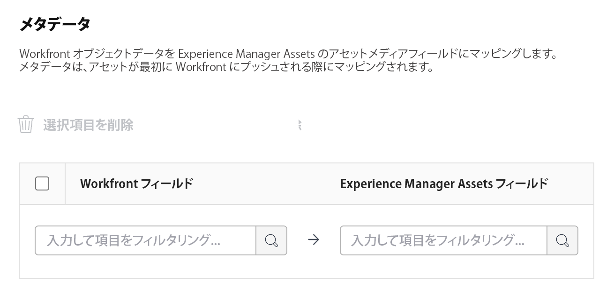

# Experience Manager Assets Essentials 統合の設定

Experience Manager Assets Essentials でのコンテンツとの連携：

* Adobe WorkfrontからExperience Manager Assets Essentials へのアセットとメタデータのプッシュ&#x200B;
* Experience Manager Assets Essentials からWorkfrontのプロジェクトおよびタスクへのアセットのリ&#x200B;ンク
* Experience Manager Assets Essentials にプッシュされたアセットのバージョン管理ワークフローを容易にします

複数のExperience Manager Assetsリポジトリを 1 つのWorkfront環境に接続することも、複数のWorkfront環境を組織 ID をまたいで 1 つのExperience Manager Assetsリポジトリに接続することもできます。 設定する統合ごとに、この記事の設定手順に従ってください。

## アクセス要件

以下が必要です。

<table>
  <tr>
   <td><strong>Adobe Workfront plan*</strong>
   </td>
   <td>任意
   </td>
  </tr>
  <tr>
   <td><strong>Adobe Workfrontライセンス*</strong>
   </td>
   <td>計画
   </td>
  </tr>
  <tr>
   <td><strong>Experience Manager免許</strong>
   </td>
   <td>標準
   </td>
  </tr>
  <tr>
   <td><strong>製品</strong>
   </td>
   <td>Experience Manager Assets Essentials がインストールされている、Admin Consoleのユーザーとして製品に追加されている必要があります。
   </td>
  </tr>
  <tr>
   <td><strong>アクセスレベル設定</strong>
   </td>
   <td>Workfront管理者である。 Workfront管理者について詳しくは、 <strong>ユーザーに完全な管理アクセス権を付与する</strong>.
   </td>
  </tr>
</table>

*保有するプラン、ライセンスの種類、アクセス権を確認するには、Workfront管理者にお問い合わせください。

## 統合の設定

1. 次をクリック： **メインメニュー** Adobe Workfrontの右上隅にあるアイコンをクリックし、 **設定**.
1. 選択  **ドキュメント**  左のパネルで、「 **Experience Manager統合**.
1. 選択 **Experience Manager統合を追加**.
1. 以下を指定します。

   <table>
   <tr>
      <td><strong>名前</strong>
      </td>
      <td>「ドキュメント」領域の「新規追加」ボタンに、ユーザーに表示する名前を入力します。
      </td>
   </tr>
   <tr>
      <td><strong>ナビゲーション URL</strong>
      </td>
      <td>ナビゲーション URL が自動的に入力されます。 この URL は、メインメニューから組織のAssets Essentialsインスタンスにリンクして、すばやくアクセスできるようにするために使用されます。
      </td>
   </tr>
   <tr>
      <td>
      <strong>Experience Manager Assetsリポジトリ</strong>
      </td>
      <td>
      組織 ID に関連付けられたExperience Managerリポジトリが自動的に入力されます。
      </td>
   </tr>
   </table>

1. クリック **保存** または、 [メタデータの設定（オプション）](#set-up-metadata-optional) 」の節を参照してください。

## メタデータの設定（オプション）

Workfront オブジェクトデータを Experience Manager Assets のアセットメディアフィールドにマッピングします。メタデータは、アセットが最初に Workfront にプッシュされる際にマッピングされます。

### 前提条件

始める前に、

* Experience Manager Assets Essentials でのメタデータスキーマの設定 ( [Adobe WorkfrontとExperience Manager Assetsの間でのアセットメタデータマッピングの設定](https://experienceleague.adobe.com/docs/experience-manager-cloud-service/content/assets/integrations/configure-asset-metadata-mapping.html?lang=en).
* （オプション）Workfrontでカスタムフォームフィールドを設定します。 Workfrontには、使用できる多くの組み込みカスタムフィールドがあります。 ただし、独自のカスタムフィールドを作成することもできます。 詳しくは、 [カスタムフォームの作成または編集](/help/quicksilver/administration-and-setup/customize-workfront/create-manage-custom-forms/create-or-edit-a-custom-form.md).

### Assets

メタデータは、アセットがWorkfrontから初めてプッシュされるとマッピングされます。 組み込みフィールドまたはカスタムフィールドを持つドキュメントは、アセットをExperience Manager Assets Essentials に初めて送信する際に、指定したフィールドに自動的にマッピングされます。

1. 内 **Workfrontフィールド** 列で、組み込みフィールドまたはカスタムWorkfrontフィールドを選択します。
   >[!NOTE]
   >
   >1 つのWorkfrontフィールドを複数のExperience Manager Assetsフィールドにマッピングできます。 複数のWorkfrontフィールドを 1 つのExperience Manager Assetsフィールドにマッピングすることはできません。
1. 内 **Experience Manager** 「 Experience Manager Assets 」フィールドを選択します。
1. 必要に応じて、手順 1 と 2 を繰り返します。
   
1. クリック **保存** または、 [リンクされたフォルダーの設定（オプション）](#set-up-linked-folders-optional) 」の節を参照してください。

## リンクされたフォルダーの設定（オプション）

{{setup-linked-folder}}
