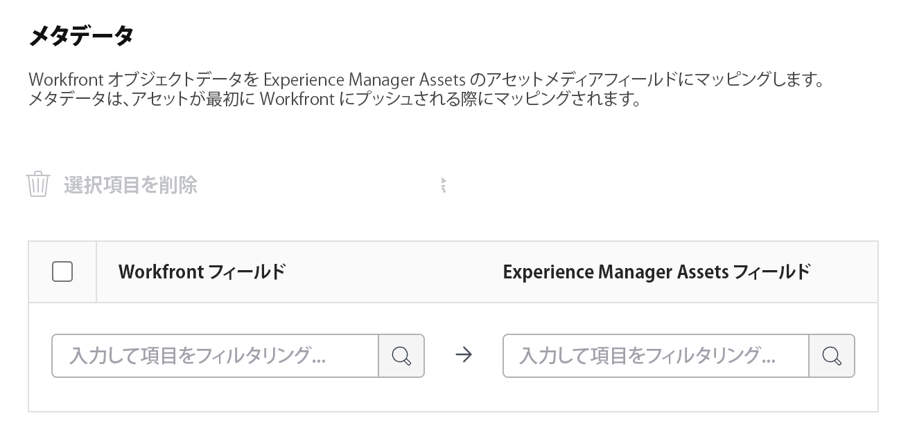

# Experience Manager Assets Essentials 統合の設定

Experience Manager Assets Essentials で作業とコンテンツを結び付けます。

* Adobe Workfront から Experience Manager Assets Essentials にアセットおよびメタデータをプッシュ
* Experience Manager Assets Essentials からのアセットを Workfront のプロジェクトおよびタスクにリンク
* Experience Manager Assets Essentials へプッシュされたアセットのバージョン管理ワークフローを促進

>[!NOTE]
>
>また、複数のExperience Manager Assets リポジトリを1つのWorkfront環境に接続したり、複数のWorkfront環境を1つのExperience Manager Assets リポジトリに組織ID間で接続したりすることもできます。設定する各統合について、この記事の設定手順に従います。 
>この機能は、新しいドキュメント エリアでは使用できません。

## アクセス要件

+++ 展開すると、この記事の機能のアクセス要件が表示されます。

<table>
  <tr>
   <td><strong>Adobe Workfront パッケージ </strong>
   </td>
   <td>任意
   </td>
  </tr>
  <tr>
   <td><strong>Adobe Workfront ライセンス </strong>
   </td>
   <td>
   
標準

   
プラン

   </td>
  </tr>
  <tr>
   <td><strong>その他の製品</strong>
   </td>
   <td>Experience Manager Assets as a Cloud Service または Assets Essentials が必要であり、製品にユーザーとして追加されている必要があります。
   </td>
  </tr>
  <tr>
   <td><strong>Experience Manager 権限</strong>
   </td>
   <td>Experience Manger 統合の宛先フォルダーへの書き込みアクセス権が必要です。
   </td>
  </tr>
  <tr>
   <td><strong>アクセスレベル設定</strong>
   </td>
   <td>Experience Manager統合を設定するには、Workfront管理者である必要があります。設定が完了すると、StandardまたはPlan ライセンスを持つユーザーは、個々のプロジェクトにリンクされたフォルダーを設定できます。
   </td>
  </tr>
</table>

この表の情報について詳しくは、[Workfront ドキュメントのアクセス要件](/help/quicksilver/administration-and-setup/add-users/access-levels-and-object-permissions/access-level-requirements-in-documentation.md)を参照してください。

+++

## 統合を設定

{{step-1-to-setup}}

1. 左側のパネルで&#x200B;**ドキュメント**  を選択し、続いて「**Experience Manager の統合**」を選択します。
1. 「**Experience Manager の統合を追加**」を選択します。
1. 以下を指定します。

   <table>
   <tr>
      <td><strong>名前</strong>
      </td>
      <td>ドキュメント領域の「新規追加」ボタンに、ユーザーに表示する名前を入力します。
      </td>
   </tr>
   <tr>
      <td><strong>ナビゲーション URL</strong>
      </td>
      <td>ナビゲーション URLが自動的に入力されます。このURLは、メインメニューから組織のAssets Essentials インスタンスにリンクし、すばやくアクセスするために使用されます。
      </td>
   </tr>
   <tr>
      <td>
      <strong>Experience Manager Assets リポジトリ</strong>
      </td>
      <td>
      組織 ID に関連付けられた Experience Manager リポジトリが、システムにより自動的に入力されます。
      </td>
   </tr>
   </table>

1. 「**保存**」をクリックするか、この記事の[メタデータを設定（オプション）](#set-up-metadata-optional)の節へ移動してください。

## メタデータを設定（オプション）

Workfront オブジェクトデータをExperience Manager Assetsのアセットメディアフィールドにマッピングします。 アセットが Workfront から初めてプッシュされると、メタデータがマッピングされます。

### 前提条件

開始する前に、

* [Adobe Workfront と Experience Manager Assets 間のアセットメタデータマッピングの設定](https://experienceleague.adobe.com/en/docs/experience-manager-cloud-service/content/assets/integrations/configure-asset-metadata-mapping)の説明に従って、Experience Manager Assets Essentials のメタデータスキーマを設定します。
* （オプション）Workfront でカスタムフォームフィールドを設定します。 Workfront には、使用できる多くのビルトインのカスタムフィールドがあります。 ただし、独自のカスタムフィールドを作成することもできます。 詳しくは、[ カスタムフォームの作成](/help/quicksilver/administration-and-setup/customize-workfront/create-manage-custom-forms/form-designer/design-a-form/design-a-form.md)を参照してください。

## サポートされている Workfront および Experience Manager Assets のフィールド

### AEM キーワード

Workfront でサポートされている任意のフィールドを、Experience Manager Assets Essentials のキーワードにマッピングできます。

フィールドをキーワードにリンクするには、メタデータマッピング領域の Experience Manager Assets フィールドドロップダウンにある `xcm:keywords` を選択します。

複数の 1 行のテキストフィールドをキーワードにマッピングするには、メタデータマッピングの Workfront 側にキーワード値のコンマで区切られたリストを入力し、`xcm:keywords` を Experience Manager Assets 側に入力します。 それぞれのフィールド値は、個別のキーワードにマッピングされます。 計算フィールドを使用すると、複数の Workfront フィールドを組み合わせて、1 つのコンマ区切りテキストフィールドにすることができます。

<!--
Look for essentials article
For more information on keywords in Experience Manager Assets, including how to create and manage keywords, see [Administering Tags]( https://experienceleague.adobe.com/docs/experience-manager-64/administering/contentmanagement/tags.html?lang=en).
-->

### アセット

アセットが Workfront から初めてプッシュされると、メタデータがマッピングされます。 ビルトインのフィールドまたはカスタムフィールドを持つドキュメントは、アセットを Experience Manager Assets Essentials に初めて送信する際に、指定したフィールドに自動的にマッピングされます。

1. **Workfront のフィールド**&#x200B;列で、ビルトインのフィールドまたはカスタム Workfront フィールドを選択します。

   >[!NOTE]
   >
   >単一の Workfront フィールドを複数の Experience Manager Assets フィールドにマッピングできます。 複数の Workfront フィールドを単一の Experience Manager Assets フィールドにマッピングすることはできません。

1. **Experience Manager** フィールドで、Experience Manager Assets フィールドを選択します。

   Workfront フィールドを Experience Manager Assets タグにマッピングするには、`xcm:keywords` を選択します。

1. 必要に応じて、手順 1 と 2 を繰り返します。
   
1. 「**保存**」をクリックするか、この記事の[リンクされたフォルダーを設定（オプション）](#set-up-linked-folders-optional)の節を参照してください。

## リンクされたフォルダーを設定（オプション）

{{setup-linked-folder}}
