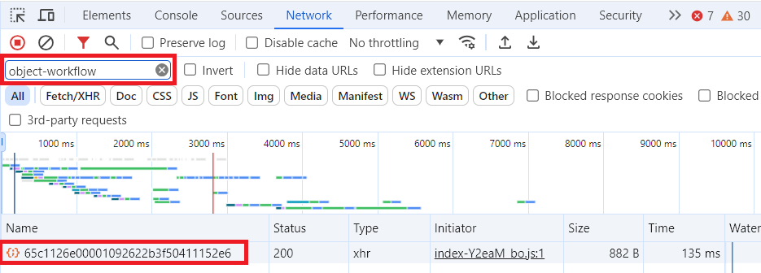

# Workfront Fusion を使用して、Workfront イシューをAdobe Experience Manager ワークフローを含むプロジェクトに変換する

Workfront Fusion でプロジェクトを作成していて、そのプロジェクトにAdobe Experience Manager ワークフローを含める場合は、ここで説明するように、特定の Fusion モジュール設定を使用する必要があります。

>[!NOTE]
>
>ワークフローを使用できるのは Adobe Experience Manager as a Cloud Service 統合のみで、Adobe Experience Manager Assets Essentials との統合では使用できません。


## アクセス要件

以下が必要です。

<table>
  <tr>
    <td><strong>Adobe Workfront プラン*</strong></td>
    <td>任意</td>
  </tr>
  <tr>
   <td><strong>Adobe Workfront ライセンス*</strong></td>
   <td>リクエスト以上</td>
  </tr>
  <tr>
   <td><strong>製品</strong></td>
   <td>
     <p><b>Adobe Experience Manager:</b></p>
     <ul>
       <li>
         <p>Experience Manager Assets as a Cloud Service または Assets Essentials を使用するには、Admin Console に製品にユーザーとして追加されていることが必要です。</p>
       </li>
       <li>
        <p>Adobe Experience Manager のリポジトリへの書き込みアクセス権が必要です。</p>
       </li>
     </ul>
     <p><b>Workfront Fusion:</b></p>
     <p>新規：</p>
     <ul>
       <li>
         <p>Workfront プランを選択または購入：Adobe Workfront Fusion は、お客様の組織で購入する必要があります。</p>
       </li>
       <li> 
         <p>Ultimate Workfront プラン：Workfront Fusion が含まれています。</p>
       </li>
     </ul>
     <p>または</p>
     <p>現在：Adobe Workfront Fusion を購入する必要があります。</p>
   </td>
  </tr>
  <tr>
   <td><strong>アクセスレベル設定*</strong>
   </td>
   <td>ドキュメントへのアクセスを編集
     <p>
       <strong>メモ</strong>：まだアクセス権がない場合は、アクセスレベルに追加の制限が設定されていないかどうか Workfront 管理者にお問い合わせください。Workfront 管理者がアクセスレベルを変更する方法について詳しくは、<strong>カスタムアクセスレベルの作成または変更</strong>を参照してください。
     </p>
   </td>
  </tr>
</table>

## 前提条件

開始する前に、

* Workfront 管理者は、Adobe Experience Manager 統合でワークフローを設定する必要があります。詳しくは、[Experience Manager Assets as a Cloud Service 統合の設定](../../administration-and-setup/configure-integrations/configure-aacs-integration.md#set-up-workflows-optional)を参照してください。
* Adobe Experience Manager統合にリンクされたフォルダーワークフローでプロジェクトテンプレートが設定されている。
* このモジュールの接続を設定するには、Workfrontで OAuth アプリケーションを作成している必要があります。

  手順については、この記事の [OAuth アプリケーションの作成 ](#create-an-oauth-application) を参照してください。

## モジュール設定

Workfront Fusion でAdobe Experience Manager ワークフローを含むプロジェクトを作成する場合は、Workfront/その他のアクション モジュールを使用する必要があります。

1. **Workfront** / **その他のアクション** モジュールをシナリオに追加します。
1. **Connection** フィールドで、このモジュールが使用するアカウントに接続するWorkfront接続を選択します。

   接続の作成方法については、「Workfront モジュール」の [Connect [!DNL Workfront] to [!DNL Workfront Fusion]](/help/quicksilver/workfront-fusion/apps-and-their-modules/workfront-modules.md#connect-workfront-to-workfront-fusion) を参照してください。

   クライアント ID およびクライアントシークレットの作成方法については、この記事の [OAuth アプリケーションの作成 ](#create-an-oauth-application) を参照してください。

1. 「**レコードタイプ**」フィールドで「`Issue`」を選択します。
1. 「**アクション**」フィールドで「`convertToProject`」を選択します。
1. **ID** フィールドに、プロジェクトに変換するイシューの ID を入力またはマッピングします。
1. 有効にする **詳細設定を表示**。
1. モジュールの下部までスクロールし、「**プロジェクト （詳細コレクション）**」フィールドを見つけます。
1. 次のテキストを「**プロジェクト （詳細コレクション）**」フィールドに貼り付けます。

   ```
   {
       "aemNativeFolderTreeIDs": ["Folder Tree ID here"],
       "aemNativeFolderWorkflowEnabled": "true",
       "name": "New project name here",
       "templateID": "Template ID here"
   }
   ```

1. `Folder tree ID here` をフォルダー ID に置き換えます。

   フォルダーツリー ID を見つけるには、この記事の [ フォルダーツリー ID を見つける ](#locate-folder-tree-ids) を参照してください。

   複数のフォルダーツリーを使用するには、ID をコンマで区切ります。

   `"aemNativeFolderTreeIDs": ["Folder tree ID here","Second folder tree ID here"],`
1. `New project name here` を、新しいプロジェクトに付ける名前に置き換えます。
1. `Template ID here` を、新しいプロジェクトに使用するテンプレートの ID に置き換えます。

   以前のモジュール（Workfront/検索モジュールなど）からテンプレート ID をマッピングしたり、Workfrontでテンプレートのページの URL で見つけたりできます。

1. **OK** をクリックして、モジュール設定を保存します。

## フォルダーツリー ID の検索

フォルダーツリー ID を探すには：

>[!NOTE]
>
>この手順では、Chrome ブラウザーを使用します。

1. Workfrontで、このプロジェクトに使用するテンプレートを開きます。 このテンプレートには、プロジェクトに使用するAdobe Experience Manager設定を含める必要があります。
1. ブラウザーのデベロッパーツールを開きます。
1. デベロッパーツールの「**ネットワーク**」タブを開きます。
1. 「**フィルター**」ボックスに、`object-workflow` と入力します。
1. 名前列で、表示される英数字の ID をクリックします。

   

1. 英数字 ID の右側にある **プレビュー** タブをクリックします。
1. 次の折りたたまれたセクションを開きます。
   1. `data`
   1. `objectWorkflow`
   1. `workflows`
   1. `enhancedLinkedFolderCreationWorkflow`
   1. `enhancedLinkedFolderCreationWorkflowConfigurations`

   各フォルダーツリーは数値で表されます。 0 （ゼロ）はリストの最初のフォルダーを表し、1 は 2 番目のフォルダーを表します。以下同様に続きます。 テンプレートにフォルダーツリーが 1 つしか含まれていない場合は、その数は 0 になります。

1. 新規プロジェクトに使用するフォルダーツリーを開きます。 `_id` フィールドの値をメモします。 複数のフォルダーツリーを使用する場合は、使用するフォルダーツリーの `_id` のフィールド値をすべてメモしておきます。

   

   これらは、Fusion モジュールの **Workfront**/**その他のアクション** で **「プロジェクト（詳細コレクション」フィールドに入力する `aemNativeFolderTreeIDs` 値** す。

## OAuth アプリケーションの作成

このモジュールの接続用に、Workfrontで OAuth アプリケーションを設定する必要があります。 Fusion の特定のWorkfront接続に対して、これを行う必要があるのは 1 回だけです。

1. [ ユーザー資格情報を使用して OAuth2 アプリケーションを作成する（認証コードフロー） ](/help/quicksilver/administration-and-setup/configure-integrations/create-oauth-application.md#create-an-oauth2-application-using-user-credentials-authorization-code-flow) の説明に従って、Workfrontで [!DNL Workfront] アプリケーションの作成を開始します。
1. クライアント ID とクライアント秘密鍵を安全な場所にコピーします。
1. 「**リダイレクト URI**」フィールドに以下を入力します。

   ```
   http://app.workfrontfusion.com/oauth/cb/workfront-workfront
   ```

1. **保存**&#x200B;をクリックします。

このクライアント ID とクライアントシークレットは、Fusion でモジュールの接続を設定する際に使用します。

接続の作成方法については、「Workfront モジュール」の [Connect [!DNL Workfront] to [!DNL Workfront Fusion]](/help/quicksilver/workfront-fusion/apps-and-their-modules/workfront-modules.md#connect-workfront-to-workfront-fusion) を参照してください。
