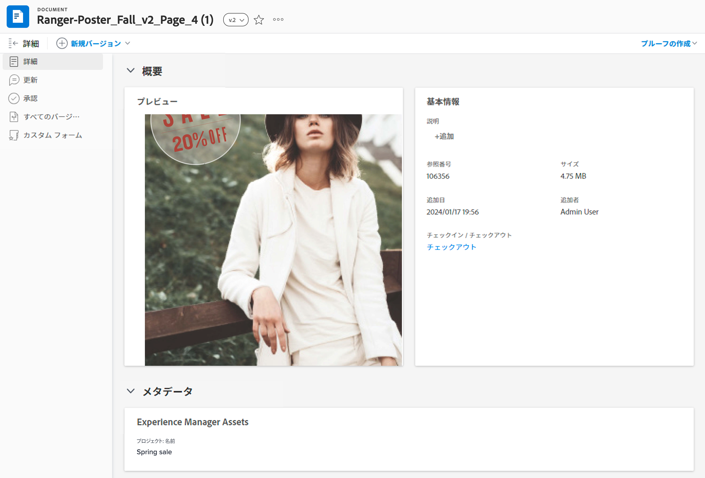
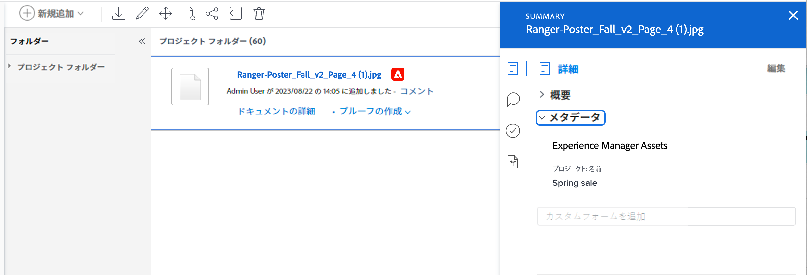

# Experience Manager Assets または Assets Essentials のマッピングされたメタデータの表示

ドキュメントの詳細とドキュメントの概要パネルで、マッピングされたメタデータのリアルタイムビューを確認できます。Workfront から Experience Manager Assets または Assets Essentials にアセットを送信する際、メタデータフィールドが最初にマッピングされます。Workfront 管理者がオブジェクトメタデータの同期を有効にしている場合、どちらかのアプリケーションで変更されたフィールドは最新の状態に保たれます。

## アクセス要件

以下が必要です。

<table>
  <tr>
   <td><strong>Adobe Workfront プラン*</strong>
   </td>
   <td>任意
   </td>
  </tr>
  <tr>
   <td><strong>Adobe Workfront ライセンス*</strong>
   </td>
   <td>リクエスト以上
   </td>
  </tr>
  <tr>
   <td><strong>製品</strong>
   </td>
   <td>Experience Manager Assets as a Cloud Service または Assets Essentials を使用するには、Admin Console に製品にユーザーとして追加されていることが必要です。
   </td>
  </tr>
  <tr>
   <td><strong>アクセスレベル設定*</strong>
   </td>
   <td>ドキュメントへのアクセスを編集

<strong>メモ</strong>：まだアクセス権がない場合は、アクセスレベルに追加の制限が設定されていないかどうか Workfront 管理者にお問い合わせください。Workfront 管理者がアクセスレベルを変更する方法について詳しくは、<strong>カスタムアクセスレベルの作成または変更</strong>を参照してください。
   </td>
  </tr>
  <tr>
   <td><strong>オブジェクトの権限</strong>
   </td>
   <td>表示アクセス権またはそれ以上の権限

追加のアクセス権のリクエストについて詳しくは、<strong>オブジェクトへのアクセス権のリクエスト</strong>を参照してください。
   </td>
  </tr>
</table>

*保有するプラン、ライセンスタイプまたはアクセス権を確認するには、Workfront 管理者にお問い合わせください。

## 前提条件

開始する前に、

* Workfront 管理者は、Experience Manager 統合を設定する必要があります。詳しくは、[Experience Manager Assets as a Cloud Service 統合を設定](/help/quicksilver/administration-and-setup/configure-integrations/configure-aacs-integration.md)または[Experience Manager Assets Essentials 統合を設定](/help/quicksilver/documents/adobe-workfront-for-experience-manager-assets-essentials/setup-asset-essentials.md)を参照してください。

## ドキュメントの詳細

ドキュメントの詳細でメタデータパネルを開くには、以下の手順を実行します。

1. ドキュメントを含むプロジェクト、タスクまたはイシューに移動し、「**ドキュメント**」を選択します。
1. 必要なドキュメントの上にポインタを合わせ、「**ドキュメントの詳細**」を選択します。
1. 「**メタデータ**」セクションを見つけて展開します。
   >[!NOTE]
   >
   >このセクションのフィールドは編集できません。これらは表示専用です。

## ドキュメントの概要

概要パネルでメタデータパネルを開くには、以下の手順を実行します。

1. ドキュメントを含むプロジェクト、タスク、またはイシューに移動し、**ドキュメント**&#x200B;を選択します。
1. 必要なドキュメントを見つけます。
1. **概要アイコン**  をクリックして、「**メタデータ**」セクションを展開します。
   >[!NOTE]
   >
   >このセクションのフィールドは編集できません。これらは表示専用です。

