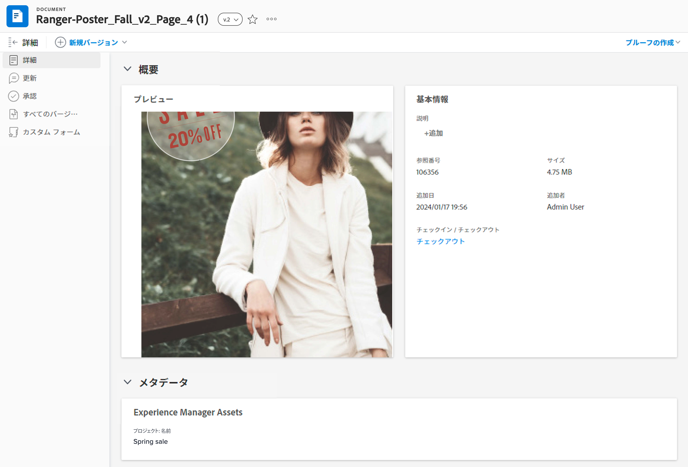

# Experience Manager Assets または Assets Essentials のマッピングされたメタデータの表示

ドキュメントの詳細とドキュメントの概要パネルで、マッピングされたメタデータのリアルタイムビューを確認できます。 Workfront から Experience Manager Assets または Assets Essentials にアセットを送信する際、メタデータフィールドが最初にマッピングされます。 Workfront 管理者がオブジェクトメタデータの同期を有効にしている場合、どちらかのアプリケーションで変更されたフィールドは最新の状態に保たれます。

## アクセス要件

+++ 展開すると、この記事の機能のアクセス要件が表示されます。

<table>
  <tr>
   <td><strong>Adobe Workfront パッケージ </strong>
   </td>
   <td>任意
   </td>
  </tr>
  <tr>
   <td><strong>Adobe Workfront ライセンス </strong>
   </td>
   <td>
   
コントリビューター以上

   
リクエスト以上

   </td>
  </tr>
  <tr>
   <td><strong>その他の製品</strong>
   </td>
   <td>Experience Manager Assets as a Cloud Service または Assets Essentials を使用するには、Admin Console に製品にユーザーとして追加されていることが必要です。
   </td>
  </tr>
  <tr>
   <td><strong>アクセスレベル設定</strong>
   </td>
   <td>
ドキュメントへのアクセスを編集

   </td>
  </tr>
  <tr>
   <td><strong>オブジェクトの権限</strong>
   </td>
   <td>表示アクセス権またはそれ以上の権限
   </td>
  </tr>
</table>

この表の情報について詳しくは、[Workfront ドキュメントのアクセス要件](/help/quicksilver/administration-and-setup/add-users/access-levels-and-object-permissions/access-level-requirements-in-documentation.md)を参照してください。

+++

## 前提条件

開始する前に、

* Workfront 管理者は、Experience Manager 統合を設定する必要があります。 詳しくは、[Experience Manager Assets as a Cloud Service 統合を設定](/help/quicksilver/administration-and-setup/configure-integrations/configure-aacs-integration.md)または[Experience Manager Assets Essentials 統合を設定](/help/quicksilver/documents/adobe-workfront-for-experience-manager-assets-essentials/setup-asset-essentials.md)を参照してください。

## ドキュメントの詳細

ドキュメントの詳細でメタデータパネルを開くには、以下の手順を実行します。

1. ドキュメントを含むプロジェクト、タスクまたはイシューに移動し、「**ドキュメント**」を選択します。
1. 必要なドキュメントの上にポインタを合わせ、「**ドキュメントの詳細**」を選択します。
1. 「**メタデータ**」セクションを見つけて展開します。

   >[!NOTE]
   >
   >このセクションのフィールドは編集できません。 これらは表示専用です。

## ドキュメントの概要

概要パネルでメタデータパネルを開くには、以下の手順を実行します。

1. ドキュメントを含むプロジェクト、タスク、またはイシューに移動し、**ドキュメント**&#x200B;を選択します。
1. 必要なドキュメントを見つけます。
1. **概要アイコン**  をクリックして、「**メタデータ**」セクションを展開します。

   >[!NOTE]
   >
   >このセクションのフィールドは編集できません。 これらは表示専用です。

