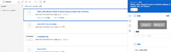

# Experience Manager Assets や Assets Essentials からリンクされたアセットを表示またはダウンロード

Experience Manager Assets や Assets Essentials からリンクされているアセットを Adobe Workfront で表示またはダウンロードできます。

## アクセス要件

以下が必要です。

<table style="table-layout:auto"> 
 <col> 
 <col> 
 <tbody> 
  <tr> 
   <td role="rowheader">Adobe Workfront プラン*</td> 
   <td> 
 任意
 </td> 
  </tr> 
  <tr> 
   <td role="rowheader">Adobe Workfront ライセンス*</td> 
   <td> 
リクエスト以上
 </td> 
  </tr> 
  <tr> 
   <td role="rowheader">製品</td> 
   <td>Experience Manager as a Cloud Service または Assets Essentials を使用するには、Admin Console に製品にユーザーとして追加されている必要があります。</td> 
  </tr> 
  <tr> 
   <td role="rowheader">アクセスレベル設定*</td> 
   <td> 
ドキュメントへのアクセスを編集
 
メモ：まだアクセス権がない場合は、アクセスレベルに追加の制限が設定されていないかどうか Workfront 管理者にお問い合わせください。Workfront 管理者がアクセスレベルを変更する方法について詳しくは、<a href="../../administration-and-setup/add-users/configure-and-grant-access/create-modify-access-levels.md" class="MCXref xref">カスタムアクセスレベルの作成または変更</a>を参照してください。
 </td> 
  </tr> 
  <tr> 
   <td role="rowheader">オブジェクト権限</td> 
   <td> 
表示アクセス権またはそれ以上の権限
 
追加のアクセス権のリクエストについて詳しくは、<a href="../../workfront-basics/grant-and-request-access-to-objects/request-access.md" class="MCXref xref">オブジェクトへのアクセス権のリクエスト</a>を参照してください。
 </td> 
  </tr> 
 </tbody> 
</table>

&#42;保有するプラン、ライセンスタイプ、アクセス権を確認するには、Workfront 管理者に問い合わせてください。

## 前提条件

開始する前に、

* Workfront 管理者は、Experience Manager 統合を設定する必要があります。詳しくは、[Experience Manager Assets as a Cloud Service の統合を設定](/help/quicksilver/administration-and-setup/configure-integrations/configure-aacs-integration.md)または[Experience Manager Assets Essentials の統合を設定](/help/quicksilver/documents/adobe-workfront-for-experience-manager-assets-essentials/setup-asset-essentials.md)を参照してください。

## リンクされたアセットを表示またはダウンロード

1. 表示またはダウンロードするドキュメントを特定します。
1. そのドキュメントをドキュメントリストから選択します。
1. 右側のドキュメントの概要で、上部のサムネイルの上にポインタを合わせて、**プレビュー**&#x200B;または&#x200B;**ダウンロード**&#x200B;を選択します。

   
