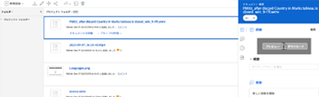

# Experience Manager Assets や Assets Essentials からリンクされたアセットを表示またはダウンロード

Experience Manager Assets や Assets Essentials からリンクされているアセットを Adobe Workfront で表示またはダウンロードできます。

## アクセス要件

+++ 展開すると、この記事の機能のアクセス要件が表示されます。

<table style="table-layout:auto"> 
 <col> 
 <col> 
 <tbody> 
  <tr> 
   <td role="rowheader">Adobe Workfront パッケージ</td> 
   <td> 
 任意
 </td> 
  </tr> 
  <tr> 
   <td role="rowheader">Adobe Workfront ライセンス</td> 
   <td>
   
コントリビューター以上

   
リクエスト以上
 </td> 
  </tr> 
  <tr> 
   <td role="rowheader">その他の製品</td> 
   <td>Experience Manager as a Cloud Service または Assets Essentials を使用するには、Admin Console に製品にユーザーとして追加されている必要があります。</td> 
  </tr> 
  <tr> 
   <td role="rowheader">アクセスレベル設定</td> 
   <td> 
ドキュメントへのアクセスを編集
  </td> 
  </tr> 
  <tr> 
   <td role="rowheader">オブジェクト権限</td> 
   <td> 
表示アクセス権またはそれ以上の権限
 </td> 
  </tr> 
 </tbody> 
</table>

この表の情報について詳しくは、[Workfront ドキュメントのアクセス要件](/help/quicksilver/administration-and-setup/add-users/access-levels-and-object-permissions/access-level-requirements-in-documentation.md)を参照してください。

+++

## 前提条件

開始する前に、

* Workfront 管理者は、Experience Manager 統合を設定する必要があります。 詳しくは、[Experience Manager Assets as a Cloud Service の統合を設定](/help/quicksilver/administration-and-setup/configure-integrations/configure-aacs-integration.md)または[Experience Manager Assets Essentials の統合を設定](/help/quicksilver/documents/adobe-workfront-for-experience-manager-assets-essentials/setup-asset-essentials.md)を参照してください。

## リンクされたアセットを表示またはダウンロード

1. 表示またはダウンロードするドキュメントを特定します。
1. そのドキュメントをドキュメントリストから選択します。
1. 右側のドキュメントの概要で、上部のサムネールにポインタを合わせて、「**プレビュー**」または「**ダウンロード**」を選択します。

   
