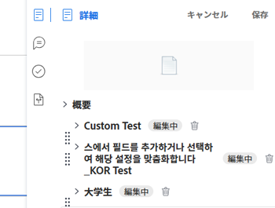

# ドキュメントにカスタムフォームを追加または編集する

カスタムフォームをドキュメントまたはドキュメントバージョンに追加して、アセットに固有の追加情報やメタデータを取り込むことができます。

## アクセス要件

以下が必要です。

<table style="table-layout:auto"> 
 <col> 
 <col> 
 <tbody> 
  <tr> 
   <td role="rowheader">Adobe Workfront plan*</td> 
   <td> 
 任意
 </td> 
  </tr> 
  <tr> 
   <td role="rowheader">Adobe Workfrontライセンス*</td> 
   <td> 
リクエスト以上
 </td> 
  </tr> 
  <tr> 
   <td role="rowheader">アクセスレベル設定*</td> 
   <td> 
ドキュメントへのアクセスを編集
 
注意：まだアクセス権がない場合は、Workfront管理者に、アクセスレベルに追加の制限を設定しているかどうかを問い合わせてください。 Workfront管理者がアクセスレベルを変更する方法について詳しくは、 <a href="../../administration-and-setup/add-users/configure-and-grant-access/create-modify-access-levels.md" class="MCXref xref">カスタムアクセスレベルの作成または変更</a>.
 </td> 
  </tr> 
  <tr> 
   <td role="rowheader">オブジェクト権限</td> 
   <td> 
ドキュメントへのアクセスを管理
 
追加のアクセス権のリクエストについて詳しくは、 <a href="../../workfront-basics/grant-and-request-access-to-objects/request-access.md" class="MCXref xref">オブジェクトへのアクセスのリクエスト </a>.
 </td> 
  </tr> 
 </tbody> 
</table>

&#42;保有しているプラン、ライセンスの種類、アクセス権を確認するには、Workfront管理者に問い合わせてください。

## 前提条件

* カスタムフォームを共有する必要があります

## カスタムフォームを追加

カスタムフォームをドキュメントに追加するには：

1. ドキュメントを含むプロジェクト、タスクまたはイシューに移動し、「 」を選択します。 **ドキュメント**.
1. 必要なドキュメントを見つけます。

1. 次をクリック： **概要** アイコン を選択し、 **詳細** 」セクションに入力します。
1. 内 **カスタムフォームを追加** ボックスに入力し、カスタムフォームを選択します。 フォームはドキュメントに自動的に保存されます。

   >[!NOTE]
   >
   >アクティブなカスタムフォームのみがドロップダウンメニューに表示されます。 1 つのドキュメントにつき最大 10 個のカスタムフォームを追加できます。 カスタムフォームを作成する必要がある場合は、 [カスタムフォームの作成または編集](../../administration-and-setup/customize-workfront/create-manage-custom-forms/create-or-edit-a-custom-form.md)

## カスタムフォームの編集

1. ドキュメントを含むプロジェクト、タスクまたはイシューに移動し、「 」を選択します。 **ドキュメント**.
1. 必要なドキュメントを見つけます。

1. 次をクリック： **概要** アイコン を選択し、 **詳細** 上部付近のセクション。
1. クリック **編集** 右上隅で、目的のフォームを展開します。
1. 必要な変更を加え、「 **保存**.

   
