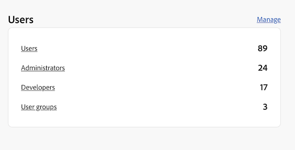
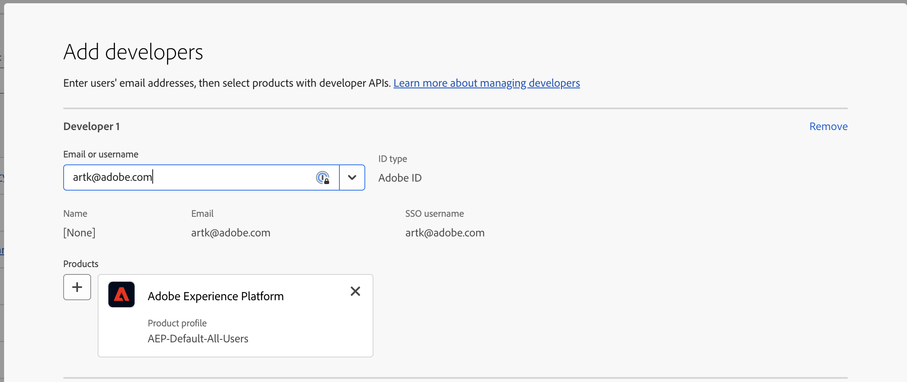
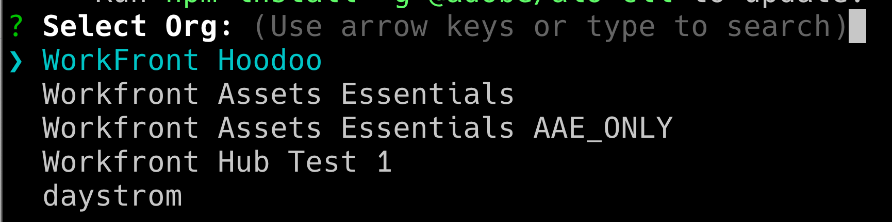
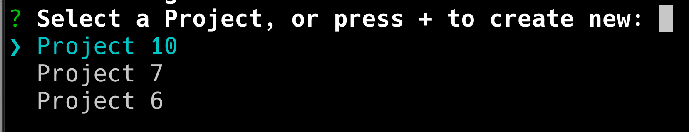
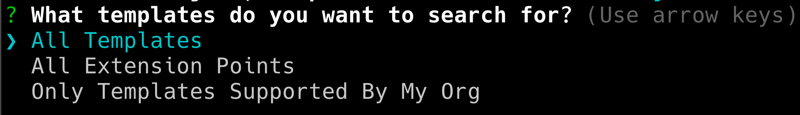
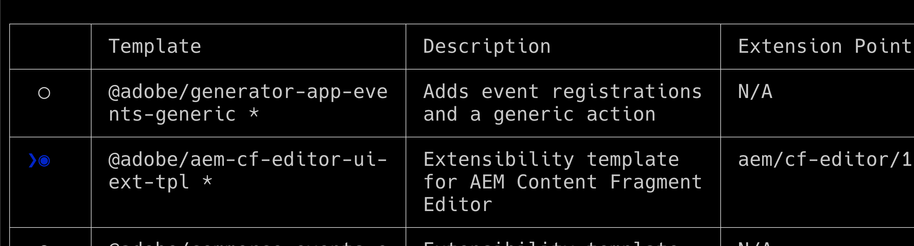
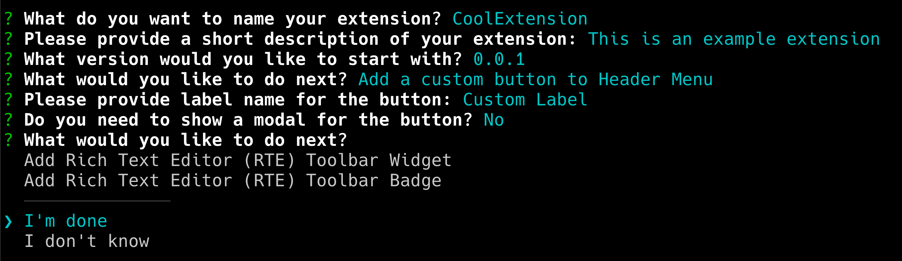
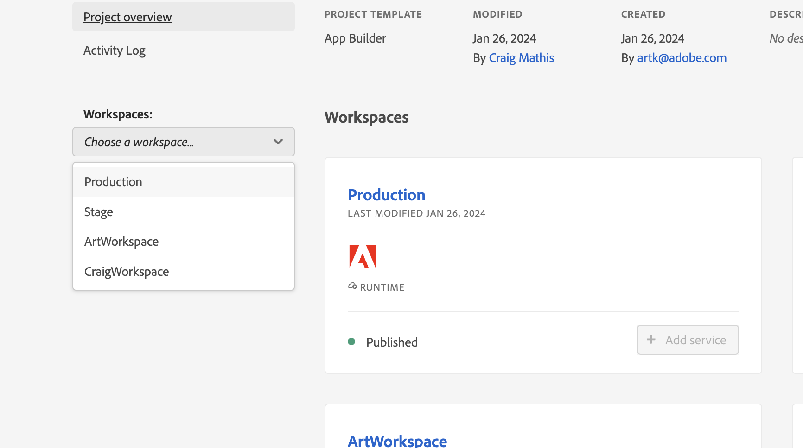
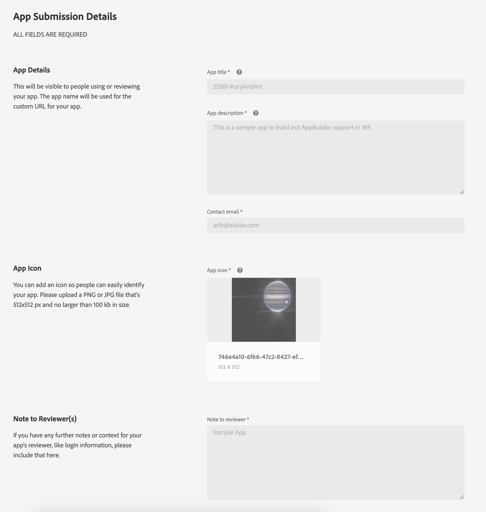
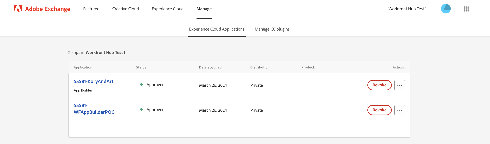

# Workfront Document Details内のAppBuilder

Document Details内にAppBuilderをインストールできます。

## 前提条件

以下が必要です。

* IMS対応のWorkfront アカウント
* ノード v18とnpmを持つ開発マシン

## Admin Consoleへの開発者の追加

>[!IMPORTANT]
>
>次のすべての手順で、適切なIMS組織を選択していることを確認してください。 複数の組織に属している場合は、間違った組織を選択することもできます。 適切な組織（通常は右上隅に表示）の下で行動していることを確認してください。


1. 次のいずれかに移動します。

* ステージ：[https://stage.adminconsole.adobe.com/](https://stage.adminconsole.adobe.com/)
* 製品：[https://adminconsole.adobe.com/](https://adminconsole.adobe.com/)

1. 「ユーザー」セクションで、**開発者**/**開発者を追加**&#x200B;をクリックします。

   

   >[!NOTE]
   >
   >開発者を管理するオプションが表示されない場合、開発アクセスを許可する製品はありません。 Workfrontでは開発者向けアクセスは提供されていませんが、AEMでは提供しています。 これを表示しない場合は、開発者向けのアプリケーションのリストにWorkfrontを含める方法を検討する必要があります。

1. ユーザーのメールアドレスを追加します。 Admin Console内から既に追加されている既存のユーザーを検索する必要があります。

1. 必要な製品を開発者プロファイルに追加し、**保存**&#x200B;をクリックします。



## AppBuilderへのアクセス

企業がAppBuilderを購入するには、アカウントマネージャーと協力する必要があります。 「POCでこれを行う必要がなかったため、この正確なプロセスは理解されていません。

AppBuilderの統合をテストする場合は、こちらからIMS組織の無料体験版をリクエストできます。
[https://developer.adobe.com/app-builder/docs/overview/getting_access/#](https://developer.adobe.com/app-builder/docs/get_started/app_builder_get_started/set-up#access-and-credentials)

30日間の無料体験版であっても、その後は実際に体験版を無効にしないという印象を受けています。

AppBuilderが適切に設定されている場合は、新しいプロジェクトの作成の一環として、「テンプレートからプロジェクトを作成」が表示されます（これは次の節で説明します）。

## 開発コンソールでの新しいプロジェクトの作成

1. 「**テンプレートからプロジェクトを作成**」をクリックします。

   >[!IMPORTANT]
   >
   >このオプションが表示されない場合は、Admin Consoleで設定が間違っており、App Builder カタログにアクセスできません。 このオプションは、AppBuilderにアクセスできる場合にのみ表示されます。

   

1. **App Builder**&#x200B;を選択します。

1. **プロジェクトタイトル**&#x200B;と&#x200B;**アプリ名**&#x200B;を入力します。 どちらもデフォルトですが、値をカスタマイズすると、後で必要なプロジェクトを特定しやすくなります。

   >[!NOTE]
   >
   >この手順でワークスペースを追加するオプションがあります。 開発者ごとにワークスペースを作成することが提案されました。 これにより、開発者が作業する際に、シークレットとデプロイメントが互いに分離されます。 ワークスペースには、それを使用する開発者の名前を付ける必要があります。 AIO cliには、ワークスペースを切り替えるためのオプションがあります。これについては、後で説明します。


1. **実行時を含める**&#x200B;を選択したままにします。

1. 「**保存**」をクリックします。

## Adobe IO （aio） CLI

Adobeには、App Builder アプリケーションの作成に役立つオープンソース CLIが用意されています。 ドキュメントについては、[https://github.com/adobe/aio-cli](https://github.com/adobe/aio-cli)およびAdobe App Builderの手順[https://developer.adobe.com/app-builder/docs/getting_started/first_app/](https://developer.adobe.com/app-builder/docs/get_started/app_builder_get_started/first-app)を参照してください。

1. インストール

   1. ツールをインストールするには、（最初にノード v18を使用していることを確認してください）実行：`npm install -g @adobe/aio-cli`。

1. ターミナルでの認証

   1. ターミナルを起動し、次のコマンドでAIOにログインします：`aio login`。

1. アプリケーションの初期化

   1. 次を実行して、アプリの設定を開始してください：`aio app init example-app`。

1. 設定の選択

   1. 指定されたオプションから組織とプロジェクトを選択します。

      

      

1. テンプレートの選択と設定

   1. 使用可能なすべてのテンプレートを参照し、プロジェクトの&#x200B;**@adobe/aem-cf-editor-ui-ext-tpl** テンプレートを選択します。

      

      

1. 拡張機能を定義

   1. 拡張機能に名前を付けます。
   1. 拡張機能の機能の概要をわかりやすく説明してください。
   1. 最初に使用する初期バージョン番号を選択します。
   1. 完了を確認するには、**完了**&#x200B;を選択します。

   

1. プロジェクトフォルダーに移動します

   1. src フォルダーへのアクセス

   1. フォルダー`aem-cf-editor-1`の名前を`workfront-doc-details-1`に変更します。

1. 設定ファイルの変更

   1. app.config.yamlを開きます
   1. `aem/cf-editor/1`から`workfront/doc-details/1`までの行を更新します。
   1. インクルードパスを`src/aem-cf-editor-1/ext.config.yaml`から`src/workfront-doc-details-1/ext.config.yaml`に調整します。

1. 拡張機能の登録コンポーネントの編集

   1. `src/workfront-doc-details-1/web-src/src/components/ExtensionRegistration.js` を開きます。.
   1. メソッド セクションで、非同期関数`getButtons`を含む関数`secondaryNav`を追加します。
   1. `getButtons`は、次の構造を持つオブジェクトを受け取る必要があります：

      ```
          {
          docId: "String",  // Document ID
          docvId: "String", // Document version ID
          sharedContext: {
              hostname: "String",
              protocol: "String",
              auth: {
              imsOrgID: "String",    // Customer's IMS Org ID
              imsToken: "String",    // User's IMS token
              imsClientId: "String"
              }
          }
          }
      ```

1. この関数は、ナビゲーションに表示されるボタンオブジェクトの配列を返します。

   ```
       methods: {
       secondaryNav: {
           async getButtons({docId, docvId, sharedContext}) {
           return [
               { label: 'Registration', url: '/index.html' },
               { label: 'Review', url: '/index.html#review' }
           ];
           }
       }
       }
   ```

1. アプリケーションルーティングの設定
   1. App.js ファイルを開き、新しく開発した機能を含めるようにルートを設定します。 デフォルトビューと、レビューページなどの追加ビューのルートを設定する必要があります。 ここでは、次のルートを定義します。

      ```
          <Route index element={<ExtensionRegistration />} />
          <Route exact path="index.html" element={<ExtensionRegistration />} />
          <Route exact path="review" element={<Review />} />
      ```

1. ドキュメント詳細へのアクセス
   1. アプリケーション内で指定された関数`document.getDocumentDetails`を実装して、重要なドキュメントの詳細を取得します。 この関数は、`docId`と`docvId`を含むオブジェクト、および`hostname`、`protocol`および認証の詳細を含む`sharedContext` オブジェクトを取得します。 アプリケーションがこれらのデータを適切に処理することを確認します。

1. コンポーネントへのデータフェッチの統合
   1. アプリケーションのコンポーネントフォルダーに新しいコンポーネントを追加します。 このコンポーネント内で、Workfrontへの接続を確立し、ホストアプリケーションで確立された接続を使用してドキュメント情報と認証データを取得します。 コンポーネントを構造化して処理する方法の例を次に示します。

      ```
          import { useEffect, useState } from 'react';
          import { attach } from "@adobe/uix-guest";
          import { extensionId } from "./Constants";
      
          function Review() {
              const [conn, setConn] = useState();
      
              useEffect(() => {
              const iife = async () => {
                  // "attach" the guest application to the host. This creates a "tunnel" from the host app that allows data to be passed to the iframe running this app.
                  const connection = await attach({
                  id: extensionId,
                  });
                  setConn(connection);
              };
      
              iife();
              }, []);
      
              useEffect(() => {
                  if (conn) {
                      // Using the connection created above, grab the document details from the host tunnel.
                      conn?.host?.document?.getDocumentDetails().then(setDocDetails);
                      // Pull the auth tokens from the sharedContext (see host app for details)
                      setAuth(conn?.sharedContext?.get("auth"));
                      setHostname(conn?.sharedContext?.get("hostname"));
                      setProtocol(conn?.sharedContext?.get("protocol"));
                  }
              }, [conn]);
      
          return (<>Text</>);
          }
      
          export default Review;
      ```

## 既存のAIO プロジェクトの設定

1. 設定ファイルの更新
   1. `app.config.yaml` を開きます。.
   1. 参照を`aem/cf-editor/1`から`workfront/doc-details/1`に更新して、設定を変更します。 この調整は、現在のプロジェクト構造に合わせてファイルパスを調整します。

1. 拡張機能の登録コンポーネントの変更
   1. `ExtensionRegistration.js`という名前のファイルを探して開きます。
   1. メソッド セクションで、非同期関数`getButtons`を含む関数`secondaryNav`を追加します。
   1. `getButtons`は、次の構造を持つオブジェクトを受け取る必要があります：

      ```
          {
          docId: "String",  // Document ID
          docvId: "String", // Document version ID
          sharedContext: {
              hostname: "String",
              protocol: "String",
              auth: {
              imsOrgID: "String",    // Customer's IMS Org ID
              imsToken: "String",    // User's IMS token
              imsClientId: "String"
              }
          }
          }
      ```

1. この関数は、ナビゲーションに表示されるボタンオブジェクトの配列を返します。

   ```
       methods: {
       secondaryNav: {
           async getButtons({docId, docvId, sharedContext}) {
           return [
               { label: 'Registration', url: '/index.html' },
               { label: 'Review', url: '/index.html#review' }
           ];
           }
       }
       }
   ```

1. アプリケーションルーティングの設定
   1. `App.js` ファイルを開き、新しく開発した機能を含めるようにルートを設定します。 デフォルトビューと、レビューページなどの追加ビューのルートを設定する必要があります。 ここでは、次のルートを定義します。

      ```
          <Route index element={<ExtensionRegistration />} />
          <Route exact path="index.html" element={<ExtensionRegistration />} />
          <Route exact path="review" element={<Review />} />
      ```

1. ドキュメント詳細へのアクセス
   1. アプリケーション内で指定された関数`document.getDocumentDetails`を実装して、重要なドキュメントの詳細を取得します。 この関数は、`docId`と`docvId`を含むオブジェクト、および`hostname`、`protocol`および認証の詳細を含む`sharedContext` オブジェクトを取得します。 アプリケーションがこれらのデータを適切に処理することを確認します。

1. コンポーネントへのデータフェッチの統合
   1. アプリケーションのコンポーネントフォルダーに新しいコンポーネントを追加します。 このコンポーネント内で、Workfrontへの接続を確立し、ホストアプリケーションで確立された接続を使用してドキュメント情報と認証データを取得します。 コンポーネントを構造化して処理する方法の例を次に示します。

      ```
          import { useEffect, useState } from 'react';
          import { attach } from "@adobe/uix-guest";
          import { extensionId } from "./Constants";
      
          function Review() {
              const [conn, setConn] = useState();
      
              useEffect(() => {
              const iife = async () => {
                  // "attach" the guest application to the host. This creates a "tunnel" from the host app that allows data to be passed to the iframe running this app.
                  const connection = await attach({
                  id: extensionId,
                  });
                  setConn(connection);
              };
      
              iife();
              }, []);
      
              useEffect(() => {
                  if (conn) {
                      // Using the connection created above, grab the document details from the host tunnel.
                      conn?.host?.document?.getDocumentDetails().then(setDocDetails);
                      // Pull the auth tokens from the sharedContext (see host app for details)
                      setAuth(conn?.sharedContext?.get("auth"));
                      setHostname(conn?.sharedContext?.get("hostname"));
                      setProtocol(conn?.sharedContext?.get("protocol"));
                  }
              }, [conn]);
      
          return (<>Text</>);
          }
      
          export default Review;
      ```

## アプリケーションの公開

>[!IMPORTANT]
>
>次の各手順で適切なIMS組織が選択されていることを確認します。

Workfront内にゲストアプリケーションを読み込むには、アプリケーションを実稼動ワークスペースにプッシュし、承認用に送信する必要があります。

1. 実稼動ワークスペースへのアプリケーションのデプロイ

   1. `aio app use -w Production`
   1. `aio app deploy`

1. [https://developer-stage.adobe.com/](https://developer-stage.adobe.com/)または[https://developer.adobe.com/](https://developer.adobe.com/)に移動します。

   1. 右上隅の&#x200B;**コンソール**&#x200B;をクリックします。

1. AppBuilder アプリケーションの作成に使用したプロジェクトを検索します。
1. 実稼動Workspaceを選択します。

   

1. プライベートレビュー用にアプリケーションを送信します（アプリ交換マーケットプレイスに公開しないという警告が表示されます。これは問題ありません）。
1. フォームに入力します（タイトル、説明、アイコン、レビュアーへのメモ）。

   

>[!IMPORTANT]
>
>送信が完了したら、組織のシステム管理者が送信を承認する必要があります。

## 送信を承認

1. システム管理者として、[https://stage.exchange.adobe.com/](https://stage.exchange.adobe.com/)または[https://exchange.adobe.com/](https://exchange.adobe.com/)に移動します。

1. **管理**/**Experience Cloud アプリケーション**をクリックします。承認/却下のオプションを含む送信済みアプリが表示されます。
承認されると、公開されたアプリケーション拡張機能がWorkfront環境に自動的に読み込まれます。

   

## その他のヘルプ

Adobeには、AppBuilder用のアプリケーションの構築を開始し、デプロイする方法に関する優れたドキュメントがあります。

次のようなリンクがあります。

* [https://developer.adobe.com/app-builder/docs/getting_started/first_app/#4-bootstrapping-new-app-using-the-cli](https://developer.adobe.com/app-builder/docs/get_started/app_builder_get_started/first-app#bootstrap-the-new-app-using-the-cli)

* [https://developer.adobe.com/uix/docs/guides/publication/](https://developer.adobe.com/uix/docs/guides/publication/)

* [https://developer.adobe.com/uix/docs/services/aem-cf-console-admin/extension-development/](https://developer.adobe.com/uix/docs/services/aem-cf-console-admin/extension-development/)

## ローカル開発

Workfront用のApp Builder アプリケーションを開発する際に、アプリを公開せずにWorkfront内でテストする必要が生じる場合があります。 幸いなことに、この課題を解決するためのソリューションがあります。

App Builder アプリ内で、ローカル開発用に`aio app run`を開始できます。 これにより、URL （通常は`https://localhost:9080`など）が提供されます。 または、`aio app deploy`を実行して静的なAdobe ドメインを取得することもできます。 後で使用する場合は、これらのURLに注意してください。

次に、ブラウザーで開発する特定のドキュメントの詳細ページに移動します。 開発者ツールを開き、workfront.comまたはworkfront.adobe.comのローカルストレージにアクセスします。 ここで、エントリを追加する必要があります。 キーとして`appBuilderDocDetailsOverride`を使用し、値として前述のアプリビルダーURLを使用します。

ページを再読み込みすると、App Builder アプリケーションのボタンが表示されます。 これらのボタンをクリックすると、アプリを実際に見ることができます。
