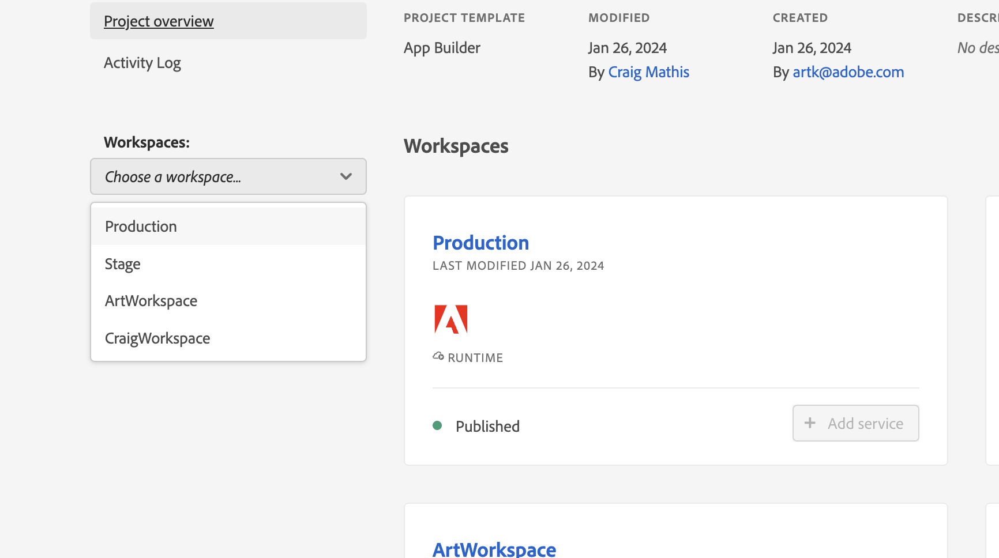

# Workfront ドキュメントの詳細内の AppBuilder

AppBuilder は、「ドキュメントの詳細」内でインストールできます。

## 前提条件

以下が必要です。

* IMS が有効なWorkfront アカウント
* ノード v18 および npm を持つ開発マシン

## Admin Console への開発者の追加

>[!IMPORTANT]
>
>次の手順のすべてに適切な IMS 組織を選択していることを確認します。 複数の組織に属している場合は、間違った組織を選択する可能性があります。 通常は右上隅にリストされている適切な組織の下で作業していることを確認します。


1. 次のいずれかに移動します。

* ステージ：[https://stage.adminconsole.adobe.com/](https://stage.adminconsole.adobe.com/)
* 製品：[https://adminconsole.adobe.com/](https://adminconsole.adobe.com/)

1. 「ユーザー」セクションで、**開発者**/**開発者を追加** をクリックします。

   

   >[!NOTE]
   >
   >開発者を管理するオプションが表示されない場合、開発アクセスを許可する製品はありません。 Workfrontは開発者アクセスを提供しませんが、AEMは提供します。 表示されない場合は、開発者向けアプリのリストにWorkfrontを含める方法を見つける必要があります。

1. ユーザーのメールアドレスを追加します。 Admin Console 内から既に追加されている既存のユーザーを検索する必要があります。

1. 開発者プロファイルに必要な製品を追加して、「**保存**」をクリックします。


## AppBuilder へのアクセスの取得

組織は、アカウントマネージャーと協力して AppBuilder を購入する必要があります。 POC に対してこれを行う必要がなかったので、正確なプロセスは理解されていません。

AppBuilder の統合をテストする場合は、IMS 組織に次の場所で無料体験版をリクエストできます。
[https://developer.adobe.com/app-builder/docs/overview/getting_access/#](https://developer.adobe.com/app-builder/docs/overview/getting_access/#)

30 日間の無料トライアルであっても、その後は実際にトライアルを無効にできないという印象を持っています。

AppBuilder が正しく設定されている場合は、新しいプロジェクトの作成の一部として「テンプレートからプロジェクトを作成」が表示されます（次の節で説明します）。

## 開発コンソールでの新しいプロジェクトの作成

1. **テンプレートからプロジェクトを作成** をクリックします。

   >[!IMPORTANT]
   >
   >このオプションが表示されない場合は、Admin Console の設定が誤っており、app Builder カタログにアクセスできません。 このオプションは、AppBuilder にアクセスできる場合にのみ表示されます。

   

1. 「**App Builder**」を選択します。

1. **プロジェクトタイトル** および **アプリ名** を入力します。 どちらもデフォルト値がありますが、値をカスタマイズすると、後で必要なプロジェクトを特定しやすくなります。

   >[!NOTE]
   >
   >この手順でワークスペースを追加するオプションがあります。 開発者向けにワークスペースを作成してはどうかと提案されました。 これにより、開発者の作業に合わせて、シークレットとデプロイメントを相互に分離することができます。 ワークスペースには、使用する開発者の名前を付ける必要があります。 AIO CLI には、ワークスペースを切り替えるためのオプションがあります。これについては後ほど説明します。


1. **ランタイムを含む** が選択されたままにします。

1. **保存**&#x200B;をクリックします。

## Adobe IO （aio） CLI

Adobeには、App Builder アプリケーションの作成に役立つオープンソース CLI が用意されています。 ドキュメントは、[https://github.com/adobe/aio-cli](https://github.com/adobe/aio-cli) およびAdobe App Builderの説明 [https://developer.adobe.com/app-builder/docs/getting_started/first_app/](https://developer.adobe.com/app-builder/docs/getting_started/first_app/) で参照できます。

1. インストール
   1. ツールをインストールするには、（最初にノード v18 を使用していることを確認して） `npm install -g @adobe/aio-cli ` を実行します。

1. ターミナルでの認証
   1. ターミナルを起動し、次のコマンドで AIO にログインします：`aio login`。

1. アプリケーションの初期化
   1. `aio app init example-app` を実行して、アプリの設定を開始します。

1. 設定の選択
   1. 表示されたオプションから組織とプロジェクトを選択します。\
      
      

1. テンプレートの選択と設定
   1. 使用可能なすべてのテンプレートを参照し、プロジェクトの **@adobe/aem-cf-editor-ui-ext-tpl** テンプレートを選択します。

      
      

1. 拡張機能の定義
   1. 拡張機能に名前を付けます。
   1. 拡張機能の機能の説明的な概要を提供します。
   1. 開始する初期バージョン番号を選択します。
   1. 「完了しました **を選択して完了を確認** ます。

      

1. プロジェクトフォルダーに移動します
   1. src フォルダーへのアクセス
   1. フォルダー `aem-cf-editor-1` の名前を `workfront-doc-details-1` に変更します。

1. 設定ファイルの変更
   1. app.config.yaml を開きます
   1. 行を `aem/cf-editor/1` から `workfront/doc-details/1` に更新します。
   1. インクルードパスを `src/aem-cf-editor-1/ext.config.yaml` から `src/workfront-doc-details-1/ext.config.yaml` に調整します。

1. 拡張機能登録コンポーネントの編集
   1. `src/workfront-doc-details-1/web-src/src/components/ExtensionRegistration.js` を開きます。.
   1. メソッド セクションで、非同期関数 `getButtons` を含む関数 `secondaryNav` を追加します。
   1. 次 `getButtons` 構造のオブジェクトを受け取る必要があります。

      ```
          {
          docId: "String",  // Document ID
          docvId: "String", // Document version ID
          sharedContext: {
              hostname: "String",
              protocol: "String",
              auth: {
              imsOrgID: "String",    // Customer's IMS Org ID
              imsToken: "String",    // User's IMS token
              imsClientId: "String"
              }
          }
          }
      ```

1. この関数は、ナビゲーションに表示されるボタンオブジェクトの配列を返します。

   ```
       methods: {
       secondaryNav: {
           async getButtons({docId, docvId, sharedContext}) {
           return [
               { label: 'Registration', url: '/index.html' },
               { label: 'Review', url: '/index.html#review' }
           ];
           }
       }
       }
   ```

1. アプリケーションルーティングの設定
   1. App.js ファイルを開き、新しく開発された機能が含まれるようにルートを設定します。 デフォルトビューおよびレビューページなどの追加ビューのルートを設定する必要があります。 これらのルートを定義する方法を次に示します。

      ```
          <Route index element={<ExtensionRegistration />} />
          <Route exact path="index.html" element={<ExtensionRegistration />} />
          <Route exact path="review" element={<Review />} />
      ```

1. ドキュメントの詳細へのアクセス
   1. 提供された関数 `document.getDocumentDetails` をアプリケーション内に実装して、重要なドキュメントの詳細を取得します。 この関数は、`hostname`、`protocol`、認証の詳細を含む `sharedContext` オブジェクトと共に、`docId` および `docvId` を含むオブジェクトを取得します。 アプリケーションがこのデータを適切に処理していることを確認します。

1. データ取得をコンポーネントに統合する
   1. 新しいコンポーネントをアプリケーションの components フォルダーに追加します。 このコンポーネント内で、Workfrontへの接続を確立し、ホストアプリケーションと確立された接続を使用してドキュメント情報と認証データを取得します。 これを処理するためにコンポーネントを構築する方法の例を次に示します。

      ```
          import { useEffect, useState } from 'react';
          import { attach } from "@adobe/uix-guest";
          import { extensionId } from "./Constants";
      
          function Review() {
              const [conn, setConn] = useState();
      
              useEffect(() => {
              const iife = async () => {
                  // "attach" the guest application to the host. This creates a "tunnel" from the host app that allows data to be passed to the iframe running this app.
                  const connection = await attach({
                  id: extensionId,
                  });
                  setConn(connection);
              };
      
              iife();
              }, []);
      
              useEffect(() => {
                  if (conn) {
                      // Using the connection created above, grab the document details from the host tunnel.
                      conn?.host?.document?.getDocumentDetails().then(setDocDetails);
                      // Pull the auth tokens from the sharedContext (see host app for details)
                      setAuth(conn?.sharedContext?.get("auth"));
                      setHostname(conn?.sharedContext?.get("hostname"));
                      setProtocol(conn?.sharedContext?.get("protocol"));
                  }
              }, [conn]);
      
          return (<>Text</>);
          }
      
          export default Review;
      ```

## 既存の AIO プロジェクトの設定

1. 設定ファイルを更新
   1. `app.config.yaml` を開きます。.
   1. 参照を `aem/cf-editor/1` から `workfront/doc-details/1` に更新して、設定を変更します。 この調整により、ファイル パスが現在のプロジェクト構造に位置合わせされます。

1. 拡張機能登録コンポーネントの変更
   1. `ExtensionRegistration.js` という名前のファイルを探して開きます。
   1. メソッド セクションで、非同期関数 `getButtons` を含む関数 `secondaryNav` を追加します。
   1. 次 `getButtons` 構造のオブジェクトを受け取る必要があります。

      ```
          {
          docId: "String",  // Document ID
          docvId: "String", // Document version ID
          sharedContext: {
              hostname: "String",
              protocol: "String",
              auth: {
              imsOrgID: "String",    // Customer's IMS Org ID
              imsToken: "String",    // User's IMS token
              imsClientId: "String"
              }
          }
          }
      ```

1. この関数は、ナビゲーションに表示されるボタンオブジェクトの配列を返します。

   ```
       methods: {
       secondaryNav: {
           async getButtons({docId, docvId, sharedContext}) {
           return [
               { label: 'Registration', url: '/index.html' },
               { label: 'Review', url: '/index.html#review' }
           ];
           }
       }
       }
   ```

1. アプリケーションルーティングの設定
   1. `App.js` ファイルを開き、新しく開発された機能が含まれるようにルートを設定します。 デフォルトビューおよびレビューページなどの追加ビューのルートを設定する必要があります。 これらのルートを定義する方法を次に示します。

      ```
          <Route index element={<ExtensionRegistration />} />
          <Route exact path="index.html" element={<ExtensionRegistration />} />
          <Route exact path="review" element={<Review />} />
      ```

1. ドキュメントの詳細へのアクセス
   1. 提供された関数 `document.getDocumentDetails` をアプリケーション内に実装して、重要なドキュメントの詳細を取得します。 この関数は、`hostname`、`protocol`、認証の詳細を含む `sharedContext` オブジェクトと共に、`docId` および `docvId` を含むオブジェクトを取得します。 アプリケーションがこのデータを適切に処理していることを確認します。

1. データ取得をコンポーネントに統合する
   1. 新しいコンポーネントをアプリケーションの components フォルダーに追加します。 このコンポーネント内で、Workfrontへの接続を確立し、ホストアプリケーションと確立された接続を使用してドキュメント情報と認証データを取得します。 これを処理するためにコンポーネントを構築する方法の例を次に示します。

      ```
          import { useEffect, useState } from 'react';
          import { attach } from "@adobe/uix-guest";
          import { extensionId } from "./Constants";
      
          function Review() {
              const [conn, setConn] = useState();
      
              useEffect(() => {
              const iife = async () => {
                  // "attach" the guest application to the host. This creates a "tunnel" from the host app that allows data to be passed to the iframe running this app.
                  const connection = await attach({
                  id: extensionId,
                  });
                  setConn(connection);
              };
      
              iife();
              }, []);
      
              useEffect(() => {
                  if (conn) {
                      // Using the connection created above, grab the document details from the host tunnel.
                      conn?.host?.document?.getDocumentDetails().then(setDocDetails);
                      // Pull the auth tokens from the sharedContext (see host app for details)
                      setAuth(conn?.sharedContext?.get("auth"));
                      setHostname(conn?.sharedContext?.get("hostname"));
                      setProtocol(conn?.sharedContext?.get("protocol"));
                  }
              }, [conn]);
      
          return (<>Text</>);
          }
      
          export default Review;
      ```

## アプリの公開

>[!IMPORTANT]
>
>次の手順ごとに適切な IMS 組織が選択されていることを確認します。

Workfrontにゲストアプリケーションを読み込むには、アプリケーションを実稼動ワークスペースにプッシュし、承認を得るために送信する必要があります。

1. アプリケーションを実稼動ワークスペースにデプロイします
   1. `aio app use -w Production `
   1. `aio app deploy `

1. [https://developer-stage.adobe.com/&rbrace; または ](https://developer-stage.adobe.com/)2&rbrace;https://developer.adobe.com/[&#128279;](https://developer.adobe.com/) に移動します。
   1. 右上隅の **コンソール** をクリックします。

1. AppBuilder アプリケーションの作成に使用したプロジェクトを見つけます。

1. 実稼動Workspaceを選択します。
   

1. 非公開レビュー用にアプリを送信します（アプリ交換マーケットプレイスに公開していないという警告が表示されます。問題ありません）。

1. フォーム（タイトル、説明、アイコン、レビュー担当者へのメモ）に入力します。
   

>[!IMPORTANT]
>
>送信が完了すると、組織のシステム管理者が送信を承認する必要があります。

## 送信を承認

1. システム管理者は、[https://stage.exchange.adobe.com/&rbrace; または ](https://stage.exchange.adobe.com/)2&rbrace;https://exchange.adobe.com/[&#128279;](https://exchange.adobe.com/) に移動します。

1. **管理**/**Experience Cloud アプリケーション** をクリックします。 送信されたアプリと、承認/拒否するオプションが表示されます。
承認されると、公開済みのアプリケーション拡張機能がWorkfront環境に自動的に読み込まれます。

   

## その他のヘルプ

Adobeには、AppBuilder 用のアプリの構築を開始する方法と、アプリをデプロイする方法に関する優れたドキュメントがあります。

次に、役立つリンクを示します。

* [https://developer.adobe.com/app-builder/docs/getting_started/first_app/#4-bootstrapping-new-app-using-the-cli](https://developer.adobe.com/app-builder/docs/getting_started/first_app/#4-bootstrapping-new-app-using-the-cli)

* [https://developer.adobe.com/uix/docs/guides/publication/](https://developer.adobe.com/uix/docs/guides/publication/)

* [https://developer.adobe.com/uix/docs/services/aem-cf-console-admin/extension-development/](https://developer.adobe.com/uix/docs/services/aem-cf-console-admin/extension-development/)

## ローカル開発

App Builder アプリケーションをWorkfront用に開発する際に、アプリを公開せずにWorkfront内でテストする必要が生じる場合があります。 幸いなことに、私たちにはこれに対する解決策があります。

App Builder アプリ内で、ローカル開発の `aio app run` を開始できます。 これにより、URL （通常は `https://localhost:9080`）が提供されます。 または、`aio app deploy` を実行して静的Adobe ドメインを取得することもできます。 今後の使用のために、これらの URL をメモしておいてください。

次に、ブラウザーで、開発する特定のドキュメントの詳細ページに移動します。 開発者ツールを開き、workfront.comまたはworkfront.adobe.comのローカルストレージにアクセスします。 ここでは、エントリを追加する必要があります。 キーとして `appBuilderDocDetailsOverride` を使用し、値として以前にメモした App Builder URL を使用します。

ページを再読み込みすると、App Builder アプリケーションのボタンが表示されます。 これらのボタンをクリックすると、アプリの動作を表示できます。
