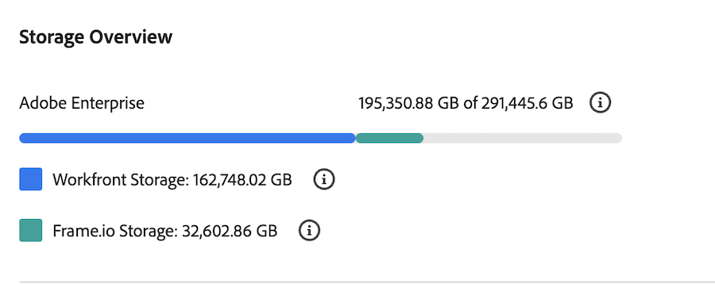

# ドキュメントのストレージ制限のチェック

{{highlighted-preview}}

ユーザーがWorkfront インスタンスにアップロードできる個々のファイルの種類とサイズに制限はありませんが、Workfront プランには合計ストレージ割り当てが含まれています。 Workfront管理者は、お客様情報ページの設定領域から使用状況と割り当てを監視できます。

ストレージの表示方法は、組織で従来のWorkfront ストレージを使用するか、Adobe エンタープライズストレージを使用するかによって異なります。

* 従来のWorkfront ストレージを使用している場合は、この記事の[従来のWorkfront ストレージ ](#legacy-workfront-storage)を参照してください。
* Adobe エンタープライズ ストレージを使用する場合は、この記事の[Adobe エンタープライズ ストレージ ](#adobe-enterprise-storage)を参照してください。

  エンタープライズストレージについて詳しくは、[Adobe エンタープライズストレージの概要](/help/quicksilver/review-and-approve-work/esm-overview.md)を参照してください。

## アクセス要件

+++ 展開すると、この記事の機能のアクセス要件が表示されます。

<table style="table-layout:auto"> 
 <col> 
 <col> 
 <tbody> 
  <tr data-mc-conditions=""> 
   <td role="rowheader">Workfront プラン</td> 
   <td> 
従来のストレージを使用してドキュメントを管理する任意のWorkfront パッケージ

      
Adobe エンタープライズストレージを使用してドキュメントを管理するワークフローパッケージ
 </td> 
  </tr> 
  <tr> 
   <td role="rowheader">Adobe Workfront プラン</td> 
   <td> 
Workfront 管理者である必要があります。
 </td> 
  </tr> 
 </tbody> 
</table>

この表の情報について詳しくは、[Workfront ドキュメントのアクセス要件](/help/quicksilver/administration-and-setup/add-users/access-levels-and-object-permissions/access-level-requirements-in-documentation.md)を参照してください。

+++

## 従来のWorkfront ストレージ

お客様の組織が従来のWorkfront ストレージを使用している場合、お客様の情報ページには、Workfrontに直接アップロードされたドキュメントに対する1つのストレージ割り当て量が表示されます。

従来のWorkfront ドキュメントストレージを確認するには：

{{step-1-to-setup}}

1. 左側のパネルで、**システム**／**顧客情報**&#x200B;をクリックします。
1. 「**基本情報**」セクションで「**ストレージ割当**」を探します。 ここでは、現在使用しているストレージの量と、Workfront プランに含まれるストレージの合計量を確認できます。

ストレージクォータは、最新のカウントを表示するために毎日更新されます。

>[!NOTE]
>
>この制限は、他のサードパーティサービスプロバイダー（SharePoint、Google Drive、Webdam、Box、Dropbox、またはその他のドキュメントアセット管理プロバイダー）からWorkfrontにリンクするドキュメントには適用されません。

## Adobe エンタープライズストレージ

お客様の組織でAdobe エンタープライズストレージを使用している場合、Customer Infoには、従来のWorkfront ストレージ、Adobe エンタープライズストレージ、Frame.ioの様々なセクションに使用状況を分割したストレージの概要が表示されます。 Workfrontでは、使用状況が割り当てを超えた場合にアップロードにソフトキャップが適用されるので、ユーザーは引き続きドキュメントをアップロードできます。

### お客様情報でのストレージ使用状況の表示

Adobe エンタープライズ版のドキュメントストレージを確認するには：

{{step-1-to-setup}}

1. 左側のパネルで、**システム**／**顧客情報**&#x200B;をクリックします。
1. 「**ストレージの概要**」セクションに移動します。
1. Adobe エンタープライズストレージの使用状況を表示します。
   <!--Both Workfront and Frame.io usage are broken down separately, but roll up to the total usage for Adobe enterprise storage.-->

でのAdobe エンタープライズ ストレージの使用状況

使用状況の数値は定期的に更新されるので、最新の数を確認できます。

### 管理者向けメール通知

使用率がストレージ割り当て量の75%、85%、または100%を超えると、Workfrontはシステム管理者にメール通知を送信します。

