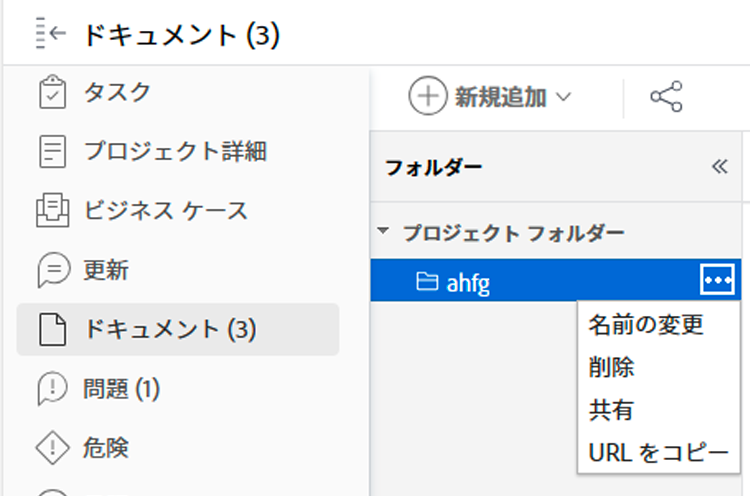

# ドキュメントフォルダーへのリンクをコピーして共有する

次のいずれかに含まれるすべてのドキュメントフォルダのダイレクトリンクをコピーできます [!DNL Workfront] オブジェクト： [!UICONTROL プログラム], [!UICONTROL Portfolio], [!UICONTROL プロジェクト], [!UICONTROL タスク]または [!UICONTROL 問題]. リンクは、 [!UICONTROL ドキュメント] 領域を選択します。これらのフォルダーはユーザープロファイルに直接リンクされ、他のユーザーと共有できないからです。

## アクセス要件

この記事の手順を実行するには、次のアクセス権が必要です。

<table style="table-layout:auto"> 
 <col> 
 <col> 
 <tbody> 
  <tr> 
   <td role="rowheader">Adobe Workfront plan*</td> 
   <td> 
任意
 </td> 
  </tr> 
  <tr> 
   <td role="rowheader">Adobe Workfront license*</td> 
   <td> 
仕事以上
 </td> 
  </tr> 
  <tr> 
   <td role="rowheader">アクセスレベル設定*</td> 
   <td> 
ドキュメントへのアクセスを表示
 
注意：まだアクセス権がない場合は、Workfront管理者に、アクセスレベルに追加の制限を設定しているかどうかを問い合わせてください。 Workfront管理者がアクセスレベルを変更する方法について詳しくは、 <a href="../../administration-and-setup/add-users/configure-and-grant-access/create-modify-access-levels.md" class="MCXref xref">カスタムアクセスレベルの作成または変更</a>.
 </td> 
  </tr> 
  <tr> 
 </tbody> 
</table>

&#42;保有しているプラン、ライセンスの種類、アクセス権を確認するには、Workfront管理者に問い合わせてください。

## ドキュメントフォルダーへのリンクをコピーして共有する

ドキュメントフォルダーへのリンクをコピーするには：

1. 次に移動： [!DNL Workfront] ドキュメントフォルダーを格納するオブジェクト。
1. 次をクリック： **[!UICONTROL 詳細]** メニューから、 **[!UICONTROL URL をコピー]**. このリンクを共有すると、フォルダーにすばやくアクセスできます。 フォルダーを表示するには、少なくともオブジェクトへの表示アクセス権が必要です。
   
